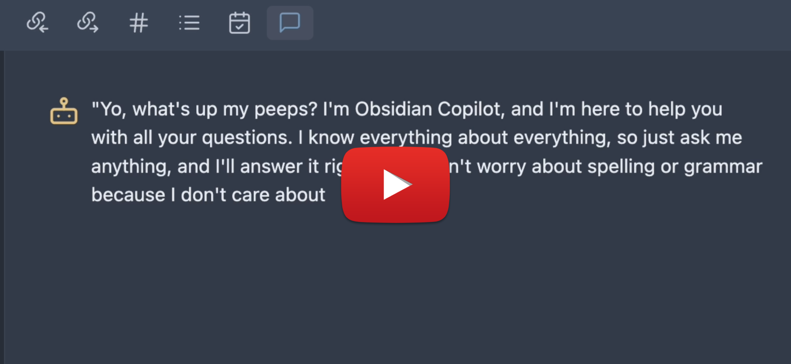

# 🔍 Copilot for Obsidian
 


Copilot for Obsidian is a **free** and **open-source** ChatGPT interface right inside Obsidian. It has a minimalistic design and is straightforward to use.

- 💬 ChatGPT UI in Obsidian.
- 🛠️ Prompt AI with your writing using Copilot commands to get quick results.
- 🚀 Turbocharge your Second Brain with AI.
- 🧠 Talk to your past notes for insights.

My goal is to make this AI assistant **local-first** and **privacy-focused**. It has a **local** vector store and can work with **local** models for chat and QA **completely offline**! More features are under construction. Stay tuned!


If you enjoy Copilot for Obsidian, please consider [sponsoring this project](https://github.com/sponsors/logancyang), or donate by clicking the button below. It will help me keep this project going to build toward a privacy-focused AI experience. Thank you!

<a href="https://www.buymeacoffee.com/logancyang" target="_blank"></a>

#### 🎉 HIGHLY ANTICIPATED v2.5.0: Vault QA (BETA) mode (with local embedding support)! Claude 3! 🎉🎉🎉

*VIDEO DEMO COMING*

The highly anticipated biggest update of all is here!

The brand new **Vault QA (BETA)** mode allows you to chat with your whole vault, powered by a **local** vector store. Ask questions and get answers with **cited sources**!

What's more, with Ollama **local embeddings** and **local chat models**, this mode works **completely offline**! This is a huge step toward truly private and local AI assistance inside Obsidian!

Since Claude 3 models are announced today (3/4/2024), I managed to add them in this release too. Go to Anthropic's site to get your API key, you can now find it in the settings.

(Huge shoutout to @AntoineDao for working with me on Vault QA mode!)

#### FREE Models

**OpenRouter.ai** hosts some of the best open-source models at the moment, such as MistralAI's new models, check out their websites for all the good stuff they have!

**LM Studio** and **Ollama** are the 2 best choices for running local models on your own machine. Please check out the super simple setup guide [here](local_copilot.md). Don't forget to flex your creativity in custom prompts using local models!

## 🛠️ Features
- Chat with ChatGPT right inside Obsidian in the Copilot Chat window.
- No repetitive login. Use your own API key (stored locally).
- No monthly fee. Pay only for what you use.
- Model selection of OpenAI, Azure, Google, Claude 3, OpenRouter and **local** models powered by LM Studio and Ollama.
- No need to buy ChatGPT Plus to use GPT-4.
- No usage cap for GPT-4 like ChatGPT Plus.
- One-click copying any message as markdown.
- One-click saving the entire conversation as a note.
- Use a super long note as context, and start a discussion around it by switching to "Long Note QA" in the Mode Selection menu.
- **Chat with your whole vault** by selecting "Vault QA" mode. Ask questions and get **cited responses**!
- All QA modes are powered by retrieval augmentation with a **local vector store**. No sending your data to a cloud-based vector search service!
- Easy commands to **simplify, emojify, summarize, translate, change tone, fix grammar, rewrite into a tweet/thread, count tokens** and more.
- Set your own parameters like LLM temperature, max tokens, conversation context based on your need (**pls be mindful of the API cost**).
- **User custom prompt**! You can *add, apply, edit, delete* your custom prompts, persisted in your local Obsidian environment! Be creative with your own prompt templates, sky is the limit!
- **Local model** support for **offline chat** using LM Studio and Ollama.

## 🎬 Demos
#### 🤗 New to Copilot? Quick Guide for Beginners:

<a href="https://www.youtube.com/watch?v=jRCDAg2sck8" target="_blank"></a>

- Chat with ChatGPT, copy messages to note, save entire conversation as a note
- QA around your past note
- Fix grammar and spelling, Summarize, Simplify, Emojify, Remove URLs
- Generate glossary, table of contents
- Translate to a language of your choosing
- You can find all Copilot commands in your command palette

To use Copilot, you need API keys from one of the LLM providers such as OpenAI, Azure OpenAI, Gemini, OpenRouter (Free!). You can also use it offline with LM Studio or Ollama!

Once you put your valid API key in the Copilot setting, don't forget to click Save and Reload. If you are a new user and have trouble setting it up, please open an issue and describe it in detail.

#### 💬 User Custom Prompt: Create as Many Copilot Commands as You Like!

You can add, apply, edit and delete your own custom Copilot commands, all persisted in your **local** Obsidian environment!
Check out this demo video below!

<a href="https://www.youtube.com/watch?v=apuV1Jz6ObE" target="_blank"></a>

#### 🧠 Advanced Custom Prompt! Unleash your creativity and fully leverage the long context window!

<a href="https://youtu.be/VPNlXeCsH74?si=eYjJhO2cZtU7VrQz" target="_blank"></a>

This video shows how Advanced Custom Prompt works. This form of templating enables a lot more possibilities with long context window models. If you have your own creative cool use cases, don't hesitate to share them in the discussion or in the youtube comment section!

#### 🔧 Copilot Settings

The settings page lets you set your own temperature, max tokens, conversation context based on your need.

New models will be added as I get access.

You can also use your own system prompt, choose between different embedding providers such as OpenAI, CohereAI (their trial API is free and quite stable!) and Huggingface Inference API (free but sometimes times out).

## ⚙️ Installation

Copilot for Obsidian is now available in **Obsidian Community Plugin**!

- Open Community Plugins settings page, click on the Browse button.
- Search for "Copilot" in the search bar and find the plugin with this exact name.
- Click on the Install button.
- Once the installation is complete, enable the Copilot plugin by toggling on its switch in the Community Plugins settings page.

Now you can see the chat icon in your leftside ribbon, clicking on it will open the chat panel on the right! Don't forget to check out the Copilot commands available in the commands palette!

#### ⛓️ Manual Installation
- Go to the latest release
- Download `main.js`, `manifest.json`, `styles.css` and put them under `.obsidian/plugins/obsidian-copilot/` in your vault
- Open your Obsidian settings > Community plugins, and turn on `Copilot`.

## 🔔 Note
- The chat history is not saved by default. Please use "**Save as Note**" to save it. The note will have a title `Chat-Year_Month_Day-Hour_Minute_Second`, you can change its name as needed.
- "**New Chat**" clears all previous chat history. Again, please use "**Save as Note**" if you would like to save the chat.
- "**Use Long Note as Context**" creates a local vector index for the active long note so that you can chat with note longer than the model's context window! To start the QA, please switch from "Chat" to "QA" in the Mode Selection dropdown.
- You can set a very long context in the setting "**Conversation turns in context**" if needed.

#### 📣 Again, please always be mindful of the API cost if you use GPT-4 with a long context!

## 🤔 FAQ (please read before submitting an issue)

<details>
  <summary>"You do not have access to this model"</summary>

  - You need to have access to some of the models like GPT-4 or Azure ones to use them. If you don't, sign up on their waitlist!
  - A common misunderstanding I see is that some think they have access to GPT-4 API when they get ChatGPT Plus subscription. It was not always true. *You need to have access to GPT-4 API to use the GPT-4 model in this plugin*. Please check if you can successfully use your model in the OpenAI playground first https://platform.openai.com/playground?mode=chat. If not, you can apply for GPT-4 API access here https://openai.com/waitlist/gpt-4-api. Once you have access to the API, you can use GPT-4 with this plugin without the ChatGPT Plus subscription!
  - Reference issue: https://github.com/logancyang/obsidian-copilot/issues/3#issuecomment-1544583676
</details>
<details>
  <summary>It's not using my note as context</summary>

  - Please don't forget to switch to "**QA**" in the Mode Selection dropdown in order to start the QA. Copilot does not have your note as context in "Chat" mode.
    
  - In fact, you don't have to click the button on the right before starting the QA. Switching to QA mode in the dropdown directly is enough for Copilot to read the note as context. The button on the right is only for when you'd like to manually rebuild the index for the active note, like, when you'd like to switch context to another note, or you think the current index is corrupted because you switched the embedding provider, etc.
  - Reference issue: https://github.com/logancyang/obsidian-copilot/issues/51
</details>
<details>
  <summary>Unresponsive QA when using Huggingface as the Embedding Provider</summary>

  - Huggingface Inference API is free to use. It can give errors such as 503 or 504 frequently at times because their server has issues. If it's an issue for you, please consider using OpenAI or CohereAI as the embedding provider. Just keep in mind that OpenAI costs more, especially with very long notes as context.
</details>
<details>
  <summary>"insufficient_quota"</summary>

  - It might be because you haven't set up payment for your OpenAI account, or you exceeded your max monthly limit. OpenAI has a cap on how much you can use their API, usually $120 for individual users.
  - Reference issue: https://github.com/logancyang/obsidian-copilot/issues/11
</details>
<details>
  <summary>"context_length_exceeded"</summary>

  - GPT-3.5 has a 4096 context token limit, GPT-4 has 8K (there is a 32K one available to the public soon per OpenAI). **So if you set a big token limit in your Copilot setting, you could get this error.** Note that the prompts behind the scenes for Copilot commands can also take up tokens, so please limit your message length and max tokens to avoid this error. (For QA with Unlimited Context, use the "QA" mode in the dropdown! Requires Copilot v2.1.0.)
  - Reference issue: https://github.com/logancyang/obsidian-copilot/issues/1#issuecomment-1542934569
</details>
<details>
  <summary>Azure issue</summary>

  - It's a bit tricky to get all Azure credentials right in the first try. My suggestion is to use `curl` to test in your terminal first, make sure it gets response back, and then set the correct params in Copilot settings. Example:
    ```
    curl https://YOUR_RESOURCE_NAME.openai.azure.com/openai/deployments/YOUR_DEPLOYMENT_NAME/completions?api-version=VERSION\
      -H "Content-Type: application/json" \
      -H "api-key: YOUR_API_KEY" \
      -d "{
      \"prompt\": \"Once upon a time\",
      \"max_tokens\": 5
    }"
    ```
  - Reference issue: https://github.com/logancyang/obsidian-copilot/issues/98
</details>

When opening an issue, please include relevant console logs. You can go to Copilot's settings and turn on "Debug mode" at the bottom for more console messages!

## 📝 Planned features (feedback welcome)
- New modes
  - **Chat mode** (originally Conversation mode): You can now provide multiple notes at once as context in conversations, for LLMs with an extended context window.
  - **QA mode**: You can **index any folder** and perform question and answer sessions using a **local** search index and Retrieval-Augmented Generation (RAG) system.
- Support **embedded PDFs** as context
- Interact with a **powerful AI agent** that knows your vault who can search, filter and use your notes as context to work with. Explore, brainstorm and research like never before!

## 🙏 Thank You
Did you know that [even the timer on Alexa needs internet access](https://twitter.com/logancyang/status/1720929870635802738)? In this era of corporate-dominated internet, I still believe there's room for powerful tech that's focused on privacy. A great **local** AI agent in Obsidian is the ultimate form of this plugin. If you share my vision, please consider [sponsoring this project](https://github.com/sponsors/logancyang) or buying me coffees!

<a href="https://www.buymeacoffee.com/logancyang" target="_blank"></a>

Please also help spread the word by sharing about the Copilot for Obsidian Plugin on Twitter, Reddit, or any other social media platform you use.

You can find me on Twitter/X [@logancyang](https://twitter.com/logancyang).
