<h1 align="center">Copilot for Obsidian</h1>

<h2 align="center">
The Ultimate AI Assistant for Your Second Brain
</h2>

  
  

  <a href="https://www.obsidiancopilot.com/en/docs">Documentation</a> |
  <a href="https://www.youtube.com/@loganhallucinates">Youtube</a> |
  <a href="https://github.com/logancyang/obsidian-copilot/issues/new?template=bug_report.md">Report Bug</a> |
  <a href="https://github.com/logancyang/obsidian-copilot/issues/new?template=feature_request.md">Request Feature</a>

  

Copilot for Obsidian is your ultimate in‑vault AI assistant with chat-based vault search, web and youtube support, powerful context processing and ever-expanding agentic capabilities—all within Obsidian’s highly customizable workspace.

- **🔒 Your data is 100% yours**: Local search and storage, and full control of your data if you use self-hosted models.
- **🧠 Bring Your Own Model**: Tap any OpenAI-compatible or local model to uncover insights, spark connections, and create content.
- **🖼️ Multimedia understanding**: Drop in webpages, YouTube videos, images, PDFs, EPUBS, or real-time web search for quick insights.
- **🔍 Smart Vault Search**: Search your vault with chat, no setup required. Embeddings are optional. Copilot delivers results right away.
- **✍️ Composer and Quick Commands**: Interact with your writing with chat, apply changes with 1 click.
- **🗂️ Project Mode**: Create AI-ready context based on folders and tags. Think NotebookLM but inside your vault!
- **🤖 Agent Mode (Plus)**: Unlock an autonomous agent with built-in tool calling. No commands needed. Copilot automatically triggers vault, web searches or any other relevant tool when relevant.

  <em>Copilot's Agent can call the proper tools on its own upon your request.</em>

  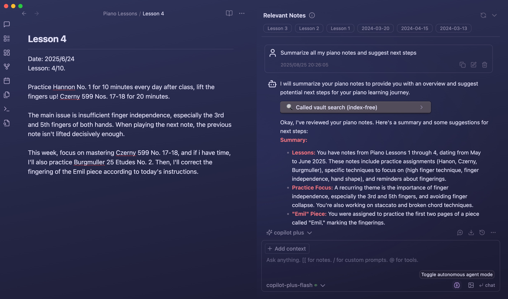

## Copilot V3 is a New Era 🔥

After months of hard work, we have revamped the codebase and adopted a new paradigm for our agentic infrastructure. It opens the door for easier addition of agentic tools (MCP support coming). We will provide a new version of the documentation soon. Here is a couple of new things that you cannot miss!

- FOR ALL USERS: You can do vault search out-of-the-box **without building an index first** (Indexing is still available but optional behind the "Semantic Search" toggle in QA settings).
- FOR FREE USERS: Image support and chat context menu are available to all users starting from v3.0.0!
- FOR PLUS USERS: Autonomous agent is available with vault search, web search, youtube, composer and soon a lot other tools!

Read the [Changelog](https://github.com/logancyang/obsidian-copilot/releases/tag/3.0.0).

## Why People Love It ❤️

- *"Copilot is the missing link that turns Obsidian into a true second brain. I use it to draft investment memos with text, code, and visuals—all in one place. It’s the first tool that truly unifies how I search, process, organize, and retrieve knowledge without ever leaving Obsidian. With AI-powered search, organization, and reasoning built into my notes, it unlocks insights I’d otherwise miss. My workflow is faster, deeper, and more connected than ever—I can’t imagine working without it."* - @jasonzhangb, Investor & Research Analyst
- *"Since discovering Copilot, my writing process has been completely transformed. Conversing with my own articles and thoughts is the most refreshing experience I’ve had in decades.”* - Mat QV, Writer
- *"Copilot has transformed our family—not just as a productivity assistant, but as a therapist. I introduced it to my non‑technical wife, Mania, who was stressed about our daughter’s upcoming exam; within an hour, she gained clarity on her mindset and next steps, finding calm and confidence."* - @screenfluent, A Loving Husband

## **Get Started in 5 Minutes**

### FREE Product Features

**🔌 Install Copilot in Community Plugins in Obsidian**

**🔑 Set Up Your AI Model (API Key)**

- To start using Copilot AI features, you'll need access to an AI model of your choice.

  <a href="https://www.youtube.com/watch?v=mzMbiamzOqM" target="_blank">
    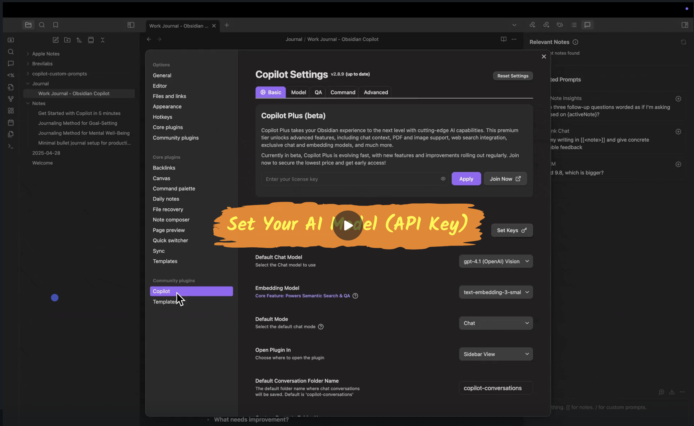
  </a> 
  <em>Click the image to watch the video on YouTube</em>

**📖** **Chat Mode: Summarize Specific Notes**

- 🧠 **Use When:** You want to reference specific notes or folders, generate content, or talk through ideas with Copilot like a knowledgeable thought partner.

- 💭 **In `Chat` mode, ask Copilot:**
  > _"Summarize [[Meeting Notes – March]] and create a follow-up task list based on notes in {projects}."_

  <a href="https://www.youtube.com/watch?v=idit7nCqEs0" target="_blank">
    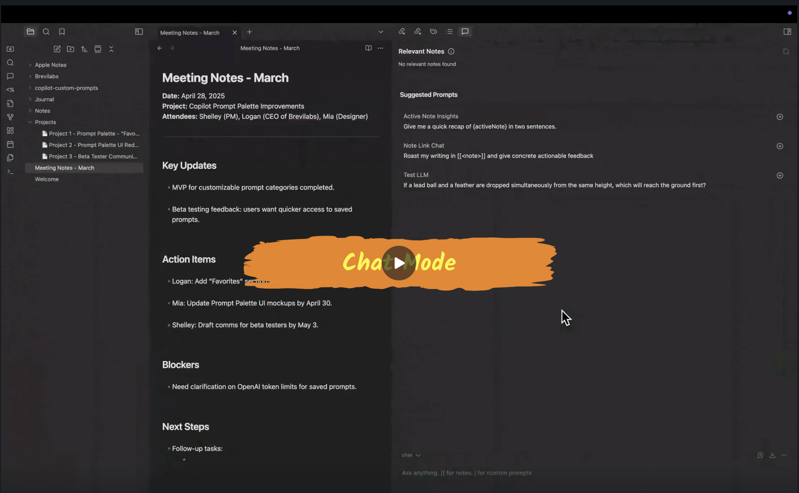
  </a> 
  <em>Click the image to watch the video on YouTube</em>

**📖** **Vault QA Mode: Chat With Your Entire Vault**

- 🧠 **Use When:** You want to search your vault for patterns, ideas, or facts without knowing exactly where the information is stored.

- 💭 **In `Vault QA` mode, ask Copilot:**

  > _"What insights can I gather about the benefits of journaling from all of my notes?"_

- 💡 **Tip:** Replace _the benefits of journaling_ with any topic mentioned in your notes to get more precise results.

  <a href="https://www.youtube.com/watch?v=hBLMWE8WRFU" target="_blank">
    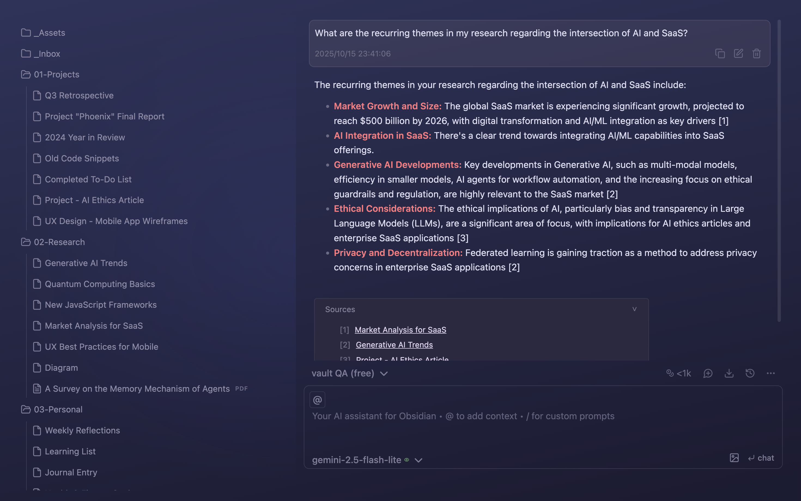
  </a> 
  <em>Click the image to watch the video on YouTube</em>

**📖 Edit and Apply with One Click**

- 🧠 **Use When:** You want to quickly fix grammar, spelling or wording directly in your notes—without switching tabs or manually rewriting.

- 💭 **Select the text** and **edit with one RIGHT click**

- 💡 **Tip:** Set up and customize your right-click menu with common actions you use often, like _"Summarize"_, _"Simplify Language"_, or _"Translate to Formal Tone"_—so you can apply them effortlessly while you write.

  <a href="https://www.youtube.com/watch?v=hSmRnmEVoec" target="_blank">
    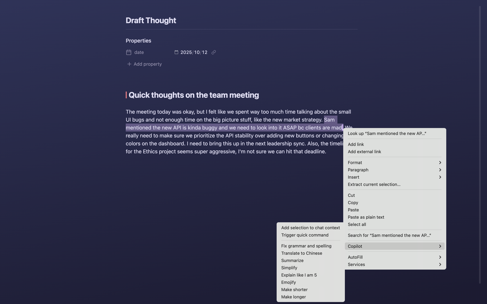
  </a> 
  <em>Click the image to watch the video on YouTube</em>

**📖 Automate your workflow with the Copilot Prompt Palette**

- 🧠 **Use When:** You want to speed up repetitive tasks like summarizing, rewriting, or translating without typing full prompts every time.

- 💭 Type / to use Prompt Palette

- 💡 **Tip:** Create shortcuts for your most-used actions—like _"Translate to Spanish"_ or _"Draft a blog post outline"_—and trigger them instantly with typing / !

  <a href="https://www.youtube.com/watch?v=9YzY2OJ54wM" target="_blank">
    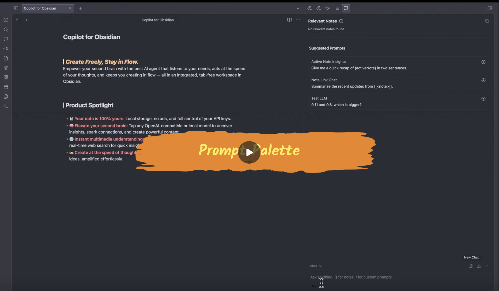
  </a> 
  <em>Click the image to watch the video on YouTube</em>

**📖 Stay in flow with the Relevant Notes**

- 🧠 **Use When:** You're working on a note and want to pull in context or insights from related notes—without breaking your focus.

- 💭 Appears automatically when there's useful related content.

- 💡 **Tip:** Use it to quickly reference past research, ideas, or decisions—no need to search or switch tabs.

  <a href="https://www.youtube.com/watch?v=qapQD7jD3Uk" target="_blank">
    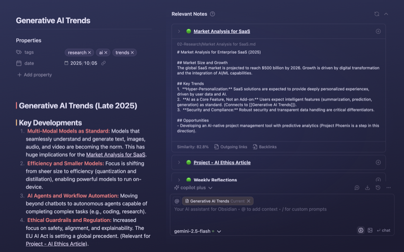
  </a> 
  <em>Click the image to watch the video on YouTube</em>

### Level Up with Copilot Plus and Beyond

Copilot Plus brings powerful AI agentic capabilities, context-aware actions and seamless tool integration—built to elevate your knowledge work in Obsidian.

🆙 **Upgrade to Copilot Plus**

First, go to https://www.obsidiancopilot.com/en to subscribe to Copilot Plus. Then, set up Copilot Plus License Key in Obsidian.

  <a href="https://www.youtube.com/watch?v=pPfWKZnNYhA" target="_blank">
    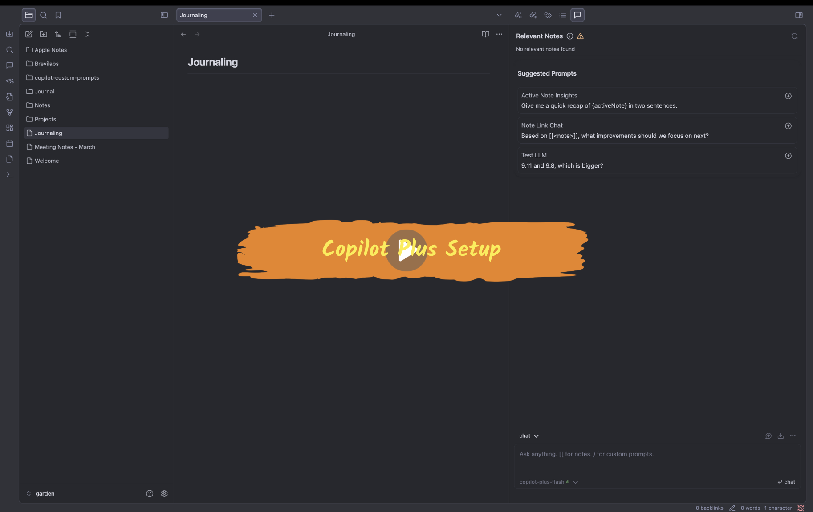
  </a> 
  <em>Click the image to watch the video on YouTube</em>

❔Community is at the heart of everything we build. Join us on Discord for updates, priority support, and a voice in shaping the best AI products for your experience.

  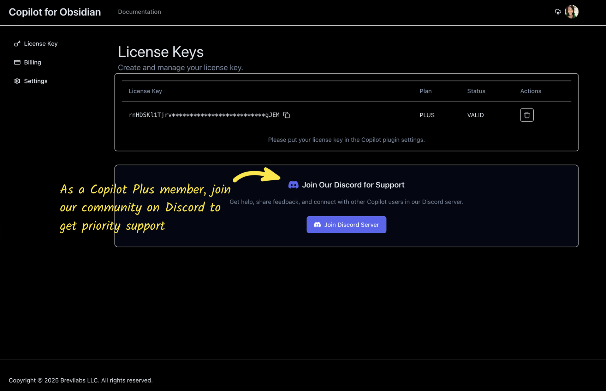

**📖 Get Precision Insights From a Specific Time Window**

- 🧠 **Use When:** You want to quickly review tasks, notes, or ideas from a specific time range without manually digging through files.

- 💭 **In Chat mode, ask Copilot:**

  > _"Give me a recap of everything I captured last week."_

- 💡 **Tip:** Try variations like _"Summarize my highlights from August 11 through August 22"_ for even more insights.

  <a href="https://www.youtube.com/watch?v=sXP2sjvrqtI" target="_blank">
    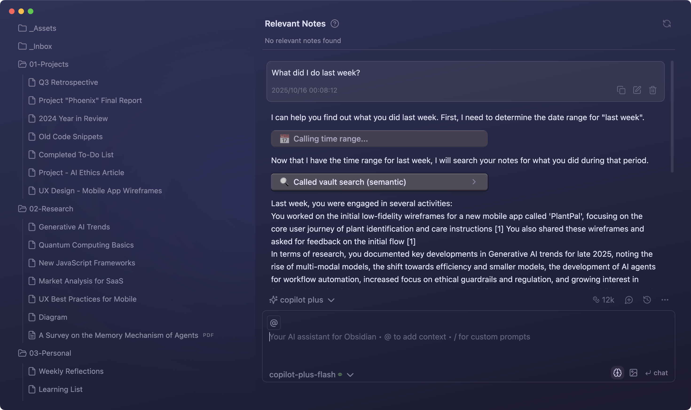
  </a> 
  <em>Click the image to watch the video on YouTube</em>

**📖 One Prompt, Every Source—Instant Summaries from PDFs, Videos, and Web**

- 🧠 **Use When:** You want to combine information from multiple formats—documents, videos, web pages, and images—into one concise, actionable summary.

- 💭 **In PLUS mode, ask Copilot:**

  > "Please write a short intro of Kiwi birds based on the following information I collected about this animal.

  > @youtube Summarize [https://www.youtube.com/watch?v=tZ2jm_UPc6c&t=417s](https://www.youtube.com/watch?v=ABTfc5wUT1U)
  > in a short paragraph.

  > @websearch where can I find Kiwi birds?

  > Summarize https://www.doc.govt.nz/nature/native-animals/birds/birds-a-z/kiwi/ in 300 words.“

- 🛠️ **Add PDFs and Images as Context to Enrich Your Learning**

- 💡 _Tip: For large PDFs, reference specific sections to focus the AI's attention._

  <a href="https://www.youtube.com/watch?v=WXoOZmMSHVE" target="_blank">
    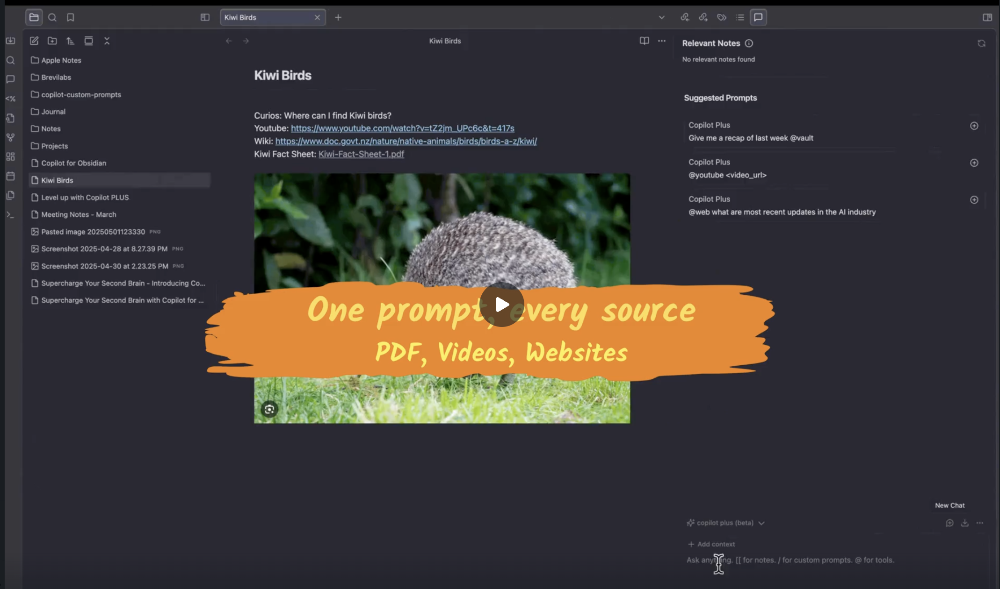
  </a> 
  <em>Click the image to watch the video on YouTube</em>

# **💡 Need Help?**

- Check the [documentation](https://www.obsidiancopilot.com/en/docs) for setup guides, how-tos, and advanced features.
- Watch [Youtube](https://www.youtube.com/@loganhallucinates) for walkthroughs.
- If you're experiencing a bug or have a feature idea, please follow the steps below to help us help you faster:
  - 🐛 Bug Report Checklist
    - ☑️Use the [bug report template](https://github.com/logancyang/obsidian-copilot/issues/new?template=bug_report.md) when reporting an issue
    - ☑️Enable Debug Mode in Copilot Settings → Advanced for more detailed logs
    - ☑️Open the dev console to collect error messages:
      - Mac: Cmd + Option + I
      - Windows: Ctrl + Shift + I
    - ☑️Turn off all other plugins, keeping only Copilot enabled
    - ☑️Attach relevant console logs to your report
    - ☑️Submit your bug report [here](https://github.com/logancyang/obsidian-copilot/issues/new?template=bug_report.md)
  - 💡 Feature Request Checklist
    - ☑️Use the [feature request template](https://github.com/logancyang/obsidian-copilot/issues/new?template=feature_request.md) for requesting a new feature
    - ☑️Clearly describe the feature, why it matters, and how it would help
    - ☑️Submit your feature request [here](https://github.com/logancyang/obsidian-copilot/issues/new?template=feature_request.md)

# **🙋‍♂️ FAQ**

  
<strong>Why isn’t Vault search finding my notes?</strong>

If you're using the Vault QA mode (or the tool <code>@vault</code> in Plus), try the following:

- Ensure you have a working embedding model from your AI model's provider (e.g. OpenAI). Watch this video: [AI Model Setup (API Key)](https://www.youtube.com/watch?v=mzMbiamzOqM)
- Ensure your Copilot indexing is up-to-date. Watch this video: [Vault Mode](https://www.youtube.com/watch?v=hBLMWE8WRFU)
- If issues persist, run <strong>Force Re-Index</strong> or use <strong>List Indexed Files</strong> from the Command Palette to inspect what's included in the index.
- ⚠️ <strong>Don’t switch embedding models after indexing</strong>—it can break the results.

  
<strong>Why is my AI model returning error code 429: ‘Insufficient Quota’?</strong>

Most likely this is happening because you haven’t configured billing with your chosen model provider—or you’ve hit your monthly quota. For example, OpenAI typically caps individual accounts at $120/month. To resolve:

- ▶️ Watch the “AI Model Setup” video: [AI Model Setup (API Key)](https://www.youtube.com/watch?v=mzMbiamzOqM)
- 🔍 Verify your billing settings in your OpenAI dashboard
- 💳 Add a payment method if one isn’t already on file
- 📊 Check your usage dashboard for any quota or limit warnings

If you’re using a different provider, please refer to their documentation and billing policies for the equivalent steps.

  
<strong>Why am I getting a token limit error?</strong>

Please refer to your model provider’s documentation for the context window size.

⚠️ If you set a large <strong>max token limit</strong> in your Copilot settings, you may encounter this error.

- <strong>Max tokens</strong> refers to <em>completion tokens</em>, not input tokens.
- A higher output token limit means less room for input!

🧠 Behind-the-scenes prompts for Copilot commands also consume tokens, so:

- Keep your message length short
- Set a reasonable max token value to avoid hitting the cap

💡 For QA with unlimited context, switch to the <strong>Vault QA</strong> mode in the dropdown (Copilot v2.1.0+ required).

# **💎 Choose the Copilot Plan That’s Right for You**

| **Feature**                                                        | **Free Plan ✅** | **Plus Plan 💎** | **Believer Plan 🛡️** |
| ------------------------------------------------------------------ | ---------------- | ---------------- | -------------------- |
| No credit card or sign-up required                                 | ✅               | ❌               | ❌                   |
| All open-source features                                           | ✅               | ✅               | ✅                   |
| Bring your own API key                                             | ✅               | ✅               | ✅                   |
| Best-in-class AI chat in Obsidian                                  | ✅               | ✅               | ✅                   |
| Local data store for Vault QA                                      | ✅               | ✅               | ✅                   |
| Support                                                            | ✅ Essential     | ✅ Pro           | ✅ Elite             |
| AI agent capabilities                                              | ❌               | ✅               | ✅                   |
| Image and PDF support                                              | ❌               | ✅               | ✅                   |
| Enhanced chat UI (context menu)                                    | ❌               | ✅               | ✅                   |
| State-of-the-art embedding models included                         | ❌               | ✅               | ✅                   |
| Exclusive @AI tools (e.g., web, YouTube)                           | ❌               | ✅               | ✅                   |
| Exclusive chat model included in plan                              | ❌               | ✅               | ✅                   |
| Access to exclusive Discord channel                                | ❌               | ✅               | ✅                   |
| Lifetime access                                                    | ❌               | ❌               | ✅                   |
| Priority access to new features                                    | ❌               | ❌               | ✅                   |
| Prioritized feature requests                                       | ❌               | ❌               | ✅                   |
| Exclusive access to next-gen chat & embedding models (coming soon) | ❌               | ❌               | ✅                   |

## **🙏 Thank You**

If you share the vision of building the most powerful AI agent for our second brain, consider [sponsoring this project](https://github.com/sponsors/logancyang) or buying me a coffee. Help spread the word by sharing Copilot for Obsidian on Twitter/X, Reddit, or your favorite platform!

  

**Acknowledgments**

Special thanks to our top sponsors: @mikelaaron, @pedramamini, @Arlorean, @dashinja, @azagore, @MTGMAD, @gpythomas, @emaynard, @scmarinelli, @borthwick, @adamhill, @gluecode, @rusi, @timgrote, @JiaruiYu-Consilium, @ddocta, @AMOz1, @chchwy, @pborenstein, @GitTom, @kazukgw, @mjluser1, @joesfer, @rwaal, @turnoutnow-harpreet, @dreznicek, @xrise-informatik, @jeremygentles, @ZhengRui, @bfoujols, @jsmith0475, @pagiaddlemon, @sebbyyyywebbyyy, @royschwartz2, @vikram11, @amiable-dev, @khalidhalim, @DrJsPBs, @chishaku, @Andrea18500, @shayonpal, @rhm2k, @snorcup, @JohnBub, @obstinatelark, @jonashaefele, @vishnu2kmohan

## **Copilot Plus Disclosure**

Copilot Plus is a premium product of Brevilabs LLC and it is not affiliated with Obsidian. It offers a powerful agentic AI integration into Obsidian. Please check out our website [obsidiancopilot.com](https://obsidiancopilot.com/) for more details!

- An account and payment are required for full access.
- Copilot Plus requires network use to faciliate the AI agent.
- Copilot Plus does not access your files without your consent.
- Copilot Plus collect server-side telemetry to improve the product. Please see the privacy policy on the website for more details.
- The frontend code of Copilot plugin is fully open-source. However, the backend code facilitating the AI agents is close-sourced and proprietary.
- We offer a full refund if you are not satisfied with the product within 14 days of your purchase, no questions asked.

## **Authors**

Brevilabs Team | Email: logan@brevilabs.com | X/Twitter: [@logancyang](https://twitter.com/logancyang)
