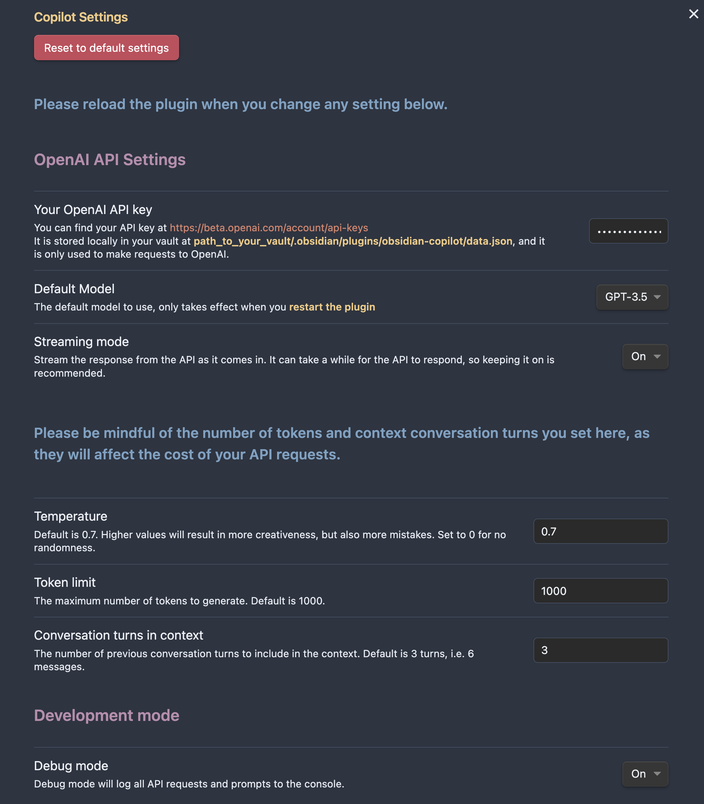

# 🔍 Copilot for Obsidian
 

Copilot for Obsidian is a ChatGPT interface right inside Obsidian. It has a minimalistic design and is straightforward to use.

- 💬 ChatGPT UI in Obsidian.
- 🛠️ Prompt AI with your writing using Copilot commands to get quick results.
- 🚀 Turbocharge your Second Brain with AI.
- 🧠 Talk to your past notes for insights.

## 🛠️ Features
- Chat with ChatGPT right inside Obsidian in the Copilot Chat window.
- No repetitive login. Use your own API key (stored locally).
- No monthly fee. Pay only for what you use.
- Model selection of GPT-3.5 and GPT-4.
- No need to buy ChatGPT Plus to use GPT-4 **if you have API access**.
- No usage cap for GPT-4 like ChatGPT Plus.
- One-click copying any message as markdown.
- One-click saving the entire conversation as a note.
- One-click using the active note as context, and start a discussion around it (currently only supports shorter notes)
- Easy commands to **simplify, emojify, translate, rewrite into a tweet/thread,** and more.
- Set your own parameters like LLM temperature, max tokens, conversation context based on your need (**pls be mindful of the API cost**).

## 🎬 Video Demo

- Chat with ChatGPT, copy messages to note, save entire conversation as a note
- QA around your past note
- Fix grammar and spelling, Summarize, Simplify, Emojify, Remove URLs
- Generate glossary, table of contents
- Translate to a language of your choosing
- Change tone: professional, casual, straightforward, confident, friendly
- Make longer/shorter
- Rewrite into a tweet/thread

The settings page lets you set your own temperature, max tokens, conversation context based on your need:

## ⚙️ Installation

Copilot for Obsidian is now available in **Obsidian Community Plugin**!

- Open Community Plugins settings page, click on the Browse button.
- Search for "Copilot" in the search bar and find the plugin with this exact name.
- Click on the Install button.
- Once the installation is complete, enable the Copilot plugin by toggling on its switch in the Community Plugins settings page.

Now you can see the chat icon in your leftside ribbon, clicking on it will open the chat panel on the right! Don't forget to check out the Copilot commands available in the commands palette!

### 🔧 Manual Installation
- Go to the latest release
- Download `main.js`, `manifest.json`, `styles.css` and put them under `.obsidian/plugins/obsidian-copilot/` in your vault
- Open your Obsidian settings > Community plugins, and turn on `Copilot`.

## 🤔 FAQ (please read before submitting an issue)
- "model_not_found"
  - A common misunderstanding I see is that some think they have access to GPT-4 API when they get ChatGPT Plus subscription. That is not true. *You need to get access to GPT-4 API to use the GPT-4 model in this plugin*. Please check if you can successfully use your model in the OpenAI playground first https://platform.openai.com/playground?mode=chat&model=gpt-4. If not, you can apply for GPT-4 API access here https://openai.com/waitlist/gpt-4-api. Once you have access to the API, you can use GPT-4 with this plugin without the ChatGPT Plus subsciption!
  - Reference issue: https://github.com/logancyang/obsidian-copilot/issues/3#issuecomment-1544583676
- "insufficient_quota"
  - It might be because you haven't set up payment for your OpenAI account, or you exceeded your max monthly limit. OpenAI has a cap on how much you can use their API, usually $120 for individual users.
  - Reference issue: https://github.com/logancyang/obsidian-copilot/issues/11
- "context_length_exceeded"
  - GPT-3.5 has a 4096 context token limit, GPT-4 has 8K (there is a 32K one available to the public soon per OpenAI). So if you pass a very long note as context or set a big token limit in your Copilot setting, you can get this error. Note that the prompts behind the scenes for Copilot commands can also take up tokens, so please limit your message length to avoid this error. (I'm working on a solution to support unlimited context, stay tuned!)
  - Reference issue: https://github.com/logancyang/obsidian-copilot/issues/1#issuecomment-1542934569

## 📝 Planned features (based on feedback)
- More standard prompts that can be used with commands
- User custom prompts
- Online prompt library access
- Unlimited context, i.e. very long notes, a collection of notes or the entire vault
- Integration with more LLMs, including open-source and local ones.

## 🔔 Note
- The chat history is not saved by default. Please use "**Save as Note**" to save it. The note will have a title `Chat-Year_Month_Day-Hour_Minute_Second`, you can change its name as needed.
- "**New Chat**" clears all previous chat history. Again, please use "**Save as Note**" if you would like to save the chat.
- "**Use Active Note as Context**" does not support super long notes yet since the OpenAI API has a limited context length (currently about 4K, 8K, or 32K tokens depending on the model you use). In the future I'm considering supporting very long notes / a folder of notes / the entire vault as context if there is enough demand.
- You can set a very long context in the setting "**Conversation turns in context**" if needed.

### 📣 Again, please always be mindful of the API cost if you use GPT-4 with a long context!

## 🙏 Say Thank You
If you are enjoying Copilot, please support my work by buying me a coffee here: https://www.buymeacoffee.com/logancyang

Please also help spread the word by sharing about the Copilot for Obsidian Plugin on Twitter, Reddit, or any other social media platform you use.

You can find me on Twitter [@logancyang](https://twitter.com/logancyang).
