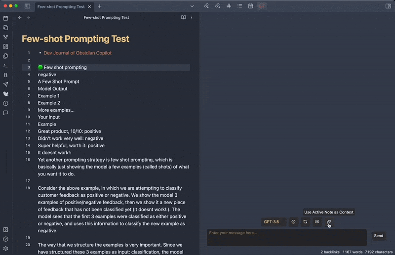
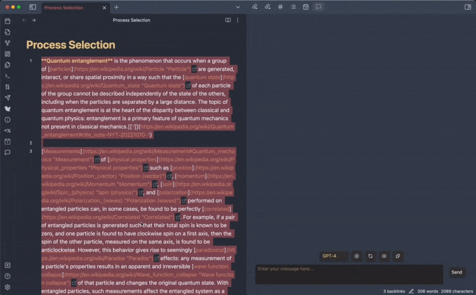

# 🔍 Obsidian Copilot

Obsidian Copilot is a ChatGPT interface right inside Obsidian. It has a minimalistic design and is straightforward to use.

- 💬 ChatGPT integration in Obsidian.
- 🚀 Turbocharge your Second Brain with AI.
- 🧠 Talk to your past notes for insights.
- 🛠️ Prompt AI with your writing to get quick results.

## 🛠️ Features
- Chat with ChatGPT right inside Obsidian in the Copilot Chat window.
- No repetitive login. Use your own API key (stored locally).
- No monthly fee. Pay only for what you use.
- Model selection of GPT-3.5 and GPT-4.
- No need to buy ChatGPT Plus to use GPT-4 if you have API access.
- No usage cap for GPT-4 like ChatGPT Plus.
- One-click copying any message as markdown.
- One-click saving the entire conversation as a note.
- One-click using the active note as context, and start a discussion around it (currently only supports shorter notes)
- Easy commands to **simplify, emojify, translate, rewrite into a tweet/thread,** and more.
- Set your own parameters like LLM temperature, max tokens, conversation context based on your need (**pls be mindful of the API cost**).

## 🎬 Demo

#### Chat with ChatGPT, copy a message to note, or save entire conversation as a note:

#### QA around your past note:

#### Simplify, Emojify, Remove URLs

#### Translate to a language of your choosing

#### Rewrite into a tweet/thread

The settings page lets you set your own temperature, max tokens, conversation context based on your need:

## ⚙️ Manual Installation
- Go to the latest release
- Download `main.js`, `manifest.json`, `styles.css` and put them under `.obsidian/plugins/obsidian-copilot/` in your vault
- Open your Obsidian settings > Community plugins, and turn on `Copilot`.

## 📝 Planned features (based on feedback)
- More standard prompts that can be used with commands
- User customized prompts
- Online prompt library access
- Add support for having unlimited context, i.e. QA against very long notes, a collection of notes or the entire vault
- Integration with ChatGPT plugins when I get access

## 🔔 Note
- The chat history is not saved by default. Please use "**Save as Note**" to save it. The note will have a title `Chat-Year_Month_Day-Hour_Minute_Second`, you can change its name as needed.
- "**New Chat**" clears all previous chat history. Again, please use "**Save as Note**" if you would like to save the chat.
- "**Use Active Note as Context**" does not support super long notes yet since the OpenAI API has a limited context length (currently about 4K, 8K, or 32K tokens depending on the model you use). In the future I'm considering supporting very long notes / a folder of notes / the entire vault as context if there is enough demand.
- You can set a very long context in the setting "**Conversation turns in context**" if needed.

### 📣 Again, please always be mindful of the API cost if you use GPT-4 with a long context!
