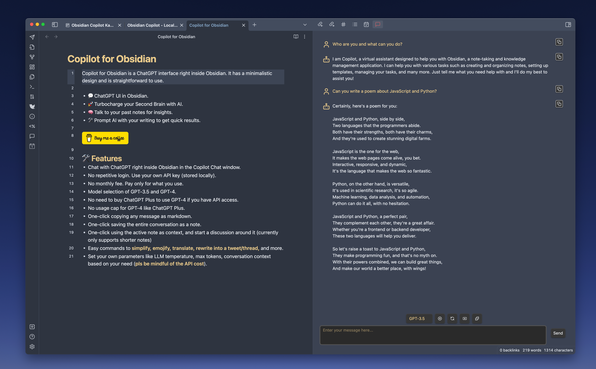
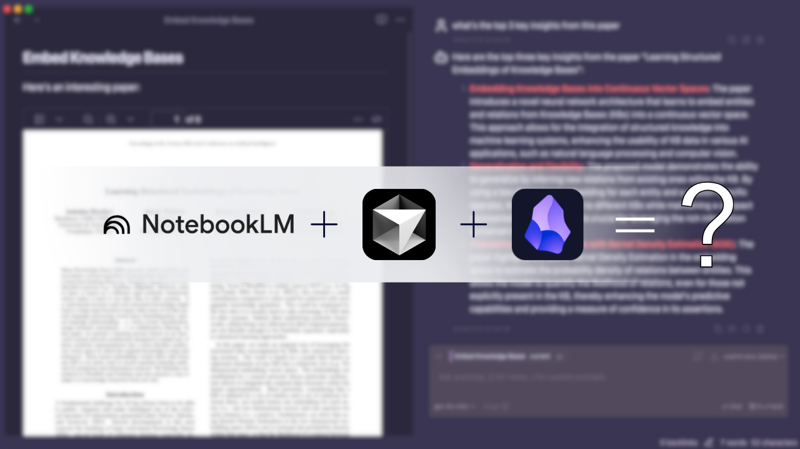
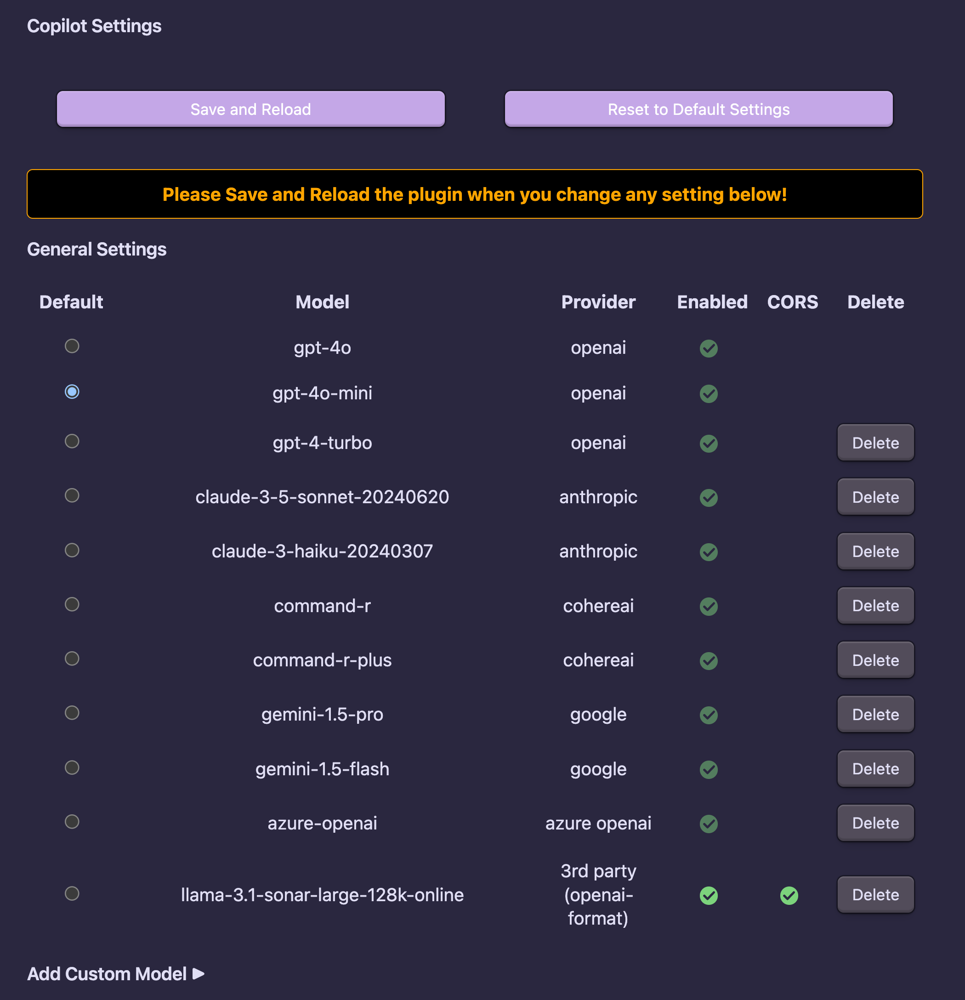
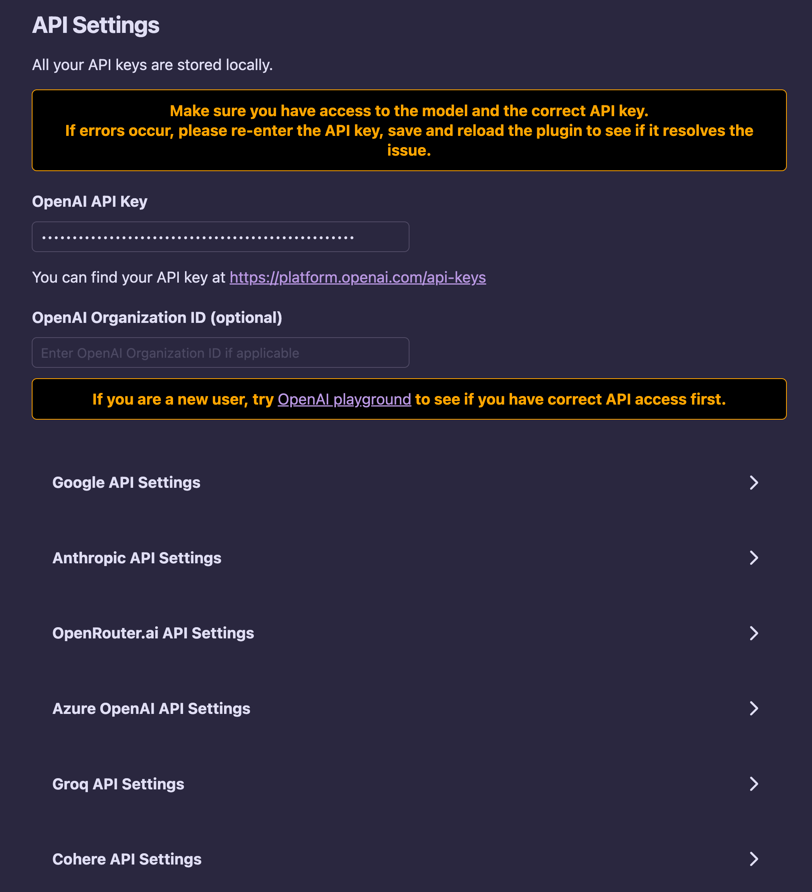
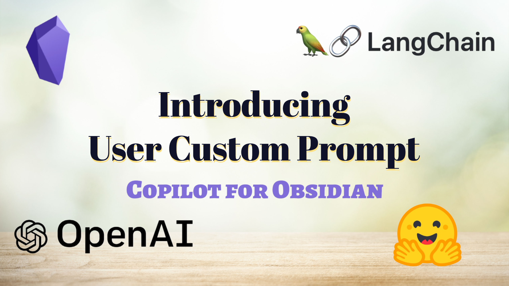
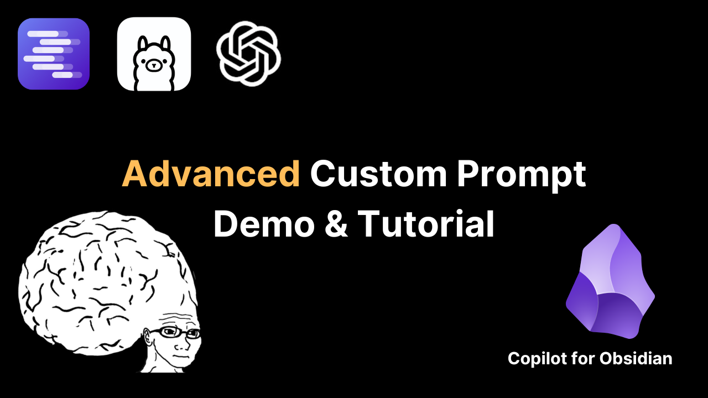
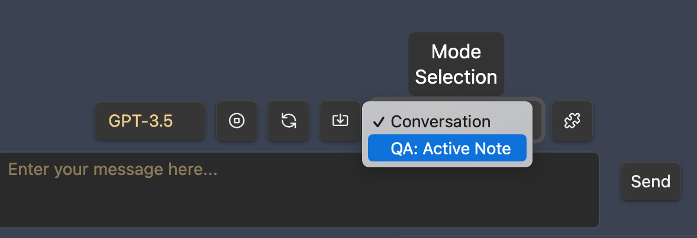

# 🔍 Copilot for Obsidian

 

Copilot for Obsidian is an **open-source** LLM interface right inside Obsidian. It has a minimalistic design and is straightforward to use.

- 💬 Chat UI in Obsidian with support for countless models, just BYO API key or use local models with LM Studio or Ollama.
- 🛠️ Prompt AI with Copilot commands or your own custom prompts at the speed of thought.
- 🧠 Talk to your entire vault for answers and insights.
- 🚀 Turbocharge your Second Brain with powerful AI agents (Copilot Plus).

My goal is to make it the **ultimate AI assistant** that truly **understands** your personal knowledge base while being **privacy-focused**.

It has a **local** index that powers the question-answering. Your notes are always stored on your own device and nowhere else! More features are under construction. Stay tuned!



If you enjoy Copilot for Obsidian, please consider [sponsoring this project](https://github.com/sponsors/logancyang), or donate by clicking the button below. It will help me keep this project going to build toward a privacy-focused AI experience. Thank you!

<a href="https://www.buymeacoffee.com/logancyang" target="_blank"></a>

SPECIAL THANKS TO OUR TOP SPONSORS:
@pedramamini, @Arlorean, @dashinja, @azagore, @MTGMAD, @gpythomas, @emaynard, @scmarinelli, @borthwick, @adamhill, @gluecode, @rusi, @timgrote, @JiaruiYu-Consilium, @ddocta, @AMOz1, @agu3rra

[Changelog](https://github.com/logancyang/obsidian-copilot/releases)

## 🚨 IMPORTANT NOTICE

In the new release v2.7.0, we will migrate off of PouchDB to Orama. This will require you to re-index your vault. With the new Orama db, you can find your index file at `.obsidian/copilot-index-<hash>.json`.

## 🤖 v2.7.0 Copilot Plus (alpha) demo video - AI Agent for Obsidian! 🚀

Copilot Plus is a brand new mode that brings powerful agentic capabilities to Obsidian. Think of it as Cursor inside Obsidian but optimized for PKM use cases instead of coding. It is still in limited alpha and only available to alpha testers. If you are interested in joining the alpha, please consider sponsoring the project on Github (please have your email info in your github profile or I won't be able to reach you) or buy me coffees!

Check out the demo video below for the first sneak peak of what Copilot Plus can do. It is under active development so expect more features to come very soon!

<a href="https://youtu.be/WxcBEXkQoSE?si=Y5HnJgt-Ii_ZxLDl" target="_blank"></a>

## 🛠️ Features

- Engage with numerous LLMs seamlessly within Obsidian via the Copilot Chat window.
- Access GPT-4 or Claude 3 without purchasing ChatGPT Plus or Claude Pro—simply use your own API key (stored locally) and pay as you go for the best value.
- Choose from a variety of models, including OpenAI, Azure, Google, Claude, OpenRouter, Groq, Cohere, or **any third-party models with OpenAI-compatible APIs** via Custom Model.
- Customize parameters like LLM temperature, max tokens, and conversation context to suit your needs (**be mindful of API costs**).
- Utilize local models powered by LM Studio and Ollama.
- Easily copy, edit, or insert any message to your note with a single click.
- Save or load entire conversations to or from a note.
- To mention a note in Copilot Chat, simply type `[[` and provide the note title.
- Use simple commands to **simplify, emojify, summarize, translate, change tone, fix grammar, rewrite into a tweet/thread, count tokens**, and more.
- Take advantage of powerful **User Custom Prompts**! You can _add, apply, edit, and delete_ your custom prompts, all stored locally in your Obsidian vault as markdown. Trigger any custom prompt with a simple `/` in the chat input!
- **Interact with your entire vault** using "Vault QA" mode. Ask questions and receive **cited responses**!
- All QA modes leverage retrieval augmentation with a **local index**, ensuring your data isn't sent to a cloud-based vector search service.
- **Copilot Plus (in limited Alpha)**: supercharge your second brain with a **powerful AI agent** right inside your Obsidian vault. More powerful than anything else out there. [Learn more here](https://obsidiancopilot.com).

Chat and Vault QA modes are completely free to use. Copilot Plus is currently in limited alpha and free to use for alpha testers.

## Model Providers

**OpenAI**, **Anthropic**, **Azure OpenAI**, **Google Gemini**, **Cohere**, **OpenRouter**, **GROQ**, and any **3rd Party Models with OpenAI-Compatible API** are supported. You can easily add them via Custom Model in Copilot settings.

**LM Studio** and **Ollama** are supported for local models. Please check out the super simple setup guide [here](local_copilot.md). Don't forget to flex your creativity in custom prompts using local models!

## 🤗 New to Copilot? Quick Guide for Beginners

The simplest way to get started is to get an OpenAI API key (with payment method set up with OpenAI) and set it in the Copilot settings. Then simply pick `gpt-4o` or `gpt-4o-mini` in the model dropdown to start chatting. Please check out the [documentation](https://obsidiancopilot.com/en/docs) for more details.

Try going through all the Copilot commands in the command palette, and see what they do. You can also checkout my [youtube channel](https://youtube.com/@loganhallucinates?sub_confirmation=1) for previous demos.

#### 🔧 Copilot Settings

Explore the "General Settings" to select your default chat model and customize parameters such as temperature, max tokens, and conversation context to fit your needs.



Enter your API keys in "API settings" for existing providers.



Add model using the "Custom Model" form.

- When you add any model from the existing list of providers, there's no need to provide the URL.
- When you add your own custom models, you can add them with the endpoint URL as long as they have OpenAI-compatible API.

You can also use your own system prompt, choose between different embedding providers for Vault QA and more.

#### 💬 User Custom Prompt: Create as Many Copilot Commands as You Like!

You can add, apply, edit and delete your own custom Copilot commands, all persisted in your **local** Obsidian environment!
Check out this demo video below!

<a href="https://www.youtube.com/watch?v=apuV1Jz6ObE" target="_blank"></a>

#### 🧠 Advanced Custom Prompt! Unleash your creativity and fully leverage the long context window!

<a href="https://youtu.be/VPNlXeCsH74?si=eYjJhO2cZtU7VrQz" target="_blank"></a>

This video shows how Advanced Custom Prompt works. This form of templating enables a lot more possibilities with long context window models. If you have your own creative cool use cases, don't hesitate to share them in the discussion or in the youtube comment section!

## ⚙️ Installation (recommended)

- Open Community Plugins settings page, click on the Browse button.
- Search for "Copilot" in the search bar and find the plugin with this exact name.
- Click on the Install button.
- Once the installation is complete, enable the Copilot plugin by toggling on its switch in the Community Plugins settings page.

Now you can see the chat icon in your leftside ribbon, clicking on it will open the chat panel on the right! Don't forget to provide your API keys in settings before using the plugin!

#### ⛓️ Manual Installation

- Go to the latest release
- Download `main.js`, `manifest.json`, `styles.css` and put them under `.obsidian/plugins/obsidian-copilot/` in your vault
- Open your Obsidian settings > Community plugins, and turn on `Copilot`.

## 🔔 Note

- The chat history is not saved by default. Please check "**Autosave Chat**" in the setting if you would like to enable it. The note will have a title `<first-chat-message>@YYMMDD_HHMMSS`, you can change its name as needed.
- "**New Chat**" clears all previous chat history. Again, please use "**Save as Note**" if you would like to save the chat.
- You can set a very long context in the setting "**Conversation turns in context**" if needed.

#### 📣 Again, please always be mindful of the API cost if you use GPT-4 with a long context!

## 🤔 FAQ (please read before submitting an issue)

<details>
  <summary>"You do not have access to this model"</summary>

- You need to **have access to the model APIs** to use them. Usually they require an API key and a payment method.
- A common misunderstanding I see is that some think they have access to GPT-4 API when they get ChatGPT Plus subscription. It's not always true (depending on when you signed up). _You need to have access to GPT-4 API to use the model in this plugin_. Please check if you have payment available on your OpenAI account. Then check OpenAI playground if you can use that particular model https://platform.openai.com/playground?mode=chat. Again, API access and ChatGPT Plus are two different things! You can use the API without the ChatGPT Plus subscription.
- Reference issue: https://github.com/logancyang/obsidian-copilot/issues/3#issuecomment-1544583676
</details>
<details>
  <summary>It's not using my note as context</summary>

- Please don't forget to switch to "**Vault QA**" in the Mode Selection dropdown in order to start the QA. Copilot does not have your note as context in "Chat" mode without an explicit `[[notetitle]]` in the message.

</details>
<details>
  <summary>"insufficient_quota"</summary>

- Most likely because **you haven't set up payment in your OpenAI account**, or you exceeded your max monthly limit. OpenAI has a cap on how much you can use their API, usually $120 for individual users.
- Reference issue: https://github.com/logancyang/obsidian-copilot/issues/11
</details>
<details>
  <summary>"context_length_exceeded"</summary>

- Please refer to the model provider's documentation for the context window size. **Note: if you set a big max token limit in your Copilot setting, you could get this error**. Max token refers to completion tokens, not input tokens. So a bigger max output token limit means a smaller input token limit!
- The prompts behind the scenes for Copilot commands can also take up tokens, so please limit your message length and max tokens to avoid this error. (For QA with Unlimited Context, use the "QA" mode in the dropdown! Requires Copilot v2.1.0.)
- Reference issue: https://github.com/logancyang/obsidian-copilot/issues/1#issuecomment-1542934569
</details>
<details>
  <summary>Azure issue</summary>

- It's a bit tricky to get all Azure credentials right in the first try. My suggestion is to use `curl` to test in your terminal first, make sure it gets response back, and then set the correct params in Copilot settings. Example:
  ```
  curl https://YOUR_RESOURCE_NAME.openai.azure.com/openai/deployments/YOUR_DEPLOYMENT_NAME/completions?api-version=VERSION\
    -H "Content-Type: application/json" \
    -H "api-key: YOUR_API_KEY" \
    -d "{
    \"prompt\": \"Once upon a time\",
    \"max_tokens\": 5
  }"
  ```
- Reference issue: https://github.com/logancyang/obsidian-copilot/issues/98
</details>

When opening an issue, please follow the issue template and include relevant console logs. You can go to Copilot's settings and turn on "Debug mode" at the bottom for more console messages. On Mac, you can open the console by pressing `Cmd+Opt+I`. On Windows, you can open the console by pressing `Ctrl+Shift+I`.

## 📝 Planned features (feedback welcome)

- Support **embedded PDFs** as context. Index PDFs in the vault locally same as notes.
- Image support in chat.
- User profile with different system prompts and model parameters for different use cases e.g. work, personal, creative writing, etc.
- Interact with a **powerful AI agent** that knows your vault that has access to various tools like web search, note search, youtube video to markdown, etc. Explore, brainstorm and research like never before!

## 🙏 Thank You

If you share my vision, please consider [sponsoring this project](https://github.com/sponsors/logancyang) or buying me some coffees!

<a href="https://www.buymeacoffee.com/logancyang" target="_blank"></a>

Please also help spread the word by sharing about the Copilot for Obsidian Plugin on Twitter/X, Reddit, or any other social media platform you use.

You can find me on Twitter/X [@logancyang](https://twitter.com/logancyang).
