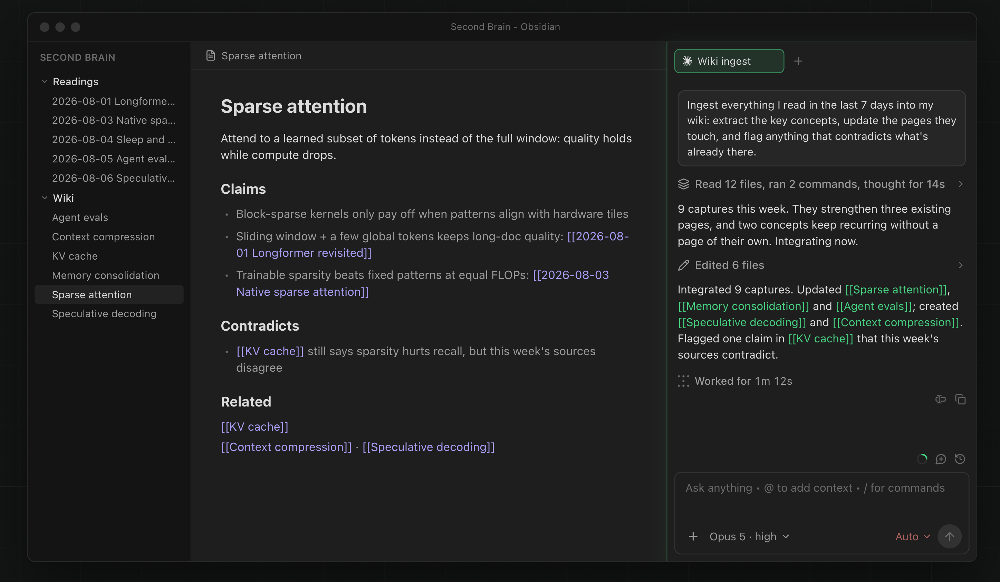
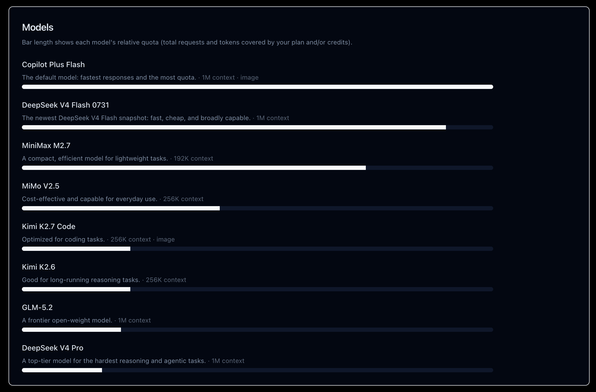

<h1 align="center">Copilot for Obsidian</h1>

<p align="center"><strong>Copilot Makes Obsidian the Knowledge Worker's IDE</strong></p>

<p align="center"><strong>Rewritten end to end. Copilot V4 puts frontier agents natively inside Obsidian.</strong></p>

<p align="center">
  <a href="https://obsidian.md/blog/2024-goty-winners/"></a>
</p>

<p align="center">
  <a href="https://obsidian.md/plugins?id=copilot"><strong>No. 1 Obsidian AI Plugin</strong></a>
</p>

<p align="center">
  
  
</p>

<p align="center">
  
</p>

<p align="center">
  <a href="https://obsidian.md/plugins?id=copilot"><strong>Install in Obsidian</strong></a> ·
  <a href="https://www.obsidiancopilot.com/en/pricing">Plans</a>
</p>

---

## Free with the AI you already pay for

Bring your own Claude or ChatGPT subscription and use Copilot for free. The plugin is open source, and each way of bringing your own AI maps to an agent that runs natively in your vault:

| You have                                                               | Copilot runs    |
| ---------------------------------------------------------------------- | --------------- |
| Claude subscription                                                    | **Claude Code** |
| ChatGPT subscription                                                   | **Codex**       |
| API keys or local models (OpenAI, Google, Ollama, LM Studio, and more) | **opencode**    |

Prefer not to juggle API keys? The new [**Lite**](https://www.obsidiancopilot.com/en/pricing) plan runs opencode on Copilot-hosted models with enterprise-grade privacy for $7.99 a month, and unlocks most paid features.

<sub>Provider terms and usage limits still apply.</sub>

## Rebuilt from the ground up

V4 is an entire rewrite. Instead of a single built-in assistant, real agents plan, search, use tools, and write results back to your notes.

- **Speaks fluent Obsidian.** Agents write wikilinks, canvases, and Markdown. The work lands in your vault and stays linked to everything around it.
- **Tabs, like a browser.** Open a different agent in each tab and work several threads at once: one summarizing a paper while another reorganizes your inbox.
- **Project Mode, scoped to the work.** Give an agent its own project, with a per-project `AGENTS.md` that steers how it behaves inside that project.
- **Quick Ask, without leaving the page.** Assign a shortcut in Hotkeys (we recommend `Ctrl/Cmd+K`) and trigger an inline, turn-by-turn window right from the note area, so you can ask a quick question without losing your place.
- **Finds that vague thought instantly.** Ask in half-remembered language and Copilot searches your vault by meaning, powered by [Miyo](https://miyo.md/), our local indexing engine.
- **Any model, zero lock-in.** OpenAI, Anthropic, Google, Ollama, LM Studio, or any OpenAI-compatible endpoint. Switch whenever you want.
- **One setup, every agent.** Add a skill once, then enable it across opencode, Claude Code, and Codex.

> **"Where's that note about attention only reading some of the tokens?"**
>
> Found it in `[[Sparse attention]]`: "Attend to a learned subset of tokens instead of the full window: quality holds while compute drops."
>
> You also captured this in `[[2026-08-03 Native sparse attention]]` and `[[2026-08-01 Longformer revisited]]`.

## One prompt, every agent

> [!IMPORTANT]
> Multi-agent collaboration is a **Copilot Plus** feature, included for Plus subscribers and Supporters.

Mention several agents in one prompt and each works it in parallel. Copilot combines their answers into a single result, so you get three perspectives for the effort of one question.

```text
@claude @codex @opencode Review my draft on sparse attention and flag claims that newer papers contradict.
```

## Pick your plan

| Plan                                                        | What you get                                                                                                                                                                                                                 |
| ----------------------------------------------------------- | ---------------------------------------------------------------------------------------------------------------------------------------------------------------------------------------------------------------------------- |
| [**Free**](https://www.obsidiancopilot.com/en/pricing)      | The full plugin with your own subscriptions, API keys, or local models: agents, Project Mode, Quick Ask, [semantic search](https://miyo.md/), and inline commands.                                                           |
| [**Lite**](https://www.obsidiancopilot.com/en/pricing)      | Our most affordable license: Copilot hosted models without API-key setup (subject to 5h and weekly quota).                                                                                                                   |
| [**Plus**](https://www.obsidiancopilot.com/en/pricing)      | Everything: 3x the token allowance of Lite, multi-agent collaboration, better web search, better PDF parsing, built-in skills like YouTube and X capture, and [Symposium](https://symposium.md/) publishing.                 |
| [**Supporter**](https://www.obsidiancopilot.com/en/pricing) | Lifetime self-host mode, two years of Plus included, lifetime [Miyo](https://miyo.md/), exclusive access to bleeding edge features in preview, and 15% extra credit forever on Copilot credit purchases from your dashboard. |

<p align="center"><a href="https://www.obsidiancopilot.com/en/pricing"><strong>Compare plans →</strong></a></p>

<p align="center">
  
</p>

<p align="center"><sub>Copilot hosted models included in your license. Find your own usage on the <a href="https://www.obsidiancopilot.com/en/dashboard/token-usage">token usage dashboard</a>.</sub></p>

## Start in three steps

1. [Install Copilot](https://obsidian.md/plugins?id=copilot) from Obsidian Community Plugins.
2. Open Copilot and choose opencode, Claude Code, or Codex.
3. Connect your subscription, API key, or local model and start working in your vault.

## Trusted by people who think for a living

> "The first tool that truly unifies how I search, organize, and retrieve knowledge without ever leaving Obsidian. My workflow is faster, deeper, and more connected. I can't imagine working without it."
>
> **Jason Zhang**, Investor & Research Analyst

<details>
<summary><strong>More from the community</strong></summary>

> "I drop meeting transcriptions, personal notes, and architecture ideas into my vault. Copilot gives me a personal assistant that finds missing puzzle pieces and surfaces relevant info during live calls, no manual searches."
>
> **Brad Decker**, CTO, Concierge Auctions

> "Since discovering Copilot, my writing process has been completely transformed. Conversing with my own articles and thoughts is the most refreshing experience I've had in decades."
>
> **Mat QV**, Professional Writer

</details>

## Frequently asked questions

<details>
<summary><strong>How is V4 different from previous versions?</strong></summary>

V4 rebuilds Copilot from scratch, with agents as the main interface instead of a single built-in assistant. Frontier agents run natively inside your vault with full tool use, and around them V4 adds tabs for parallel sessions, Project Mode with its own `AGENTS.md`, and skills you configure once and share across every agent.

</details>

<details>
<summary><strong>What does a license add?</strong></summary>

Built-in models with zero setup, multi-agent collaboration, a web-search backend built for agents, PDF parsing that preserves tables and layout, built-in skills such as YouTube and X capture, and Symposium, which publishes a note as a shareable webpage in one click. Lite covers most of these at the lowest price; multi-agent collaboration is included with Plus and Supporter.

</details>

<details>
<summary><strong>I'm a V3 user. What happens to my setup?</strong></summary>

V4 arrives as a normal plugin update. Your settings, custom prompts, API keys, and existing Copilot Plus license carry over, and Quick Ask plus vault QA keep working as before.

</details>

<details>
<summary><strong>How is my data handled?</strong></summary>

Your notes remain plain files in your vault, and the search index is stored locally. On the free tier, requests go only to the model provider you configure. Licensed features may use Brevilabs services for the processing you explicitly request. See the [disclosure below](#copilot-plus-disclosure) and the [privacy policy](https://www.obsidiancopilot.com/en/privacy).

</details>

## Help and links

[YouTube](https://www.youtube.com/@loganhallucinates) · [Report a bug](https://github.com/logancyang/obsidian-copilot/issues/new?template=bug_report.md) · [Request a feature](https://github.com/logancyang/obsidian-copilot/issues/new?template=feature_request.md) · [Privacy](https://www.obsidiancopilot.com/en/privacy)

## Support the project

If you share our vision for a powerful, portable AI agent for your second brain, consider [sponsoring Copilot on GitHub](https://github.com/sponsors/logancyang) or buying us a coffee.

<p align="center">
  <a href="https://www.buymeacoffee.com/logancyang"></a>
</p>

### Thank you to our GitHub Sponsors

Special thanks to our top sponsors: @mikelaaron, @pedramamini, @Arlorean, @dashinja, @azagore, @MTGMAD, @gpythomas, @emaynard, @scmarinelli, @borthwick, @adamhill, @gluecode, @rusi, @timgrote, @JiaruiYu-Consilium, @ddocta, @AMOz1, @chchwy, @pborenstein, @GitTom, @kazukgw, @mjluser1, @joesfer, @rwaal, @turnoutnow-harpreet, @dreznicek, @xrise-informatik, @jeremygentles, @ZhengRui, @bfoujols, @jsmith0475, @pagiaddlemon, @sebbyyyywebbyyy, @royschwartz2, @vikram11, @amiable-dev, @khalidhalim, @DrJsPBs, @chishaku, @Andrea18500, @shayonpal, @rhm2k, @snorcup, @JohnBub, @obstinatelark, @jonashaefele, @vishnu2kmohan

## Copilot Plus Disclosure

Copilot Plus is a premium product of Brevilabs LLC and is not affiliated with Obsidian. Visit [obsidiancopilot.com](https://obsidiancopilot.com/) for details.

- An account and payment are required for full access.
- Copilot Plus requires network access to provide its AI agent services.
- **Privacy and data handling:**
  - **Free tier:** Your messages and notes are sent only to your configured LLM provider, such as OpenAI, Anthropic, or Google. Nothing goes to Brevilabs servers.
  - **Plus tier:** Messages go to your configured LLM provider. File conversions, including PDF, DOCX, EPUB, and images, are processed by Brevilabs servers only when you explicitly trigger those features through `@` commands.
  - **Processing, not retention:** We process data to deliver the feature you requested, then discard it. No message content, file uploads, or documents are retained on our servers after processing.
  - **User ID:** A randomly generated UUID is sent with Plus API requests for service delivery, license abuse prevention, and rate limiting. It is not used for tracking, profiling, or analytics.
- See the [privacy policy](https://www.obsidiancopilot.com/en/privacy) for more details.
- The Copilot plugin frontend is fully open source. Backend services that facilitate AI agents are closed source and proprietary.
- We offer a full refund within 14 days of purchase if you are not satisfied.

## Authors

Brevilabs Team · [logan@brevilabs.com](mailto:logan@brevilabs.com) · [@logancyang](https://twitter.com/logancyang)
