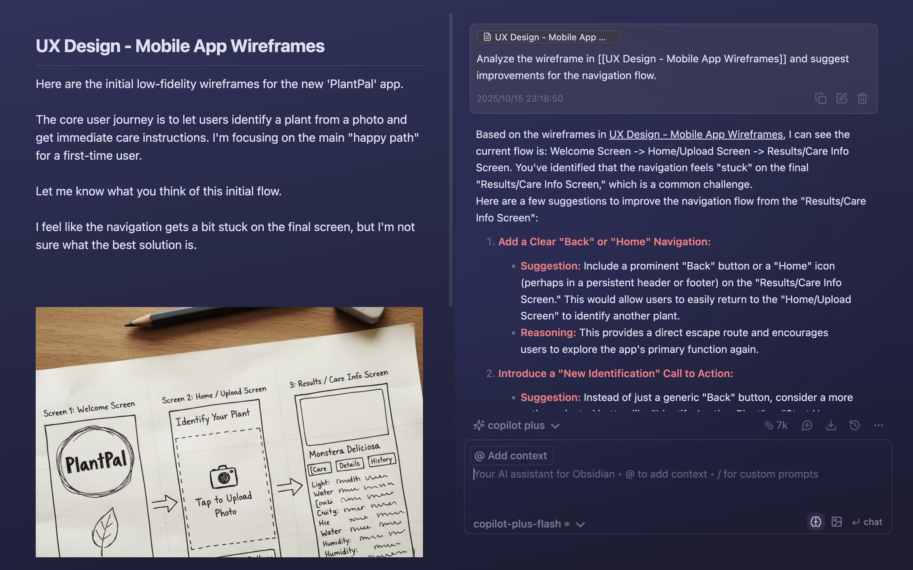
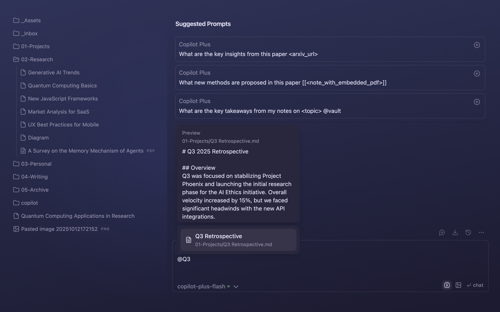
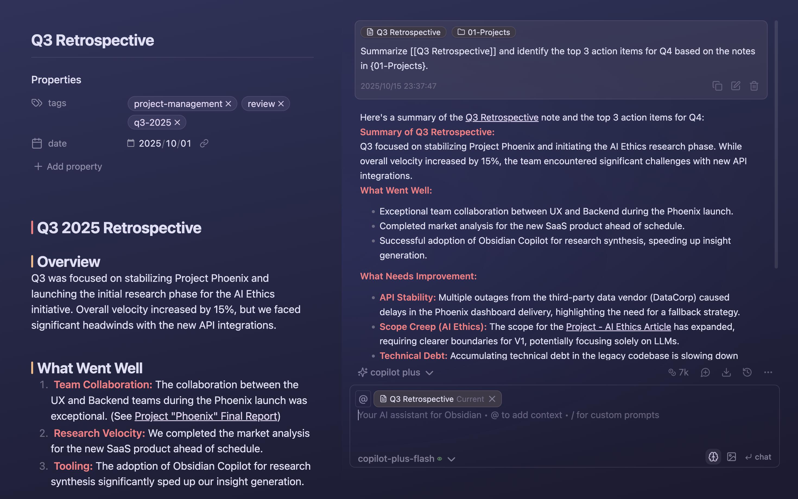
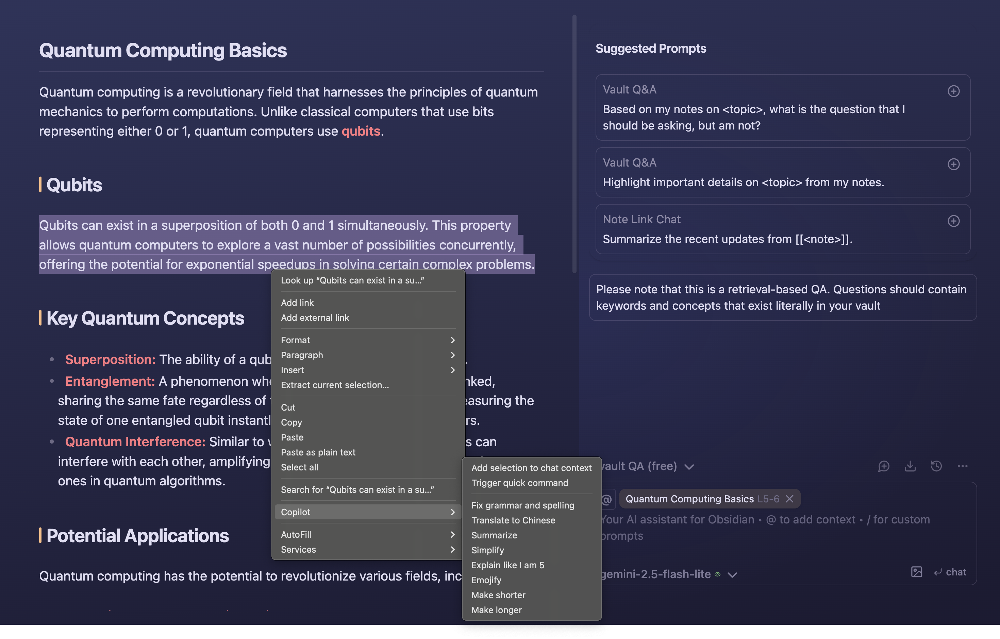
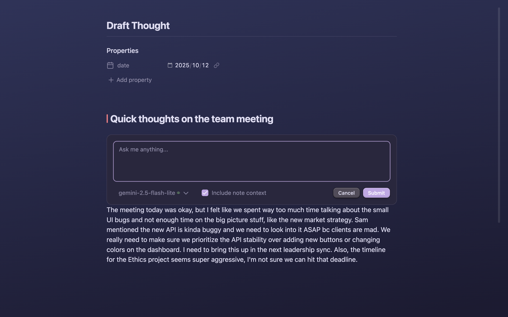
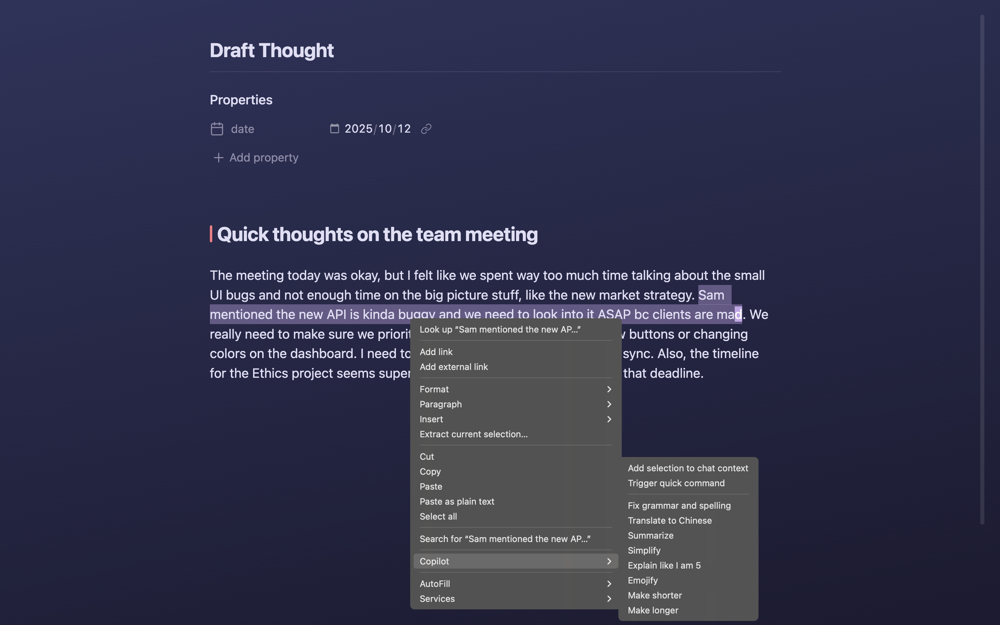
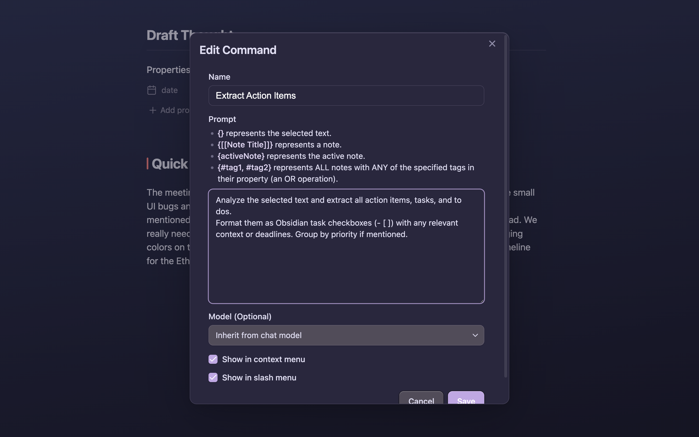
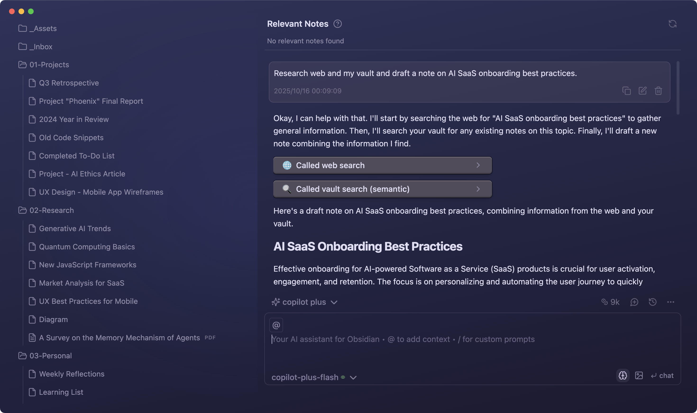
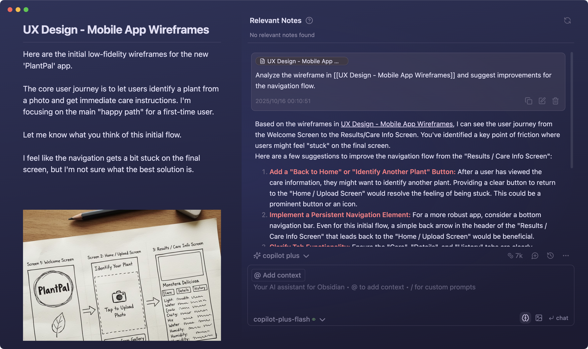

<h1 align="center">Copilot for Obsidian</h1>

<h2 align="center">
The Ultimate AI Assistant for Your Second Brain
</h2>

  
  

  <a href="https://www.obsidiancopilot.com/en/docs">Documentation</a> |
  <a href="https://www.youtube.com/@loganhallucinates">Youtube</a> |
  <a href="https://github.com/logancyang/obsidian-copilot/issues/new?template=bug_report.md">Report Bug</a> |
  <a href="https://github.com/logancyang/obsidian-copilot/issues/new?template=feature_request.md">Request Feature</a>

  

## The What

_Copilot for Obsidian_ is your in‑vault AI assistant with chat-based vault search, web and YouTube support, powerful context processing, and ever-expanding agentic capabilities within Obsidian's highly customizable workspace - all while keeping your data under **your** control.

## The Why

Today's AI giants want **you trapped**: your data on their servers, prompts locked to their models, and switching costs that keep you paying. When they change pricing, shut down features, or terminate your account, you lose everything you built.

We are building the opposite. Our goal is to create a portable agentic experience with no provider lock-in. **Data is always yours.** Use whatever LLM you like. Imagine that a brand new model drops, you run it on your own hardware, and it already knows about you (_long-term memory_), knows how to run _the same commands and tools_ you have defined over time (as just markdown files), and becomes the thought partner and assistant that you _own_. This is AI that grows with you, not a subscription you're hostage to.

This is the future we believe in. If you share this vision, please support this project!

## Key Features

- **🔒 Your data is 100% yours**: Local search and storage, and full control of your data if you use self-hosted models.
- **🧠 Bring Your Own Model**: Tap any OpenAI-compatible or local model to uncover insights, spark connections, and create content.
- **🖼️ Multimedia understanding**: Drop in webpages, YouTube videos, images, PDFs, EPUBS, or real-time web search for quick insights.
- **🔍 Smart Vault Search**: Search your vault with chat, no setup required. Embeddings are optional. Copilot delivers results right away.
- **✍️ Composer and Quick Commands**: Interact with your writing with chat, apply changes with 1 click.
- **🗂️ Project Mode**: Create AI-ready context based on folders and tags. Think NotebookLM but inside your vault!
- **🤖 Agent Mode (Plus)**: Unlock an autonomous agent with built-in tool calling. No commands needed. Copilot automatically triggers vault, web searches or any other relevant tool when relevant.

  <em>Copilot's Agent can call the proper tools on its own upon your request.</em>

  

## Table of Contents

- [Get Started](#get-started)
  - [Install Obsidian Copilot](#install-obsidian-copilot)
  - [Set API Keys](#set-api-keys)
- [Usage](#usage)
  - [Free User](#free-user)
  - [Copilot Plus/Believer](#copilot-plusbeliever)
- [Need Help?](#need-help)
- [FAQ](#️faq)

## Copilot V3 is a New Era 🔥

After months of hard work, we have revamped the codebase and adopted a new paradigm for our agentic infrastructure. It opens the door for easier addition of agentic tools (MCP support coming). We will provide a new version of the documentation soon. Here is a couple of new things that you cannot miss!

- FOR ALL USERS: You can do vault search out-of-the-box **without building an index first** (Indexing is still available but optional behind the "Semantic Search" toggle in QA settings).
- FOR FREE USERS: Image support and chat context menu are available to all users starting from v3.0.0!
- FOR PLUS USERS: **Autonomous agent** is available with vault search, web search, youtube, composer and soon a lot other tools! **Long-term memory** is also a tool the agent can use by itself starting from 3.1.0!

Read the [Changelog](https://github.com/logancyang/obsidian-copilot/releases/tag/3.0.0).

## Why People Love It ❤️

- *"Copilot is the missing link that turns Obsidian into a true second brain. I use it to draft investment memos with text, code, and visuals—all in one place. It’s the first tool that truly unifies how I search, process, organize, and retrieve knowledge without ever leaving Obsidian. With AI-powered search, organization, and reasoning built into my notes, it unlocks insights I’d otherwise miss. My workflow is faster, deeper, and more connected than ever—I can’t imagine working without it."* - @jasonzhangb, Investor & Research Analyst
- *"Since discovering Copilot, my writing process has been completely transformed. Conversing with my own articles and thoughts is the most refreshing experience I’ve had in decades.”* - Mat QV, Writer
- *"Copilot has transformed our family—not just as a productivity assistant, but as a therapist. I introduced it to my non‑technical wife, Mania, who was stressed about our daughter’s upcoming exam; within an hour, she gained clarity on her mindset and next steps, finding calm and confidence."* - @screenfluent, A Loving Husband

## Get Started

### Install Obsidian Copilot

1. Open **Obsidian → Settings → Community plugins**.
2. Turn off **Safe mode** (if enabled).
3. Click **Browse**, search for **“Copilot for Obsidian”**.
4. Click **Install**, then **Enable**.

### Set API Keys

**Free User**

1. Go to **Obsidian → Settings → Copilot → Basic** and click **Set Keys**.
2. Choose your AI provider(s) (e.g., **OpenRouter, Gemini, OpenAI, Anthropic, Cohere**) and paste your API key(s). **OpenRouter is recommended.**

**Copilot Plus/Believer**

1. Copy your license key at your [dashboard](https://www.obsidiancopilot.com/en/dashboard). _Don’t forget to join our wonderful Discord community!_
2. Go to **Obsidian → Settings → Copilot → Basic** and paste the key into in the **Copilot Plus** card.

## Usage

### Table of Contents

- [The What](#the-what)
- [The Why](#the-why)
- [Key Features](#key-features)
- [Table of Contents](#table-of-contents)
- [Copilot V3 is a New Era 🔥](#copilot-v3-is-a-new-era-)
- [Why People Love It ❤️](#why-people-love-it-️)
- [Get Started](#get-started)
  - [Install Obsidian Copilot](#install-obsidian-copilot)
  - [Set API Keys](#set-api-keys)
- [Usage](#usage)
  - [Table of Contents](#table-of-contents-1)
  - [Free User](#free-user)
    - [**Chat Mode: reference notes and discuss ideas with Copilot**](#chat-mode-reference-notes-and-discuss-ideas-with-copilot)
    - [**Vault QA Mode: chat with your entire vault**](#vault-qa-mode-chat-with-your-entire-vault)
    - [Copilot's Command Palette](#copilots-command-palette)
    - [**Relevant Notes: notes suggestions based on semantic similarity and links**](#relevant-notes-notes-suggestions-based-on-semantic-similarity-and-links)
  - [Copilot Plus/Believer](#copilot-plusbeliever)
    - [**Get Precision Insights From a Specific Time Window**](#get-precision-insights-from-a-specific-time-window)
    - [**Agent Mode: Autonomous Tool Calling**](#agent-mode-autonomous-tool-calling)
    - [**Understand Images in Your Notes**](#understand-images-in-your-notes)
    - [**One Prompt, Every Source—Instant Summaries from PDFs, Videos, and Web**](#one-prompt-every-sourceinstant-summaries-from-pdfs-videos-and-web)
- [**Need Help?**](#need-help)
- [**FAQ**](#faq)
- [**🙏 Thank You**](#-thank-you)
- [**Copilot Plus Disclosure**](#copilot-plus-disclosure)
- [**Authors**](#authors)

### Free User

#### **Chat Mode: reference notes and discuss ideas with Copilot**

Use `@` to add context and chat with your note.

    

Ask Copilot:

> _Summarize [[Q3 Retrospective]] and identify the top 3 action items for Q4 based on the notes in {01-Projects}._

    

#### **Vault QA Mode: chat with your entire vault**

Ask Copilot:

> _What are the recurring themes in my research regarding the intersection of AI and SaaS?_

    

#### Copilot's Command Palette

Copilot's Command Palette puts powerful AI capabilities at your fingertips. Access all commands in chat window via `/` or via
right-click menu on selected text.

**Add selection to chat context**

Select text and add it to context. Recommend shortcut: `ctrl/cmd + L`

    

**Quick Command**

Select text and apply action without opening chat. Recommend shortcut: `ctrl/cmd + K`

    

**Edit and Apply with One Click**

Select text and edit with one RIGHT click.

    

**Create your Command**

Create commands and workflows in `Settings → Copilot → Command → Add Cmd`.

    

**Command Palette in Chat**

Type `/` to use Command Palette in chat window.

    

#### **Relevant Notes: notes suggestions based on semantic similarity and links**

Appears automatically when there's useful related content and links.

Use it to quickly reference past research, ideas, or decisions—no need to search or switch tabs.

    

### Copilot Plus/Believer

Copilot Plus brings powerful AI agentic capabilities, context-aware actions and seamless tool integration—built to elevate your knowledge work in Obsidian.

#### **Get Precision Insights From a Specific Time Window**

In agent mode, ask copilot:

> _What did I do last week?_

    

#### **Agent Mode: Autonomous Tool Calling**

Copilot's agent automatically calls the right tools—no manual commands needed. Just ask, and it searches the web, queries your vault, and combines insights seamlessly.

Ask Copilot in agent mode:

> _Research web and my vault and draft a note on AI SaaS onboarding best practices._

    

#### **Understand Images in Your Notes**

Copilot can analyze images embedded in your notes—from wireframes and diagrams to screenshots and photos. Get detailed feedback, suggestions, and insights based on visual content.

Ask Copilot to analyze your wireframes:

> _Analyze the wireframe in [[UX Design - Mobile App Wireframes]] and suggest improvements for the navigation flow._

    

#### **One Prompt, Every Source—Instant Summaries from PDFs, Videos, and Web**

In agent mode, ask Copilot

> \*Compare the information about [Agent Memory] from this youtube video: [URL], this PDF [file], and @web[search results]. Start with your

     conclusion in bullet points in your response*

    

## **Need Help?**

- Check the [documentation](https://www.obsidiancopilot.com/en/docs) for setup guides, how-tos, and advanced features.
- Watch [Youtube](https://www.youtube.com/@loganhallucinates) for walkthroughs.
- If you're experiencing a bug or have a feature idea, please follow the steps below to help us help you faster:
  - 🐛 Bug Report Checklist
    - ☑️Use the [bug report template](https://github.com/logancyang/obsidian-copilot/issues/new?template=bug_report.md) when reporting an issue
    - ☑️Enable Debug Mode in Copilot Settings → Advanced for more detailed logs
    - ☑️Open the dev console to collect error messages:
      - Mac: Cmd + Option + I
      - Windows: Ctrl + Shift + I
    - ☑️Turn off all other plugins, keeping only Copilot enabled
    - ☑️Attach relevant console logs to your report
    - ☑️Submit your bug report [here](https://github.com/logancyang/obsidian-copilot/issues/new?template=bug_report.md)
  - 💡 Feature Request Checklist
    - ☑️Use the [feature request template](https://github.com/logancyang/obsidian-copilot/issues/new?template=feature_request.md) for requesting a new feature
    - ☑️Clearly describe the feature, why it matters, and how it would help
    - ☑️Submit your feature request [here](https://github.com/logancyang/obsidian-copilot/issues/new?template=feature_request.md)

## **FAQ**

  
<strong>Why isn’t Vault search finding my notes?</strong>

If you're using the Vault QA mode (or the tool <code>@vault</code> in Plus), try the following:

- Ensure you have a working embedding model from your AI model's provider (e.g. OpenAI). Watch this video: [AI Model Setup (API Key)](https://www.youtube.com/watch?v=mzMbiamzOqM)
- Ensure your Copilot indexing is up-to-date. Watch this video: [Vault Mode](https://www.youtube.com/watch?v=hBLMWE8WRFU)
- If issues persist, run <strong>Force Re-Index</strong> or use <strong>List Indexed Files</strong> from the Command Palette to inspect what's included in the index.
- ⚠️ <strong>Don’t switch embedding models after indexing</strong>—it can break the results.

  
<strong>Why is my AI model returning error code 429: ‘Insufficient Quota’?</strong>

Most likely this is happening because you haven’t configured billing with your chosen model provider—or you’ve hit your monthly quota. For example, OpenAI typically caps individual accounts at $120/month. To resolve:

- ▶️ Watch the “AI Model Setup” video: [AI Model Setup (API Key)](https://www.youtube.com/watch?v=mzMbiamzOqM)
- 🔍 Verify your billing settings in your OpenAI dashboard
- 💳 Add a payment method if one isn’t already on file
- 📊 Check your usage dashboard for any quota or limit warnings

If you’re using a different provider, please refer to their documentation and billing policies for the equivalent steps.

  
<strong>Why am I getting a token limit error?</strong>

Please refer to your model provider’s documentation for the context window size.

⚠️ If you set a large <strong>max token limit</strong> in your Copilot settings, you may encounter this error.

- <strong>Max tokens</strong> refers to <em>completion tokens</em>, not input tokens.
- A higher output token limit means less room for input!

🧠 Behind-the-scenes prompts for Copilot commands also consume tokens, so:

- Keep your message length short
- Set a reasonable max token value to avoid hitting the cap

💡 For QA with unlimited context, switch to the <strong>Vault QA</strong> mode in the dropdown (Copilot v2.1.0+ required).

## **🙏 Thank You**

If you share the vision of building the most powerful AI agent for our second brain, consider [sponsoring this project](https://github.com/sponsors/logancyang) or buying me a coffee. Help spread the word by sharing Copilot for Obsidian on Twitter/X, Reddit, or your favorite platform!

  

**Acknowledgments**

Special thanks to our top sponsors: @mikelaaron, @pedramamini, @Arlorean, @dashinja, @azagore, @MTGMAD, @gpythomas, @emaynard, @scmarinelli, @borthwick, @adamhill, @gluecode, @rusi, @timgrote, @JiaruiYu-Consilium, @ddocta, @AMOz1, @chchwy, @pborenstein, @GitTom, @kazukgw, @mjluser1, @joesfer, @rwaal, @turnoutnow-harpreet, @dreznicek, @xrise-informatik, @jeremygentles, @ZhengRui, @bfoujols, @jsmith0475, @pagiaddlemon, @sebbyyyywebbyyy, @royschwartz2, @vikram11, @amiable-dev, @khalidhalim, @DrJsPBs, @chishaku, @Andrea18500, @shayonpal, @rhm2k, @snorcup, @JohnBub, @obstinatelark, @jonashaefele, @vishnu2kmohan

## **Copilot Plus Disclosure**

Copilot Plus is a premium product of Brevilabs LLC and it is not affiliated with Obsidian. It offers a powerful agentic AI integration into Obsidian. Please check out our website [obsidiancopilot.com](https://obsidiancopilot.com/) for more details!

- An account and payment are required for full access.
- Copilot Plus requires network use to facilitate the AI agent.
- **Privacy & Data Handling**:
  - **Free tier**: Your messages and notes are sent only to your configured LLM provider (OpenAI, Anthropic, Google, etc.). Nothing goes to Brevilabs servers.
  - **Plus tier**: Messages go to your configured LLM provider. File conversions (PDF, DOCX, EPUB, images, etc.) are processed by Brevilabs servers only when you explicitly trigger these features via `@` commands.
  - **Processing vs. Retention**: We process your data to deliver the feature you requested, then discard it. No message content, file uploads, or documents are retained on our servers after processing.
  - **User ID**: A randomly generated UUID is sent with Plus API requests for service delivery (license abuse prevention, rate limiting) but is not used for user tracking, profiling, or analytics.
- Please see the privacy policy on the website for more details.
- The frontend code of Copilot plugin is fully open-source. However, the backend code facilitating the AI agents is close-sourced and proprietary.
- We offer a full refund if you are not satisfied with the product within 14 days of your purchase, no questions asked.

## **Authors**

Brevilabs Team | Email: logan@brevilabs.com | X/Twitter: [@logancyang](https://twitter.com/logancyang)
