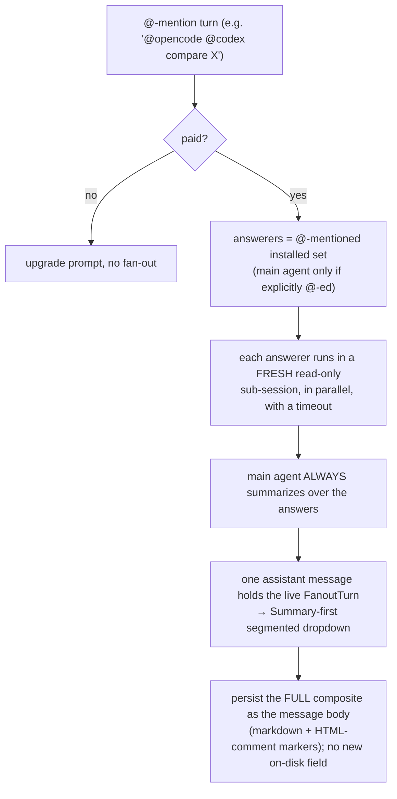
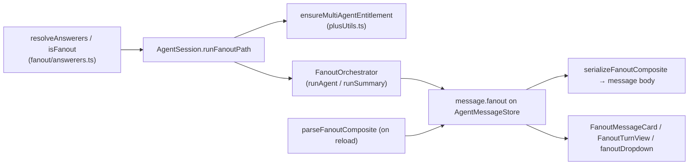

# Multi-Agent Per-Turn QA (Fan-Out) Architecture

How one `@agent`-mentioned chat turn fans out to several coding agents in
parallel, gets summarized by the session's own agent, renders as a single
switchable assistant message, persists losslessly, and is gated behind the paid
tier. This is the design and the line-by-line justification for PR #2628
(`v4-preview`), which lands the feature plus its pre-ship redesign.

> [!note]
> This doc exists because the PR is large (about 7,200 added lines). The first
> section accounts for every line so the size is auditable, not mysterious. The
> rest explains why each part is shaped the way it is, and what was deliberately
> left out to keep it from growing further.

## Why this PR is ~7,200 lines

The headline number is misleading on its own. The split:

| Bucket                                          | Added lines | Share |
| ----------------------------------------------- | ----------- | ----- |
| **Tests** (`*.test.ts` / `*.test.tsx`)          | 3,872       | 54%   |
| **Production**                                  | 3,312       | 46%   |
| _of which_ fan-out core (`session/fanout/*`)    | 1,665       | 23%   |
| _of which_ Agent-Mode UI (dropdown, card, gate) | 726         | 10%   |
| _of which_ session/store/persistence glue       | ~545        | 8%    |
| _of which_ Lexical pill + `@`-mention plumbing  | 307         | 4%    |
| _of which_ paywall (`plusUtils`, `constants`)   | 78          | 1%    |

Three things follow from this table:

1. **More than half the diff is tests.** The pure logic units (routing,
   serialization, history budgeting, the orchestrator state machine, the
   paywall) are exhaustively covered: `FanoutOrchestrator.test.ts` (1,370),
   `fanoutTypes.test.ts` (927), `AgentSession.test.ts` (733). A reviewer should
   read the diff as roughly 3.3k lines of feature with a 1.17x test multiplier,
   not 7.2k lines of feature.
2. **The production code is mostly one new, isolated subsystem.** 23% lives
   entirely under `src/agentMode/session/fanout/`, a directory that did not
   exist before. It has no inbound dependencies from the rest of the plugin
   except the few call sites in `AgentSession`. Deleting the feature is mostly
   deleting that folder.
3. **The cross-cutting edits are small and additive.** Persistence changed by
   13 lines. The store by 38. Types by 32. The paywall by 78. The feature did
   not rewrite existing subsystems; it threaded into them at minimal seams.

## What the feature does



A single turn that mentions one or more installed agents stops being a normal
single-agent turn. Each mentioned agent answers the same question independently
and in parallel, isolated in an ephemeral read-only sub-session. The session's
own agent then writes a narrative summary over those answers. The whole thing
renders as one assistant message with a Summary-first tab row that switches
between the summary and each agent's full answer.

## Pipeline and the modules that own each stage



| Stage              | Module                                                    | Responsibility                                                                                   |
| ------------------ | --------------------------------------------------------- | ------------------------------------------------------------------------------------------------ |
| Routing            | `fanout/answerers.ts`                                     | `resolveAnswerers` / `isFanout`: turn the `@`-mention set into the answerer list. UI-free, pure. |
| Entitlement        | `plusUtils.ts`                                            | `canUseMultiAgent` (sync) + `ensureMultiAgentEntitlement` (backend re-check). Two layers.        |
| Orchestration      | `fanout/FanoutOrchestrator.ts`                            | Fan-out state machine: per-agent sub-sessions, timeouts, cancel, then the summary pass.          |
| Turn data + format | `fanout/fanoutTypes.ts`                                   | `FanoutTurn` / `AgentAnswer` types, serialize/parse/render composite, history budgeting.         |
| Live state         | `AgentMessageStore` (`setFanout`)                         | Holds `message.fanout`, bumps a version per streamed tick so the memoized view re-renders.       |
| Render             | `FanoutMessageCard` + `FanoutTurnView` + `fanoutDropdown` | Segmented tabs, Summary-first, per-tab live status, 2-tier copy/insert.                          |
| Persistence        | `AgentChatPersistenceManager` + serializer                | The composite markdown body IS the saved form; no schema change.                                 |
| Input plumbing     | Lexical `AgentPillNode` + `@`-mention hooks               | `@agent` pills in the composer, gated for free users.                                            |

## Key decisions and why

These mirror the approved design session (`.otacon/otc_w1hgyh/plan.md`,
decisions D1 to D13). The ones that drove the most code:

### Routing: the main agent summarizes, it does not also answer (D1, D3)

Original behavior had the session's agent answer alongside the mentioned agents,
which was confusing ("if my session is Claude and I `@opencode`, why do I get a
Claude answer too?"). Now `resolveAnswerers` returns only the mentioned installed
set; the summarizer is always the session's main agent, tracked separately. A
lone `@main` mention collapses back to the normal single-agent path (D2), so the
feature never doubles a plain turn. This split is small in code but it rippled
through every fan-out test that assumed `mainAgent === answerers[0]`, which is a
chunk of the test delta.

### One message object holds its sub-responses (D4)

The live `FanoutTurn` rides directly on the assistant message
(`message.fanout?`), in memory only. The render branch keys on that field
instead of the previous `liveFanoutTurn` getter plus an `id`-match side-channel
in `AgentChatMessages`. Result: the dropdown, whole-response copy/insert, and
reload all read one object, and there is exactly one source of truth for the
turn.

### Persistence is the message body, backward-compatible by construction (D5)

> [!decision]
> The full composite is serialized AS the `message` body: plain markdown with
> HTML-comment section markers. There is NO new on-disk field and NO migration.

```
<!--copilot:multi-agent v=1-->
<!--copilot:summary-->
### Summary
{summary markdown}
<!--copilot:agent id="opencode" name="opencode" status="done"-->
### opencode
{opencode answer markdown}
<!--copilot:agent id="codex" status="error" note="did not answer"-->
<!--copilot:multi-agent-end-->
```

Why this shape:

- **HTML comments are invisible in every markdown renderer.** An older build, a
  plain export, or any unaware loader shows clean `### Summary` / `### opencode`
  headings with content. Nothing breaks.
- **The parser keys only on the markers**, not the cosmetic headings, so the
  round-trip is exact. `parseFanoutComposite` returns `null` for any body with no
  markers, so every pre-existing transcript renders exactly as before.
- **The one sharp edge** is answer text that literally contains `<!--copilot:`.
  It is escaped on write and restored on read, covered by a round-trip test. The
  same escaping neutralizes `--`, `"`, and `>` inside marker attributes so
  backend-controlled text (an agent error string) cannot break the framing.

This is the single most-scrutinized area and explains a large share of
`fanoutTypes.test.ts`: every persistence edge (partial text, terminal/cancelled
slots, the full-wrapper guard, attribute escaping, the answer cap) has a test.

### Isolation, timeouts, and caps are not optional (orchestrator + budgets)

Each answerer runs in a **fresh, read-only sub-session**: no writes, no exec, no
shared history mutation. That read-only enforcement is the reason
`permissionPrompter` exists and why it auto-denies write/exec for sub-sessions
without surfacing a user card (sub-sessions have no tab to prompt on). Every
agent has a hard per-attempt timeout (`FANOUT_AGENT_TIMEOUT_MS`); a hung backend
cannot stall the turn. Several char caps bound model input and the saved
transcript:

| Cap                                 | Bounds                          | Why                                            |
| ----------------------------------- | ------------------------------- | ---------------------------------------------- |
| `FANOUT_SUMMARY_ANSWER_MAX_CHARS`   | answers fed INTO the summary    | N answers stack into one prompt; avoid blowup. |
| `FANOUT_PERSISTED_ANSWER_MAX_CHARS` | each answer ON disk             | N agents x long answers grow the transcript.   |
| `FANOUT_HISTORY_MAX_CHARS`          | the replayed conversation block | Each sub-session carries the whole prior chat. |

A fan-out turn runs on ephemeral sub-sessions the visible backend never saw, so
the question and the summary are buffered (`pendingFanoutContext`) and replayed
as a labeled prior-turn block on the next single-agent prompt, to keep
continuity.

### The summary prompt is adaptive (two modes)

`FANOUT_SUMMARY_INSTRUCTION` attributes per agent in the third person
("opencode says...", never "I am..."), with explicit agreements/disagreements
sections in ANSWER mode, and an options/recommendation shape in DELIVERABLE mode
(rewrite/generative asks). This was iterated against live testing; the prompt is
the product surface users read, so it earned the words.

### Paywall is two real layers, not a prompt (D9, D10)

Multi-agent is paid-only (Plus / lifetime today; lite / pro later). Enforcement
is programmatic:

1. **UI layer:** free users get an empty agent-brand list, so the `@agent`
   typeahead group never renders and no pill can be inserted.
2. **Boundary layer:** if a turn still carries `@agent` pills, the session
   re-verifies entitlement. Paying users (cached `isPlusEnabled()`) skip the
   network call entirely; only the free/stale path hits the backend `/license`
   check, and a denial blocks the fan-out and shows an upgrade prompt.

The backend `plan` field leaves room to tighten per tier later without touching
call sites.

## Why the Lexical / pill plumbing (307 lines) is here

`@agent` mentions are real editor entities, not text matching. That requires a
custom `AgentPillNode`, a sync plugin to keep pills consistent, `@`-mention
category/search hooks that surface installed agents, and small `lexicalTextUtils`
changes so a pill serializes back to `@id` in the outgoing prompt. This is the
irreducible cost of first-class mention pills in a Lexical editor; it is small
and self-contained.

## Test strategy (why 3,872 test lines)

The feature is mostly pure, stateful logic with many terminal states (done,
error, cancelled, timed-out, empty, partial-then-cancel) crossed with several
consumers (live render, summary input, persisted body, replayed history). That
product of states is where bugs hide, so each pure unit is tested directly:

- `fanoutTypes.test.ts` (927): serialize/parse round-trips, marker escaping, the
  full-wrapper guard, every cap, history budgeting.
- `FanoutOrchestrator.test.ts` (1,370): the state machine, parallelism, per-agent
  timeout, cancel/abort ordering, the summary pass, failed-agent omission.
- `AgentSession.test.ts` (733): the dispatch decision, the entitlement gate,
  replay buffering, completion vs interruption.

Pure functions were extracted specifically so they could be tested without the
heavy `ContextManager` import chain. The test-to-production ratio is high on
purpose: this subsystem decides what gets shown and saved, and a silent
regression there loses user content.

## Out of scope (kept deliberately small)

- **Per-agent model choice at query time** (preview#177): answerers use their
  backend default. Filed separately.
- **No migration / no new persisted schema.** The body-as-composite decision was
  chosen precisely to avoid a versioned settings migration.
- **No silent single-agent fallback for free users.** A blocked send is a hard
  stop with an upgrade prompt; the fallback (strip mentions, run main) is a
  one-line change at the same chokepoint if testing shows the hard stop is too
  punitive.

## Where to start reading

1. `src/agentMode/session/fanout/answerers.ts` (48 lines): the routing contract.
2. `src/agentMode/session/fanout/fanoutTypes.ts`: types + serialize/parse/render.
3. `src/agentMode/session/fanout/FanoutOrchestrator.ts`: the state machine.
4. `src/agentMode/session/AgentSession.ts` (`runFanoutPath`): the integration seam.
5. `src/agentMode/ui/FanoutTurnView.tsx` + `fanoutDropdown.ts`: the render.
6. `src/plusUtils.ts`: the two-layer gate.
   </content>
