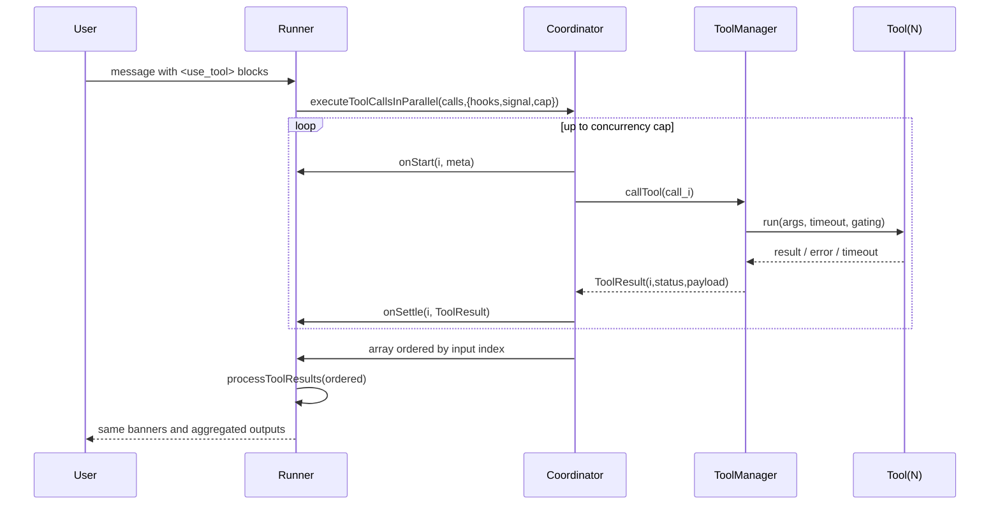

# Architecture v0.2 — Parallel Tool Execution (Brownfield: Service/API)

Date: 2025-09-27
Status: Draft (post document-project, aligned to PRD v0.2)

## 0) Summary

Introduce a concurrency coordinator in `toolExecution.ts` and switch both runners to use it. Keep XML `<use_tool>` protocol, deterministic ordered aggregation, and existing marker semantics. Add a feature flag and a concurrency cap. Primary benefit: parallel web searches and other I/O tools with no downstream contract drift.

## 1) Decisions (ADR)

- **ADR‑1**: Add `executeToolCall` core and `executeToolCallsInParallel` scheduler (cap default 4).
- **ADR‑2**: Preserve textual protocol and output ordering; no schema changes.
- **ADR‑3**: Runners integrate via hooks (`onStart`, `onSettle`) to update banners.
- **ADR‑4**: Abort stops new starts and suppresses UI mutations; in‑flight calls settle.
- **ADR‑5**: Optional telemetry for latency, errors, timeouts, wall time.

## 2) Context & Constraints

- Downstream requires ordered results aligned to input indices.
- Stream handling depends on `</use_tool>` boundaries.
- Timeout and Plus gating live in existing single‑call logic.
- Background tools remain non‑visible in UI.

## 3) Logical Architecture

```
[Autonomous Runner] ─┐
[Copilot+ Runner] ───┼──▶ [Coordinator (parallel; capped)] ─▶ [Ordered Results]
                     │
                     └──▶ hooks: onStart / onSettle / signal
Ordered Results ─▶ processToolResults ─▶ memory/user messages (unchanged)
ToolManager.callTool + timeouts/gating (unchanged)
```

Mermaid sequence:



## 4) Interfaces (TypeScript)

```ts
export interface ToolCall {
  index: number; // input position
  id?: string; // stable tool-call id (if available)
  name: string;
  args: unknown;
  background?: boolean;
  timeoutMs?: number;
}

export type ToolStatus = "ok" | "error" | "timeout" | "cancelled";

export interface ToolResult {
  index: number;
  name: string;
  status: ToolStatus;
  payload?: unknown;
  error?: string;
}

export interface ExecHooks {
  onStart?: (index: number, meta: { name: string; background?: boolean }) => void;
  onSettle?: (index: number, result: ToolResult) => void;
}

export interface ExecOptions {
  concurrency?: number; // default 4
  signal?: AbortSignal;
  hooks?: ExecHooks;
}
```

## 5) Coordinator Design

### 5.1 Scheduling

- Concurrency‑limited queue (cap default **4**, clamp 1..10).
- Round‑robin fairness: start in index order; refill as each settles.
- Stable ordering: results stored at `results[call.index]`.

### 5.2 Pseudocode

```ts
async function executeToolCallsInParallel(calls: ToolCall[], opts: ExecOptions = {}) {
  const { concurrency = 4, signal, hooks } = opts;
  const results: ToolResult[] = new Array(calls.length);
  let inFlight = 0,
    next = 0;

  const startOne = () => {
    if (signal?.aborted) return;
    if (next >= calls.length) return;
    const i = next++;
    const c = calls[i];
    hooks?.onStart?.(i, { name: c.name, background: c.background });
    inFlight++;
    executeToolCall(c, { signal })
      .then((r) => r)
      .catch((e) => ({ index: i, name: c.name, status: "error", error: String(e) }))
      .then((r) => {
        results[i] = r;
        hooks?.onSettle?.(i, r);
      })
      .finally(() => {
        inFlight--;
        pump();
      });
  };

  const pump = () => {
    if (signal?.aborted) return;
    while (inFlight < concurrency && next < calls.length) startOne();
    if (next >= calls.length && inFlight === 0) resolve(results);
  };

  return await new Promise<ToolResult[]>((resolve) => {
    pump();
  });
}
```

### 5.3 Error, Timeout, Cancel

- Use existing single‑call path for timeouts, gating, and normalization.
- Map failures to `{status:"error"| "timeout", error}`.
- On abort: do not start new calls; suppress UI updates after abort; still capture final results for logs.

## 6) Runner Integration

### 6.1 Autonomous

- Parse `<use_tool>` as today.
- Pre‑register markers for non‑background tools.
- Call coordinator with hooks:
  - `onStart` → mark “starting …”
  - `onSettle` → success/timeout/error update
- Pass ordered results to `processToolResults` (no formatting change).

### 6.2 Copilot+

- Replace sequential loop with coordinator.
- Keep `localSearch` post‑processing and exact prompt/context assembly.

## 7) Config & Feature Flags

```json
{
  "parallelToolCalls": {
    "enabled": false,
    "concurrency": 4
  }
}
```

- Read at runner init. Disable → fall back to existing sequential path.

## 8) Observability

- Spans: `tool.start`, `tool.settle` with latency, status, timeout flag.
- Turn metrics: total wall time, peak concurrency, rate‑limit events.
- Log correlation via tool `id` when available.

## 9) Performance Targets

- For 10 parallelizable web searches: ≥40% median wall‑time reduction vs sequential in synthetic tests.
- CPU overhead negligible (I/O‑bound). Memory bounded by payload sizes.

## 10) Security & Privacy

- No new data surfaces. Same inputs/outputs. Respect existing redaction and logging policies.

## 11) Backward Compatibility

- Protocol unchanged. Ordered aggregation preserved.
- UI markers identical in content; only timing of updates differs.
- Final prompt/context strings remain byte‑identical for equal inputs/results.

## 12) Testing Strategy

- **Unit (utils):** ordering with staggered latencies; timeout propagation; error mapping; abort behavior; cap boundaries.
- **Integration (runners):** 5–10 mixed tools; marker updates per settle; final string equality to sequential; `localSearch` parity.
- **Snapshot:** assembled prompt/context equality.
- **Chaos:** randomized failures/timeouts; verify partial success and non‑blocking behavior.

## 13) Rollout

1. Land utils and flag.
2. Adopt in Autonomous, then Copilot+.
3. Enable for internal cohort (cap=4).
4. Observe metrics; adjust cap.
5. Default ON.

## 14) Open Questions

- Default cap **4** or **6** for current quotas?
- Priority scheduling for visible vs background tools?
- Emit tool `id` across runs for better correlation?
