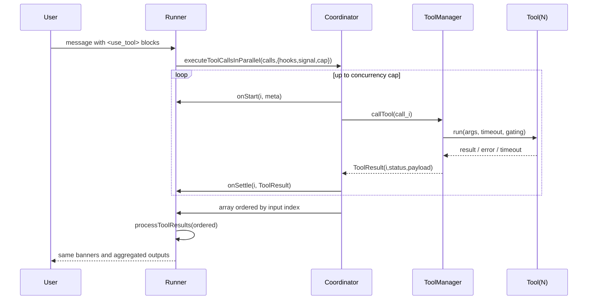

# 3) Logical Architecture

```
[Autonomous Runner] ─┐
[Copilot+ Runner] ───┼──▶ [Coordinator (parallel; capped)] ─▶ [Ordered Results]
                     │
                     └──▶ hooks: onStart / onSettle / signal
Ordered Results ─▶ processToolResults ─▶ memory/user messages (unchanged)
ToolManager.callTool + timeouts/gating (unchanged)
```

Mermaid sequence:


