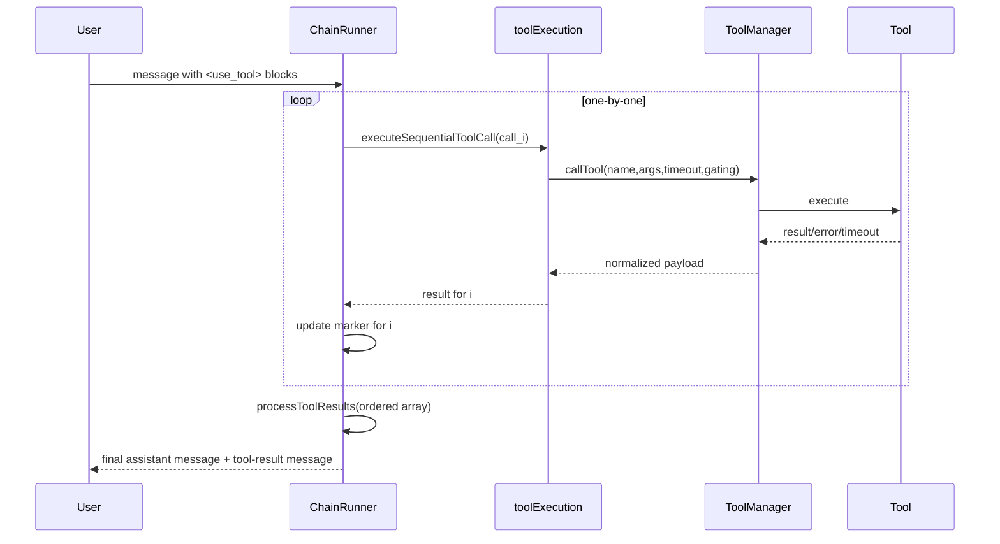

# Document-Project — Baseline (Brownfield: Service/API)

Date: 2025-09-27

## 0) Purpose

Capture the current architecture, contracts, and runtime behavior to serve as the baseline before introducing parallel tool execution.

## 1) System Overview

- **Domain:** Obsidian Copilot agentic runtime with tool calls emitted via textual XML blocks `<use_tool>…</use_tool>` embedded in assistant output.
- **Runners:**
  - `AutonomousAgentChainRunner` — drives autonomous tool-using loops.
  - `CopilotPlusChainRunner` — prepares pre‑chat context and orchestrates Copilot Plus tools.
- **Tool Execution Utility:** `toolExecution.ts` centralizes validation, Plus gating, and timeout control.
- **Streaming & Truncation:** `ThinkBlockStreamer` scans for closing `</use_tool>` tags to delineate tool blocks for UI streaming.
- **Post‑processing:** `processToolResults` in `toolResultUtils.ts` merges ordered tool outputs into the assistant’s next message, memory, and user‑facing tool‑result payloads.

> Baseline behavior: **sequential execution** of tool calls per turn. Results are consumed in **input order**. Banners/markers reflect start → complete per tool.

## 2) Key Components

- **Runners**
  - `src/LLMProviders/chainRunner/AutonomousAgentChainRunner.ts`
  - `src/LLMProviders/chainRunner/CopilotPlusChainRunner.ts`
- **Execution utilities**
  - `src/LLMProviders/chainRunner/utils/toolExecution.ts` (sequential helper and core policies)
  - `src/LLMProviders/chainRunner/utils/ThinkBlockStreamer.ts` (text streaming and block detection)
- **Result assembly**
  - `src/utils/toolResultUtils.ts` (ordered aggregation and prompt/context formatting)
- **Tool layer**
  - `ToolManager.callTool(...)` and individual tools like `webSearch`, `localSearch`, `youtube`, and vault tools.

## 3) Current Control Flow (Sequential)

## 4) Contracts & Invariants

- **Protocol:** textual XML blocks `<use_tool>`…`</use_tool>`; **no schema changes allowed** in baseline.
- **Ordering:** downstream assumes **result[i] corresponds to call[i]**.
- **Visibility:** background tools **do not** produce markers; visible tools must.
- **Timeout & gating:** enforced by the execution utility, not by the runners.
- **Streaming:** UI delimiters rely on `</use_tool>` detection; tool results must align to the parsed call order.

## 5) Configuration (Today)

- Per‑tool timeouts in execution utility.
- Plus gating enforced centrally.
- No concurrency switches exposed.
- Tool‑level special‑cases: e.g., `localSearch` post‑processing in Copilot Plus path.

## 6) External Dependencies

- LLM chat providers and their rate limits.
- Web search and other network tools with provider quotas.
- Obsidian plugin environment and UI event loop.

## 7) Observability (Today)

- Console logs and per‑tool messages.
- No unified telemetry for per‑tool latency or per‑turn wall time.

## 8) Risks, Constraints, Known Gaps

- **Throughput bottleneck:** sequential loop causes wall‑time equal to the slowest sum of tools.
- **Order coupling:** downstream formatting assumes input‑order stability.
- **Streaming coupling:** stream truncation coupled to textual markers makes protocol changes high‑risk.
- **Rate limits:** bursts of sequential web calls still at risk; no backoff policy documented.
- **Tests:** limited coverage for staggered latency or chaos scenarios.

## 9) Performance Baseline Plan

- **Goal metric:** Wall‑time per turn for N parallelizable `webSearch` calls.
- **Method:** Synthetic tool stubs with latencies in [100ms..1500ms]. Compare sequential vs. capped concurrency (dry run).
- **Target pre‑change:** Record median and p95 wall‑time and per‑tool latency distributions.
- **Artifact:** `perf/baseline-parallelization.md` plus raw logs.

## 10) Open Questions

1. What concurrency cap aligns with provider API quotas for `webSearch`?
2. Any tools with hidden dependencies between calls within a single turn?
3. Should markers display partial progress for multi‑stage tools?

## 11) Assets Index (for reference)

- `src/LLMProviders/chainRunner/AutonomousAgentChainRunner.ts`
- `src/LLMProviders/chainRunner/CopilotPlusChainRunner.ts`
- `src/LLMProviders/chainRunner/utils/toolExecution.ts`
- `src/LLMProviders/chainRunner/utils/ThinkBlockStreamer.ts`
- `src/utils/toolResultUtils.ts`

---

**Status:** Baseline captured. Treat PRD and Architecture as **draft** until this document is approved.
