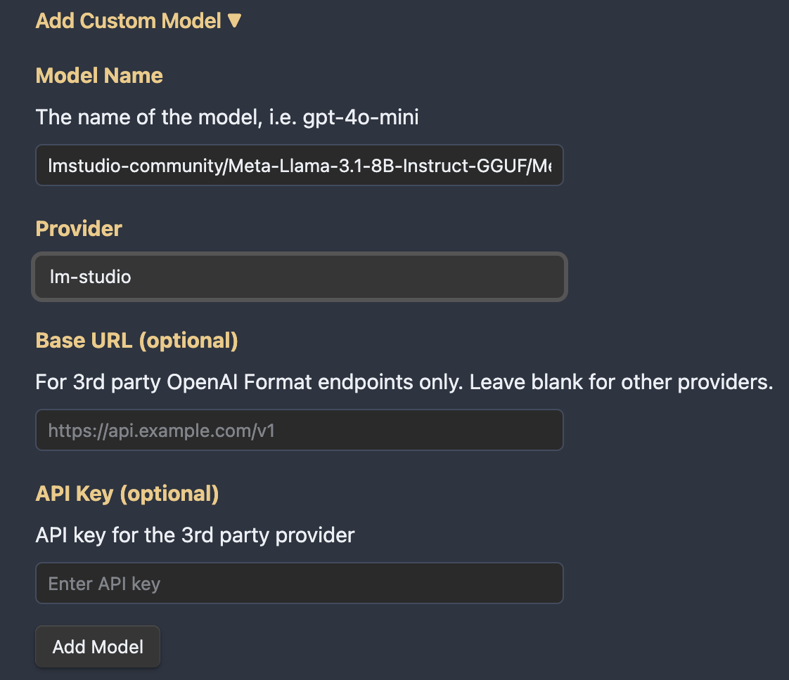

# Local Copilot Setup Guide

## LM Studio

[LM Studio](https://lmstudio.ai/) has the best UI for running local models, it has support for Apple Silicon, Windows, and Linux (in beta). After you download the correct version of LM Studio to your machine, the first thing is to download a model. Find something small to start with, such as Mistral 7B, and work your way up if you have a beefy machine.

A rule of thumb to determine how large a model you can run:
- If you are on an Apple Silicon Mac, look at your RAM
- If you are on a Windows PC with a GPU, look at your VRAM.

After you set your model and preset, you are free to test it out in LM Studio's Chat tab, making sure everything is working. Now you can find the Local Server tab, make sure you have `CORS` enabled, turn on hardware acceleration based on the type of device you have, and click Start Server. This will enable Copilot for Obsidian to access it.

Notice that LM Studio doesn't require the user to do anything in the terminal whatsoever. It is the most user-friendly way to run local models on the market now!

Here's an example for Apple Metal macs. I can run 7B models blazingly fast on my tiny Macbook Air M1 2020 with 16GB RAM!

Pick LM STUDIO (LOCAL) in the model dropdown, and start chatting!

## Ollama

[Ollama](https://ollama.ai/) currently supports Mac and Linux, they mentioned that Windows is coming soon.

Go to their website, download, install Ollama and its command line tool on your machine.

You can download your model by running either `ollama run <model_name>` or `ollama pull <model_name>` in your terminal. The default model is Llama 2 7B. But here let me use Mistral 7B as an example again.

The `ollama run mistral` command downloads and starts a chat with Mistral 7B right inside the terminal. But that is not what we want. We want a local server for our plugin.

Now, **start the local server with `OLLAMA_ORIGINS=app://obsidian.md* ollama serve`, this will allow the Obsidian app to access the local server without CORS issues**.

Inside Copilot settings, enter `mistral` under Ollama model

Pick OLLAMA (LOCAL) in the model dropdown and start chatting!

#### Now, go crazy with local models using your custom prompts!