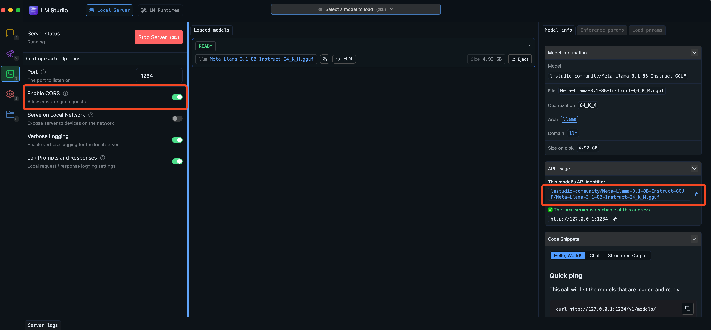

# Local Copilot Setup Guide

## LM Studio

[LM Studio](https://lmstudio.ai/) has the best UI for running local models, it has support for Apple Silicon, Windows, and Linux. After you download the correct version of LM Studio to your machine, the first thing is to download a model. Find something small to start with, such as Mistral 7B, and work your way up if you have a beefy machine.

A rule of thumb to determine how large a model you can run:

- If you are on an Apple Silicon Mac, look at your RAM
- If you are on a Windows PC with a GPU, look at your VRAM.

After you set your model and preset, you are free to test it out in LM Studio's Chat tab, making sure everything is working. Now you can find the Local Server tab, make sure you have `CORS` enabled, turn on hardware acceleration based on the type of device you have, and click Start Server. This will enable Copilot for Obsidian to access it.

Notice that LM Studio doesn't require the user to do anything in the terminal whatsoever. It is the most user-friendly way to run local models on the market now!

Here's an example for Apple Metal macs. I can run 7B models blazingly fast on my tiny Macbook Air M1 2020 with 16GB RAM!



In Copilot settings, select Add Custom Model, paste the model name from LM Studio, select `lm-studio` as provider, click add, and you'll find it in your model picker!


## Ollama

[Ollama](https://ollama.ai/) currently supports Mac, Linux and Windows.

Go to their website, download, install Ollama and its command line tool on your machine.

You can download your model by running either `ollama run <model_name>` or `ollama pull <model_name>` in your terminal. The default model is Llama 2 7B. But here let me use Mistral 7B as an example again.

The `ollama run mistral` command downloads and starts a chat with Mistral 7B right inside the terminal. But that is not what we want. We want a local server for our plugin.

#### Important note about setting context window

AFAIK `ollama serve` doesn't have a consolidated way to configure context window for all the models at a single place. The current best way is to run `ollama run <modelname>` and then `/set parameter num_ctx 32768` (this is the max for Mistral, set it based on your model requirement), and don't forget to `/save <modelname>` for each model individually.

Remember that you MUST set this parameter for Ollama models, or they will silently fail and you will think your long prompt successfully reached the model!

Look for this parameter `llama_new_context_with_model: n_ctx` in your server log, it is your true context window setting:


#### Start Ollama server for Obsidian

In order for Obsidian to communicate with Ollama, the `OLLAMA_ORIGINS` variable needs to be updated. Choose your method for running Ollama to get detailed instructions for how to update Ollama correctly.

<details>
<summary>CLI</summary>

Now, **start the local server with `OLLAMA_ORIGINS=app://obsidian.md* ollama serve`, this will allow the Obsidian app to access the local server without CORS issues**.

> **NOTE**: If using `fish`, quote the env value: `OLLAMA_ORIGINS="app://obsidian.md*" ollama serve`

Again, `OLLAMA_ORIGINS=app://obsidian.md*` is required!

</details>

<details>
<summary>macOS App</summary>

If Ollama is run as a macOS application, [environment variables should be set using launchctl](https://github.com/Ollama/Ollama/blob/main/docs/faq.md#setting-environment-variables-on-mac). To support Obsidian, set "app://obsidian.md*" on the `OLLAMA_ORIGINS` variable by running this command:

```sh
launchctl setenv OLLAMA_ORIGINS "app://obsidian.md*"
```

Then, quit Ollama from the menu bar and reopen it.

</details>


Inside Copilot settings, click Add Custom Model, enter the model name you pulled from Ollama, e.g. `mistral`, select `ollama` as provider, click add, and you'll find it in your model picker!


#### Ollama for Windows (Preview)

Ollama has released a Windows preview version! Just download it to your Windows machine, open your PowerShell, and

```
ollama pull <model>
# Remember to close the Ollama app first to free up the port
$env:OLLAMA_ORIGINS="app://obsidian.md*"; ollama serve
```

If you want to use CMD, type the following commands

```
ollama pull mistral
ollama pull nomic-embed-text
# Remember to close the Ollama app first to free up the port
set OLLAMA_ORIGINS=app://obsidian.md*
ollama serve
```

## Ollama for Local Embeddings

Ollama has added support for local embeddings for RAG since v0.1.26! It's super easy to setup, just run

```
ollama pull nomic-embed-text
```

and start your local Ollama server as before. Now you can add your Ollama embedding model in Copilot QA settings as `nomic-embed-text` with provider `ollama`, and it will use your local embeddings!

With this one Ollama server running, you can set your Chat model as Ollama too, meaning it handles both chat streaming and embedding! You can then have a **completely offline QA** experience!

Check Ollama for more embedding models, e.g. `mxbai-embed-large` is a better model than `nomic-embed-text` for vector search.

#### Now, go crazy with local models in Chat mode and QA modes!
