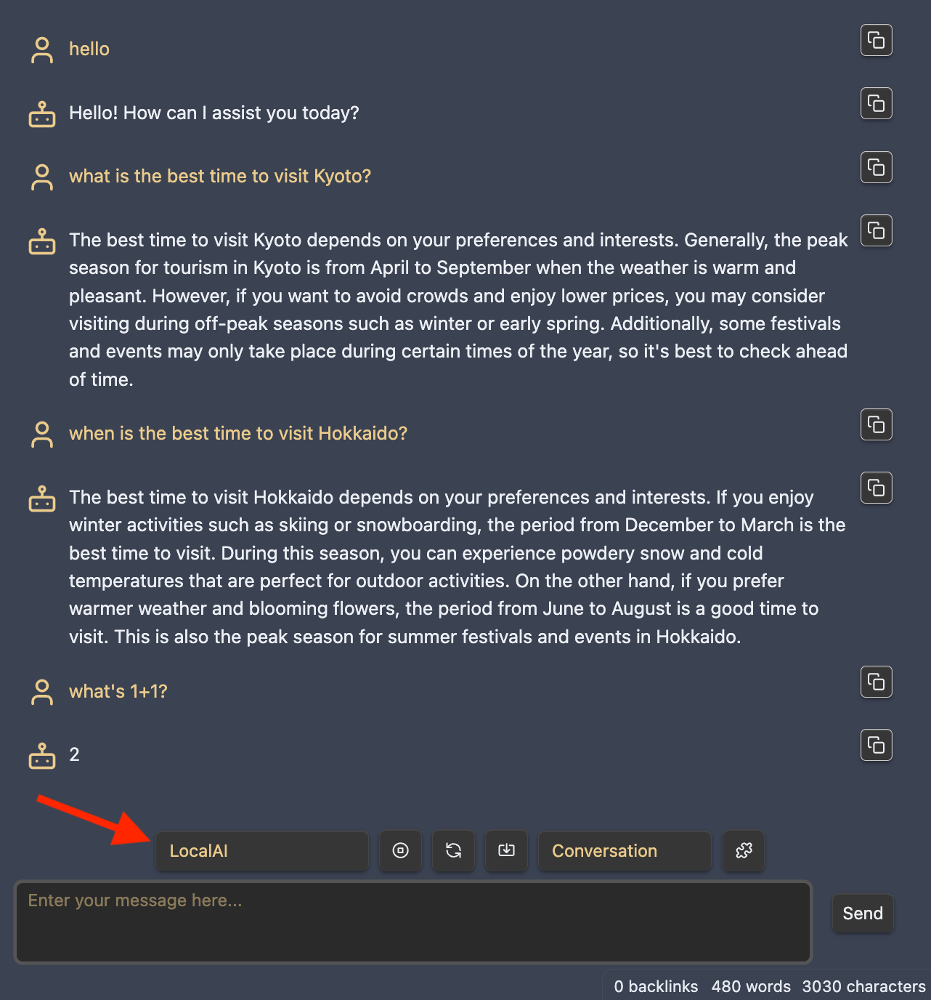

# How to setup Local Copilot

Local Copilot is powered by [LocalAI](https://github.com/go-skynet/LocalAI), a community-driven local OpenAI API replacement.

First, you need to be able to run LocalAI server locally on your device. Make sure you have some decent hardware! Refer to [this guide](https://www.reddit.com/r/LocalLLaMA/comments/11o6o3f/how_to_install_llama_8bit_and_4bit/) to check system requirements. I recommend testing with smaller models first. But keep in mind, smaller models could hallucinate more and may not give you satisfactory results for some use cases. If you have the hardware, try larger models variants!

## How to setup LocalAI on Apple Silicon
First, make sure in your terminal, `arch` shows `arm64` and not `i386`. The latter is Rosetta. If you are running Rosetta, find your terminal app and right click, find Get Info window and **uncheck "Open using Rosetta"**.

```bash
# install build dependencies
# make sure arch shows arm64, you are not running terminal in Rosetta
# and your brew is installed for Apple Silicon, not x86! (I tripped here)
# `/opt/homebrew/` should not be empty. If it is, reinstall homebrew.
brew install cmake
brew install go

# clone the repo
git clone https://github.com/go-skynet/LocalAI.git

cd LocalAI

# build the binary
make BUILD_TYPE=metal build

# Start localai with model gallery with CORS enabled
GALLERIES='[{"name":"model-gallery", "url":"github:go-skynet/model-gallery/index.yaml"}, {"url": "github:go-skynet/model-gallery/huggingface.yaml","name":"huggingface"}]' ./local-ai --models-path ./models/ --debug --cors
```

(Here's the original [localAI guide](https://localai.io/basics/build/#build-on-mac) I referred to. I added some more details for the errors I saw when I set it up on my M1 Macbook Air. Hope this helps!)

## How to setup LocalAI on Windows WSL (Linux)
First make sure you have WSL installed and running. Follow [this guide](https://learn.microsoft.com/en-us/windows/wsl/install) if you don't have WSL. Then in your WSL terminal:

```bash
# https://localai.io/basics/getting_started/
git clone https://github.com/go-skynet/LocalAI

cd LocalAI

# (optional) Checkout a specific LocalAI tag
# git checkout -b build <TAG>

# (optional) Edit the .env file to set things like context size and threads
# vim .env

# Before this step: install Docker!
# As I'm on WSL, I did not install Docker Desktop because I had trouble
# using it for WSL. Instead, I installed Docker for WSL directly.
# `sudo service docker restart` and `sudo service docker status` to make sure
# Docker is running. Then do
docker pull quay.io/go-skynet/local-ai:latest
```

Set the `GALLERIES` env variable to load models from model-gallery. Edit `.env` file and uncomment the `GALLERIES` variable, and change it to this one below

```
GALLERIES=[{"name":"model-gallery", "url":"github:go-skynet/model-gallery/index.yaml"}, {"url": "github:go-skynet/model-gallery/huggingface.yaml","name":"huggingface"}]
```

Also uncomment the `CORS` settings in `.env`

```
CORS=true
```

Then start the Docker container,

```bash
# start with docker-compose
docker compose up -d
```

If you have issues, feel free to ask in the discussion section to see if people have any tips or solutions. It's also helpful to check [LocalAI's Github page](https://github.com/go-skynet/LocalAI) and [documentation](https://localai.io/). Join their Discord community for more real-time help. I got help there when I was setting it up myself.

## How to install models and test the API
Now that you have LocalAI running successfully on your machine, it's time to get some models! They have a [model gallery](https://github.com/go-skynet/model-gallery) where you can see a lot of the model variants that you can install via the LocalAI `/models/apply` API.

```bash
# Check if model is available in the model gallery
curl http://localhost:8080/models/available | jq '.[] | select(.name | contains("llama2"))'

# Download a llama-2 variant
# Here I chose the luna-ai-llama2-uncensored-ggml q4ks model, it's a relatively small one, under 4GB.
curl http://localhost:8080/models/apply -H "Content-Type: application/json" -d '{
    "id": "huggingface@thebloke__luna-ai-llama2-uncensored-ggml__luna-ai-llama2-uncensored.ggmlv3.q4_k_s.bin",
    "name": "llama-2-uncensored-q4ks"
	}'
# {"uuid":"<uuid>","status":"http://localhost:8080/models/jobs/<uuid>"}

# Check status, fill in the uuid from above
curl http://localhost:8080/models/jobs/<uuid>

# Once completed, test with
curl http://localhost:8080/v1/chat/completions -H "Content-Type: application/json" -d '{
     "model": "llama-2-uncensored-q4ks",
     "messages": [{"role": "user", "content": "How are you?"}],
     "temperature": 0.9
   }'
```

If you get a response for the curl above you are almost there!

## ⚠️ Modify the prompt template for the model ⚠️
**This is a crucial step**! If this is not correct, the bot will not be able to understand the context properly.

First, check your `LocalAI/models/` directory and find these files:

```
chat.tmpl
completion.tmpl
llama-2-uncensored-q4ks.yaml
luna-ai-llama2-uncensored.ggmlv3.q4_K_S.bin
```

Now we need to manually update `llama-2-uncensored-q4ks.yaml` and add a new `luna-ai-chat.tmpl` chat template file.

Add `roles` to `llama-2-uncensored-q4ks.yaml`, and point the chat template to `luna-ai-chat.tmpl`. It should look like this:

```yml
context_size: 1024
name: llama-2-uncensored-q4ks
parameters:
  model: luna-ai-llama2-uncensored.ggmlv3.q4_K_S.bin
  temperature: 0.2
  top_k: 80
  top_p: 0.7
roles:
  assistant: 'ASSISTANT'
  user: 'USER'
template:
  chat: luna-ai-chat
  completion: completion
```

Then add the following to the `luna-ai-chat.tmpl` file (it is shown in the model card on Huggingface):

```yml
USER: {{.Input}}
ASSISTANT:
```

**Always remember to use the prompt template from the model card!** The default `chat.tmpl` does not always work with various models.

## How to start chatting with Local Copilot
Assuming you have done everything above correctly, head to Copilot settings, toggle "Use Local Copilot" on, then type in your model name below (in this case, llama-2-uncensored-q4ks).


Restart your plugin, select **LocalAI** in your chat window, and start chatting!



## How to run QA mode offline
If you would like to have QA mode completely offline as well, you can install the BERT embedding model to substitute the OpenAI `text-embedding-ada-002` like this:

```bash
curl http://localhost:8080/models/apply -H "Content-Type: application/json" -d '{
     "url": "github:go-skynet/model-gallery/bert-embeddings.yaml",
     "name": "text-embedding-ada-002"
   }'
```

and wait for it to get ready. Check the status link it prints.

Don't forget to **choose LocalAI as the embedding provider in Copilot settings**!


Now hopefully you should be able to turn off your internet and still have full Copilot functionality! Let me know if you have any other questions!

## Caveats
This is still in early experimental phase. Local LLMs require some experience to set up and interact with. Please be careful with any large models and ensure you have enough storage and memory for them.

If you experience issues, feel free to reach out in the discussion section. If you believe the bug is with Copilot, please submit an issue. If you think the issue is with LocalAI itself, please open an issue there instead. Again, they have a great Discord community to help troubleshoot as well, consider joining there!