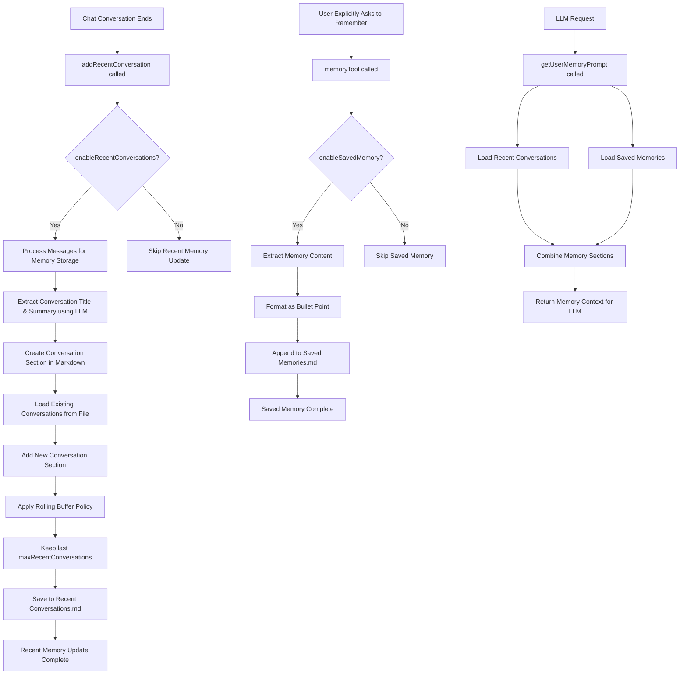

# User Memory Management Flow (Current)

## Overview

Current design for how the user memory system works in Obsidian Copilot, featuring two distinct memory types:

1. **Recent Conversations**: Automatic background processing of chat history for context
2. **Saved Memories**: Explicit user-initiated memory storage for important information

## Flow Diagram

## Key Points

### Memory Update Triggers:

**Recent Conversations:**

- **Trigger**: When a chat conversation ends and `addRecentConversation()` is called
- **Guard**: Only if `enableRecentConversations` setting is enabled
- **Fire-and-forget**: Runs asynchronously in background without blocking execution
- **Race condition protection**: Prevents multiple simultaneous memory updates

**Saved Memories:**

- **Trigger**: When user explicitly asks to remember something during chat and `memoryTool` is called
- **Guard**: Only if `enableSavedMemory` setting is enabled
- **Immediate**: Saves directly to file when invoked
- **User notification**: Shows success/failure notice to user

### Recent Conversations:

- **When**: Updated after every conversation
- **Retention policy**: Configurable rolling buffer - keeps last `maxRecentConversations` (default: 30, range: 10-50)
- **Content**:
  - Timestamp (human-readable format: YYYY-MM-DD HH:MM in local time)
  - LLM-generated conversation title (2-8 words)
  - LLM-generated summary (2-3 sentences with key details and conclusions)
- **Format**: Markdown format with `## conversation title` sections containing structured data
- **Storage**: `Recent Conversations.md` in the configured memory folder
- **File handling**: Creates file if doesn't exist, parses existing conversations to maintain rolling buffer

### Saved Memories:

- **When**: User explicitly asks to remember something via `memoryTool`
- **Retention policy**: No limit - memories persist until manually deleted
- **Content**:
  - Raw user-specified information to remember
  - Personal facts, preferences, important decisions, or context
- **Format**: Simple bullet-point list in markdown
- **Storage**: `Saved Memories.md` in the configured memory folder
- **File handling**: Appends new memories to existing file, creates if doesn't exist

### Message Processing Features:

- **Conversation Titles**: LLM-extracted titles that capture main user intent (2-8 words)
- **Conversation Summaries**: AI-generated 2-3 sentence summaries with key details and conclusions
- **Memory Tool Integration**: Explicit memory saving via natural language commands
- **Robust JSON Parsing**: Handles JSON responses wrapped in code blocks (common with Gemini and other LLMs) with fallback to plain JSON extraction
- **Language-aware**: Uses the same language as the conversation for titles and summaries

### Configuration:

- **`enableRecentConversations`**: Master switch for recent conversation history functionality
- **`enableSavedMemory`**: Master switch for saved memory functionality
- **`memoryFolderName`**: Folder where memory files are stored (creates recursively if needed)
- **`maxRecentConversations`**: Number of recent conversations to keep (10-50 range, default: 30)

### Memory Retrieval:

- **`getUserMemoryPrompt()`**: Loads and returns both Recent Conversations and Saved Memories for LLM context
- **`loadMemory()`**: Loads memory data from both files into class fields
- **System prompt integration**: Memory context automatically included via `getSystemPromptWithMemory()`
- **Conditional loading**: Only includes enabled memory types based on settings
- **Automatic folder creation**: Ensures memory folder exists before operations

### Error Handling:

- Comprehensive error logging for all operations
- Fallback mechanisms for AI processing failures
- Graceful handling of missing files and folders
- User notifications for saved memory operations (success/failure)
- Robust JSON extraction from LLM responses with multiple parsing strategies (code blocks, inline JSON, fallback to raw content)
- Race condition protection for concurrent memory updates

### Tool Integration:

- **Memory Tool**: Integrated into the tool registry when `enableSavedMemory` is enabled
- **Automatic registration**: Tool is conditionally registered based on settings
- **Natural language triggers**: Responds to phrases like "remember that", "don't forget", etc.
- **Context-aware**: Only saves information when user explicitly requests memory storage

This dual memory design provides both automatic conversation context (recent conversations) and explicit user-controlled memory storage (saved memories), offering flexible memory management while maintaining robust AI-powered content processing and configurable retention policies.

## Memory System Behavior by Mode

The memory system behaves differently depending on which chat mode is active:

### Agent Mode (Autonomous Agent)

- **Memory Retrieval**: ✅ Full access to both Recent Conversations and Saved Memories via system prompt
- **Memory Saving**: ✅ Direct access to `memoryTool` through XML-based tool calling
- **Behavior**:
  - AI autonomously decides when to save memories based on user requests
  - Uses XML format: `<use_tool><name>memoryTool</name><memoryContent>...</memoryContent></use_tool>`
  - Can reason step-by-step about whether something should be remembered
  - Shows user notifications when memories are saved
  - Access controlled by tool enablement settings (`autonomousAgentEnabledToolIds`)

### Plus Mode (Legacy Tool Calling)

- **Memory Retrieval**: ✅ Full access to both Recent Conversations and Saved Memories via system prompt
- **Memory Saving**: ✅ Access to `@memory`
- **Behavior**:
  - Uses Brevilabs API intent analysis to determine when to call memory tools
  - Intent analyzer processes user message and decides which tools to execute
  - Tools are executed before LLM response generation
  - Memory tool calls are pre-determined rather than AI-reasoned
  - Same notification system as Agent mode

### Basic Chat Mode (LLM Only)

- **Memory Retrieval**: ✅ Full access to both Recent Conversations and Saved Memories via system prompt
- **Memory Saving**: ❌ No access to memory tools
- **Behavior**:
  - Can reference existing memories for context
  - Cannot save new memories during conversations
  - Users must manually add memories outside of chat

### Project Mode

- **Memory Retrieval**: ❌ Currently disabled (memory not enabled for project mode)
- **Memory Saving**: ❌ Not available
- **Behavior**:
  - Project-specific context only
  - No cross-conversation memory persistence
  - Note: Future enhancement could add project-scoped memory

### Key Differences Summary

| Feature          | Agent Mode    | Plus Mode          | Basic Chat    | Project Mode |
| ---------------- | ------------- | ------------------ | ------------- | ------------ |
| Memory Retrieval | ✅ Dynamic    | ✅ Dynamic         | ✅ Dynamic    | ❌ Disabled  |
| Memory Saving    | ✅ XML Tools  | ✅ Intent Analysis | ❌ None       | ❌ None      |
| Tool Decision    | AI Reasoning  | Pre-analysis       | N/A           | N/A          |
| Memory Context   | System Prompt | System Prompt      | System Prompt | None         |
| User Control     | AI-driven     | Intent-driven      | Manual only   | None         |

This design ensures that memory capabilities scale appropriately with the sophistication of each chat mode, while maintaining consistent memory retrieval across modes that support it.
