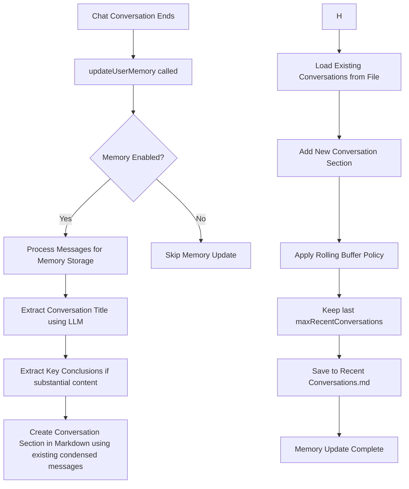

# User Memory Management Flow (Current)

## Overview

Current design for how the user memory system works in Obsidian Copilot, focusing on recent conversation memory only. Long-term memory features like user insights have been removed to simplify the system.

## Flow Diagram

## Key Points

### Memory Update Triggers:

- **Trigger**: When a chat conversation ends and `updateUserMemory()` is called
- **Guard**: Only if `enableMemory` setting (Reference Recent History) is enabled
- **Fire-and-forget**: Runs asynchronously in background without blocking execution
- **Race condition protection**: Prevents multiple simultaneous memory updates

### Recent Conversations (Current Implementation):

- **When**: Updated after every conversation
- **Retention policy**: Configurable rolling buffer - keeps last `maxRecentConversations` (default: 30, range: 10-50)
- **Content**:
  - Timestamp (ISO format with UTC)
  - LLM-generated conversation title (2-8 words)
  - Condensed user messages (AI-generated one-line summaries created during conversation)
  - Optional key conclusions (only for substantial conversations >300 chars)
- **Format**: Markdown format with `## conversation title` sections containing structured data
- **Storage**: `Recent Conversations.md` in the configured memory folder
- **File handling**: Creates file if doesn't exist, parses existing conversations to maintain rolling buffer

### Message Processing Features:

- **Condensed Messages**: AI-generated one-line summaries of user messages created during conversation (not during memory update) that preserve intent and important details
- **Conversation Titles**: LLM-extracted titles that capture main user intent
- **Key Conclusions**: Only generated for conversations with substantial content (>300 chars) containing insights, decisions, or learnings
- **Obsidian-optimized**: Special handling for note names, tags, links, and Obsidian-specific features

### Configuration (Current):

- **`enableMemory`**: Master switch for all recent history referencing functionality
- **`memoryFolderName`**: Folder where memory files are stored (creates recursively if needed)
- **`maxRecentConversations`**: Number of conversations to keep (10-50 range, default: 30)

### Memory Retrieval:

- **`getUserMemoryPrompt()`**: Loads and returns Recent Conversations for LLM context
- **`loadMemory()`**: Loads memory data from files into class fields
- **Automatic folder creation**: Ensures memory folder exists before operations

### Error Handling:

- Comprehensive error logging for all operations
- Fallback mechanisms for AI processing failures
- Graceful handling of missing files and folders
- Validation of AI-generated content (e.g., ensures condensed messages are actually shorter)

This simplified design focuses on providing recent conversation context without the complexity of long-term memory management, while maintaining robust AI-powered content processing and configurable retention policies.
