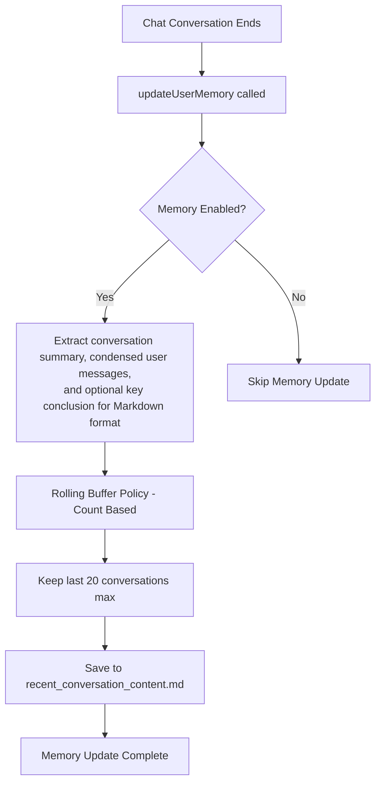

# User Memory Management Flow (Current)

## Overview

Current design for how the user memory system works in Obsidian Copilot, focusing on recent conversation memory only. Long-term memory features like user insights have been removed to simplify the system.

## Flow Diagram

## Key Points

### Memory Update Triggers:

- **Trigger**: When a chat conversation ends and `updateUserMemory()` is called
- **Guard**: Only if `enableMemory` setting (Reference Recent History) is on

### Recent Conversations (Current Implementation):

- **When**: Updated after every conversation
- **Retention policy**: Fixed rolling buffer - keeps last 20 conversations maximum
- **Content**: Timestamp + brief conversation summary + condensed user message excerpts + optional key conclusion
- **Format**: Markdown format with `# Recent Conversations` header and `## conversation title` sections containing time, user messages, and optional key conclusions
- **Storage**: `recent_conversation_content.md` in the configured memory folder

### Configuration (Current):

- **`enableMemory`**: Master switch for all recent history referencing functionality
- **`memoryFolderName`**: Folder where memory files are stored

### Removed Features:

- **Long-term Memory**: User insights, response preferences, and topic highlights have been removed
- **Complex Update Logic**: No more threshold-based updates or insight extraction
- **Multiple Memory Types**: Simplified to only recent conversations

This simplified design focuses on providing recent conversation context without the complexity of long-term memory management.
