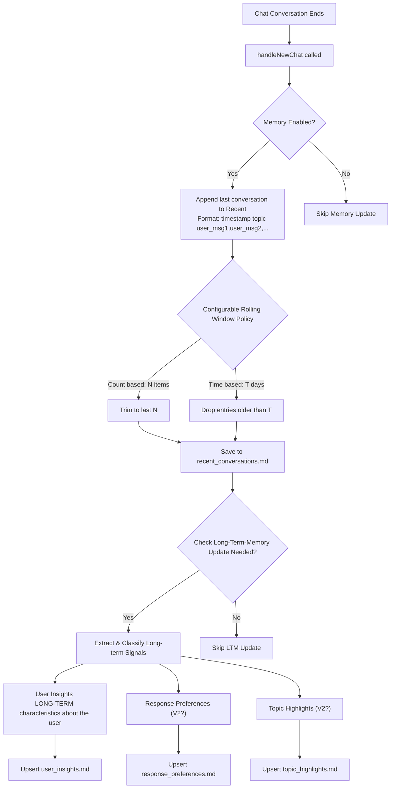

# User Memory Management Flow (Planned)

## Overview

Planned design for how the user memory system should work in Obsidian Copilot, including triggers, short-term retention policy, and long-term memory types.

## Flow Diagram

## Key Points

### Memory Update Triggers:

- **Trigger**: When a chat conversation ends and `handleNewChat()` is called
- **Guard**: Only if `enableMemory` setting is on

### Recent Conversations (Short-term):

- **When**: Updated after every conversation
- **Retention policy**: Rolling window is user-configurable by either count (keep last N items) or time (keep items within T days, e.g., 7 days)
- **Content**: Timestamp + brief summary + user message excerpts
- **Storage**: Example file `recent_conversations.md`

### Long-term Memory (Persistent):

- **Update check**: After recent memory is updated, evaluate whether LTM should be updated (e.g., new persistent info detected, thresholds reached)
- **Types**: `user_insights` (facts about the user), `response_preferences` (format/tone/style), `topic_highlights` (recurring themes)
- **Storage**: Separate files, e.g., `user_insights.md`, `response_preferences.md`, `topic_highlights.md`
- **Behavior**: Upsert with deduplication and timestamps; per-type enablement is possible

### Configuration (proposed):

- **`enableMemory`**: Master switch
- **`recentWindowType`**: `count` | `time`
- **`recentMaxItems` / `recentMaxAgeDays`**: Applies based on window type
- **`enableLTMemoryTypes`**: Toggle per type `{ user_insights, response_preferences, topic_highlights }`
- **`ltmUpdatePolicy`**: Heuristic or schedule to decide when LTM updates run

This planned design ensures recent context stays concise and fresh while selectively promoting durable knowledge into well-structured long-term categories.
