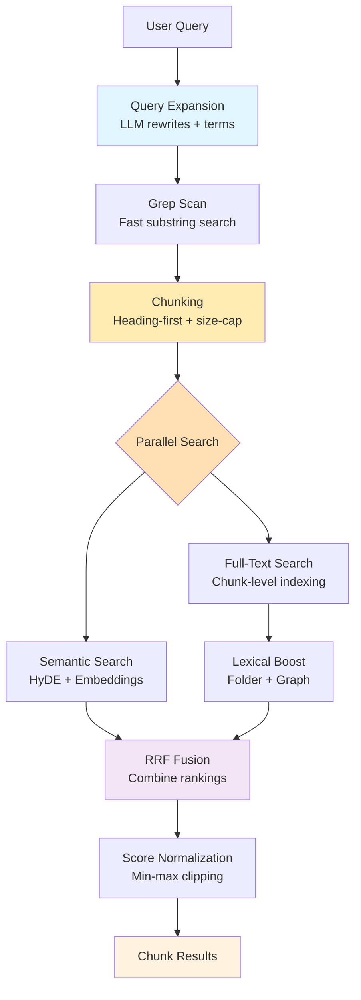

# Search v3: Chunk-Based Tiered Retrieval with Optional Semantic

A high-performance, memory-bounded search system for Obsidian that uses intelligent chunking to deliver precise, contextual results without content explosion.

## Architecture Overview



## Key Features

- **Memory-Bounded**: No persistent full-text index, everything ephemeral
- **Parallel Search**: Lexical and semantic searches run concurrently for optimal performance
- **Progressive Refinement**: Fast grep → parallel (full-text + semantic)
- **Multilingual**: Supports English and CJK languages
- **Explainable**: Tracks why documents ranked highly
- **Fault-Tolerant**: Graceful fallbacks at each stage

## Example: Search Flow

**Query**: `"How do I set up OAuth in Next.js?"`

### 1. Query Expansion

```
Input:  "How do I set up OAuth in Next.js?"
Output: ["How do I set up OAuth in Next.js?",
         "Next.js OAuth configuration",
         "NextJS OAuth setup"]
Terms:  ["oauth", "nextjs"]
```

### 2. Grep Scan (L0)

Searches for both full queries AND individual terms:

```
Finds: ["auth/oauth-guide.md", "nextjs/auth.md", "tutorials/oauth.md"]
       (up to 200 candidates)
```

### 3. Chunking (L1)

Heading-first intelligent chunking converts candidate notes into manageable pieces:

```
Input:  3 candidate notes ("auth/oauth-guide.md", "nextjs/auth.md", "tutorials/oauth.md")
Chunks: 8 chunks with size 800-2000 chars each
Output: ["auth/oauth-guide.md#0", "auth/oauth-guide.md#1", "nextjs/auth.md#0", ...]
```

### 4. Smart Pipeline Execution

**Full-Text Search (L1)** and **Semantic Search (Optional)** run based on semantic weight:

- **0% Semantic Weight**: Only runs lexical search (pure keyword mode)
- **100% Semantic Weight**: Only runs semantic search (pure meaning mode)
- **Mixed Weight (1-99%)**: Runs both searches in parallel for optimal performance

#### Full-Text Branch:

- Builds ephemeral FlexSearch index from chunks (not full notes)
- **Frontmatter Replication**: Extracts note-level frontmatter once and replicates property values across all chunks from that note
- Indexes frontmatter properties (author, tags, status, etc.) by including them in each chunk's body content
- Searches with field weights: Title (3x), Heading (2.5x), Path (2x), Body (1x including frontmatter)
- Returns up to 2x maxResults for better recall

#### Semantic Branch (if enabled):

- Generates HyDE synthetic answer for query expansion
- Searches vector store limited to same chunk candidates
- Combines HyDE document with query variants

Both branches complete before fusion begins.

### 5. Lexical Reranking (Boosting Stage)

Applied to lexical results BEFORE RRF fusion (when `enableLexicalBoosts: true`):

- **Folder Boost**: Notes in folders with multiple matches (logarithmic, 1-1.5x)
- **Graph Boost**: Notes linked to other results (1.0-1.15x, only for high-similarity results)
- **Pure Relevance Mode**: When boosts disabled, provides keyword-only scoring without folder/graph influence

### 6. Smart Fusion

Intelligently combines results based on semantic weight:

- **0% Semantic**: Uses lexical results directly (no fusion overhead)
- **100% Semantic**: Uses semantic results directly (no fusion overhead)
- **Mixed Weight**: RRF fusion with configurable balance (40% lexical + 60% semantic default)
- Weights normalized to sum to 1.0 when fusion is used

### 7. Score Normalization

Min-max normalization prevents auto-1.0 scores

- `baseScore`: The raw score after RRF fusion and all boosts are applied
- `finalScore`: The normalized score in [0.02, 0.98] range that users see

### 9. Final Results

```
1. nextjs/auth.md#0 (0.95) - Title match chunk, folder boost, graph connections
2. nextjs/config.md#1 (0.38) - Configuration section, folder boost
3. auth/oauth-guide.md#0 (0.21) - Introduction section, title match
```

## Core Components

### SearchCore

- Orchestrates the entire chunk-based search pipeline
- Executes lexical and semantic searches in parallel via `Promise.all()`
- Methods:
  - `executeLexicalSearch()`: Chunks candidates, builds index, and searches
  - `executeSemanticSearch()`: Runs HyDE + embedding search on chunks
  - `mapSemanticHit()`: Transforms semantic results to unified format

### ChunkManager

- Converts notes into intelligent chunks using heading-first algorithm
- Simple Map-based cache for performance
- Memory-bounded chunking with configurable size limits
- Methods:
  - `getChunks()`: Creates chunks from note paths with size constraints
  - `getChunkText()`: Retrieves chunk content by ID for LLM context

### Query Expander

- Generates alternative phrasings using LLM (5s timeout)
- **Critical Fix**: Separates salient terms (from original query, used for scoring) from expanded terms (LLM-generated, used for recall only)
- Extracts salient terms (nouns only, language-agnostic) exclusively from original user query
- Falls back to original query if LLM unavailable
- Prevents false positives by ensuring expanded terms don't influence ranking

### Grep Scanner

- Fast substring search using Obsidian's `cachedRead`
- Unified batching (30 files) for all platforms
- Searches both phrases and individual terms
- Path-first optimization for faster matching

### Full-Text Engine

- Ephemeral FlexSearch index built from chunks per-query
- Indexes chunk content but stores only metadata (no body storage)
- Custom tokenizer for ASCII words + CJK bigrams
- Multi-field indexing: title (3x), heading (2.5x), path (2x), body (1x)
- **Frontmatter Property Indexing**: Extracts and indexes frontmatter property values for searchability
  - **Note-Level Metadata, Chunk-Level Indexing**: Frontmatter is extracted once per note and replicated across all chunks from that note
  - Supports primitive values (strings, numbers, booleans), arrays, and Date objects
  - Converts values to searchable strings and includes them in each chunk's body content
  - Skips nested objects and null/undefined values for safety
  - Configurable array processing limit and recursion depth
  - **Performance Optimization**: Per-note metadata caching prevents redundant frontmatter extraction
- Path components indexed for folder/file search
- Memory-efficient: chunk content retrieved from ChunkManager when needed

### RRF (Reciprocal Rank Fusion)

- Combines lexical and semantic rankings with normalized weights
- Weights always sum to 1.0 for consistent scoring
- Merges explanations from both search engines
- Default: 40% lexical + 60% semantic (configurable)

### Folder & Graph Boost Calculators

**Folder Boost**: Rewards notes that share folders with other search results, scaled by relevance ratio.

- **Relevance Ratio**: `relevant_docs_in_folder / total_docs_in_folder`
- **Requirements**:
  - Minimum 2 relevant documents in folder (configurable)
  - Minimum 40% relevance ratio (configurable)
- **Formula**: `1 + (log2(count + 1) - 1) * sqrt(relevance_ratio)`, capped at 1.15x
- **Example 1**: Searching "authentication" finds 3/5 notes in `nextjs/` folder (60% relevance) → 1.15x boost
- **Example 2**: Finding 2/5 notes in folder (40% relevance) → 1.15x boost (meets threshold)
- **Example 3**: Finding 3/10 notes in folder (30% relevance) → no boost (below 40% threshold)
- **Purpose**: Only boosts truly coherent folders where a significant portion is relevant

**Graph Boost**: Rewards notes that link to other search results.

- **Intelligent Filtering**:
  - Only analyzes notes with semantic similarity ≥75% (when semantic search is enabled)
  - Maximum 10 candidates analyzed (performance cap)
  - Requires at least 2 candidates for meaningful connections
- **Connection Types**:
  - Backlinks: Notes that link TO this note (weight: 1.0)
  - Co-citations: Notes cited by same sources (weight: 0.5)
  - Shared tags: Notes with common tags (weight: 0.3)
- **Boost Formula**: `1 + strength × log(1 + connectionScore)`, capped at 1.15x
- **Example**: `auth-guide.md` has 75% semantic similarity and links to `jwt-setup.md` → both get boosted
- **Purpose**: Surfaces tightly connected knowledge networks while maintaining performance

Both boosts multiply existing scores after RRF fusion, helping related content rise together.

### Score Normalizer

- Min-max normalization (default) or Z-score with tanh squashing
- Prevents artificial 1.0 scores
- Clips to [0.02, 0.98] range
- Preserves explainability metadata

### Semantic Layer (Optional)

- JSONL-backed vector store in memory
- Runs in parallel with lexical search when enabled
- HyDE generation for query expansion (5s timeout)
- Incremental indexing for changed files
- Auto-index strategies: NEVER, ON STARTUP, ON MODE SWITCH
- Partitioned storage (~150MB per file)

## Frontmatter and Chunk Architecture

### How Note-Level Frontmatter Works with Chunk-Level Search

**The Challenge**: Frontmatter properties (like `author`, `tags`, `status`) are defined once per note, but our search operates on chunks within notes.

**The Solution**: Frontmatter replication with performance optimization:

1. **Extraction Phase** (per note):

   ```typescript
   // Extract frontmatter once per note during chunk indexing
   const frontmatter = cache?.frontmatter ?? {};
   const propValues = this.extractPropertyValues(frontmatter);
   // Cache the extracted values per note path
   processedNotes.set(chunk.notePath, { tags, links, props: propValues });
   ```

2. **Replication Phase** (per chunk):

   ```typescript
   // Include frontmatter in each chunk's searchable body
   const bodyWithProps = [chunk.content, ...noteMetadata.props].join(" ");
   ```

3. **Search Behavior**:
   - Searching for `author: "John Doe"` finds ALL chunks from notes where `author` is "John Doe"
   - Each chunk from that note becomes independently searchable by frontmatter properties
   - Maintains chunk-level granularity while preserving note-level metadata searchability

**Benefits**:

- ✅ **Complete Searchability**: Every frontmatter property is findable via any chunk
- ✅ **Performance**: Per-note caching prevents redundant frontmatter extraction
- ✅ **Consistency**: All chunks from same note have identical frontmatter properties
- ✅ **Granular Results**: Can return specific chunks while preserving metadata context

**Example**:

```
Note: "project-notes.md"
Frontmatter: { author: "Alice", status: "draft", priority: 1 }
Chunks: ["project-notes.md#0", "project-notes.md#1", "project-notes.md#2"]

Search: "Alice" → Finds all 3 chunks, each containing "Alice" in searchable content
Search: "draft" → Finds all 3 chunks, each containing "draft" in searchable content
Search: "priority 1" → Finds all 3 chunks, each containing "1" in searchable content
```

## Data Model

```typescript
interface NoteIdRank {
  id: string; // Chunk ID (note_path#chunk_index) or note path for legacy
  score: number; // Relevance score [0-1]
  engine?: string; // Source engine
  explanation?: {
    // Why it ranked high
    lexicalMatches?: Array<{ field: string; query: string; weight: number }>;
    semanticScore?: number;
    folderBoost?: { folder: string; documentCount: number; boostFactor: number };
    graphConnections?: {
      backlinks: number;
      coCitations: number;
      sharedTags: number;
      score: number;
      boostMultiplier: number;
    };
    baseScore: number; // Score before normalization (after RRF fusion and boosts)
    finalScore: number; // Score after normalization (final 0-1 range score)
  };
}

interface Chunk {
  id: string; // note_path#chunk_index
  notePath: string; // original note path
  chunkIndex: number; // 0-based chunk position
  content: string; // chunk text with headers + frontmatter properties
  title: string; // note title
  heading: string; // section heading
  mtime: number; // note modification time
}
```

## Performance Characteristics

- **Grep scan**: < 50ms for 1k files
- **Chunking**: < 50ms for 500 candidates → ~1000 chunks
- **Full-text build**: < 100ms for 1000 chunks (memory-bounded)
- **Parallel search**: Lexical and semantic run concurrently on chunks
- **Total latency**: < 250ms P95 (chunking overhead + existing pipeline)
- **Memory peak**: < 20MB mobile, < 100MB desktop
- **Memory split**: 35% chunk cache, 65% FlexSearch index

## Configuration

### Search Options

- `maxResults`: Number of results to return (default: 30, max: 100)
- `enableSemantic`: Enable vector search (default: false)
- `semanticWeight`: Percentage for semantic results (0-1, default: 0.6 = 60%)
- `candidateLimit`: Max candidates for full-text (default: 500, range: 10-1000)
- `rrfK`: RRF smoothing parameter (default: 60, range: 1-100)
- `salientTerms`: Additional terms to enhance the search (optional)
- `enableLexicalBoosts`: Enable folder and graph boosts (default: true)

### Settings

- **Enable Semantic Search**: Master toggle for vector features
- **Enable Lexical Boosts**: Toggle for folder and graph relevance boosts (v3 only)
- **Auto-Index Strategy**: NEVER | ON STARTUP | ON MODE SWITCH
- **Chunk Configuration**:
  - Chunk Size: 6000 characters (uses CHUNK_SIZE constant)
  - No per-note limits: All relevant chunks included
- **Graph Boost Configuration**:
  - Semantic Similarity Threshold: 75% (only boost highly relevant results)
  - Max Candidates: 10 (performance cap)
  - Boost Strength: 0.1 (connection influence)
  - Max Boost Multiplier: 1.15x (prevents over-boosting)
- **Lexical Search RAM Limit**: RAM usage split between chunks (35%) and FlexSearch (65%)
- **Embedding Batch Size**: Number of chunks to embed at once (reduce if token limits exceeded)
- **Exclusions/Inclusions**: File patterns to index

## Implementation Status

✅ **Core Pipeline**: Query expansion, grep, chunking, parallel search, RRF fusion
✅ **Chunking System**: Heading-first algorithm with memory-bounded processing
✅ **Smart Pipeline Execution**: Skips unused search pipelines when weight is 0% or 100% for optimal performance
✅ **Query Expansion Fix**: Separated salient terms (scoring) from expanded terms (recall only)
✅ **Lexical Boosts Control**: Optional folder and graph boosts with pure relevance mode
✅ **Lexical Reranking**: Folder and graph boosts applied before RRF fusion (when enabled)
✅ **Relevance-Based Results**: All relevant chunks included regardless of source note
✅ **Frontmatter Property Indexing**: Complete frontmatter property extraction and indexing in chunk-based system
✅ **Normalization**: Min-max normalization with explainability
✅ **Semantic**: Optional vector search with consistent chunk candidates
✅ **Security**: Path validation, size limits, circular reference handling
✅ **UX**: Progress notifications, incremental indexing, commands

## Key Design Decisions

1. **Unified Chunking**: Both lexical and semantic search operate on same chunk candidates
2. **Heading-First Algorithm**: Preserves document structure while respecting size limits
3. **No Persistent Full-Text Index**: Grep provides fast initial seeding, chunks built per-query
4. **Ephemeral Everything**: Eliminates maintenance overhead
5. **Parallel Search Architecture**: Lexical and semantic run concurrently on chunks for performance
6. **Lexical Reranking**: Folder and graph boosts applied to lexical results before RRF fusion
7. **Memory-Efficient Indexing**: FlexSearch stores metadata only, chunk content retrieved when needed
8. **Frontmatter Property Integration**: Extract note-level frontmatter once and replicate across all chunks for seamless search
9. **Chunk Sequence Preservation**: Chunks from same note served in order for LLM context
10. **Min-Max Normalization**: Prevents artificial perfect scores while preserving monotonicity
11. **Explainable Rankings**: Track contributing factors for transparency including chunk-level details
12. **Memory Budget Split**: Fixed 35%/65% allocation between chunk cache and FlexSearch index

## Legacy Search Migration

### Current State (v2.x)

The codebase currently supports both legacy Orama-based search and v3 tiered lexical search via a toggle in settings. The implementation uses a factory pattern (`SearchSystemFactory`) to route between systems.

### Architecture for Dual Support

```typescript
// SearchSystem.ts provides unified interface
interface SearchSystem {
  createRetriever(app: App, options: RetrieverOptions): BaseRetriever;
  getIndexer(): SearchIndexer;
  isSemanticSearchEnabled(): boolean;
}

// Factory routes based on settings
SearchSystemFactory.getSearchSystem(); // Returns appropriate implementation
```

### Legacy Removal Steps (v3.0.0)

When ready to remove legacy search support:

#### 1. Remove Legacy Classes from `SearchSystem.ts`

- Delete `LegacySearchIndexer` class
- Delete `LegacySearchSystem` class
- Update `SearchSystemFactory.getSearchSystem()` to always return `V3SearchSystem`

#### 2. Remove Settings Properties

- Delete `useLegacySearch` from:
  - `src/settings/model.ts`
  - `src/constants.ts` (DEFAULT_SETTINGS)
- Delete `numPartitions` setting (legacy partitioning)

#### 3. Remove UI Components

- Remove legacy search toggle from `src/settings/v2/components/QASettings.tsx`
- Remove partition dropdown UI
- Clean up conditional rendering logic

#### 4. Delete Legacy Files

```bash
# Core legacy files to remove
src/search/hybridRetriever.ts
src/search/vectorStoreManager.ts
src/search/chunkedStorage.ts
src/search/dbOperations.ts
src/search/indexOperations.ts
src/search/indexEventHandler.ts
```

#### 5. Clean Package Dependencies

Remove from `package.json`:

- `@orama/orama`
- Any Orama-related plugins

#### 6. Update Documentation

- Remove legacy search references from user documentation
- Update API documentation
- Remove deprecation warnings

### Benefits After Removal

- **Reduced Bundle Size**: ~200KB reduction from removing Orama
- **Simpler Codebase**: Single search implementation path
- **Better Performance**: No conditional checks or dynamic imports
- **Cleaner Architecture**: Direct use of v3 components without abstraction layer
- **Easier Maintenance**: One search system to maintain and optimize

### Migration Timeline

1. **v2.x** (Current): Dual support with deprecation warnings
2. **v2.x+1**: Legacy search disabled by default, requires opt-in
3. **v3.0.0**: Complete removal of legacy search code

## Known Issues & Future Improvements

### Critical Issues to Address

1. **Memory Management**: `FullTextEngine.clear()` complexity could cause silent failures
2. **Error Handling**: Inconsistent error patterns across components
3. **Input Validation**: Missing bounds checking for public API inputs
4. **Race Conditions**: Timeout handling in `QueryExpander` has potential races

### Performance Optimizations

1. **Sequential Chunking**: `ChunkManager` processes files sequentially, could benefit from batching
2. **Search Scoring**: Nested loops in `FullTextEngine.search()` create O(n²) complexity
3. **Vector Store Rebuilding**: Full rebuilds on each load instead of incremental updates
4. **Memory Estimation**: Simplistic heuristics may lead to inaccurate memory budgeting

### Performance Features ✅

1. **Pipeline Skipping**: Automatically skips unused search pipelines when semantic weight is 0% or 100%
2. **Smart Fusion**: Bypasses RRF fusion overhead for pure lexical (0%) or pure semantic (100%) searches
3. **Boost Optimization**: Skips boost calculations when lexical search is not used

### Architecture Improvements

1. **Dependency Injection**: `SearchCore` tightly couples to all dependencies
2. **Configuration Management**: Search settings scattered across multiple files
3. **Error Standardization**: Some components return empty arrays, others null/undefined
4. **Separation of Concerns**: RRF module handles multiple responsibilities

### Missing Test Coverage

1. **Concurrency**: No tests for concurrent search requests
2. **Large Scale**: No performance tests with realistic vault sizes (1000+ files)
3. **Memory Limits**: No tests for memory exhaustion scenarios
4. **Provider Switching**: No tests for switching embedding providers mid-session

### Security Considerations

1. **Input Sanitization**: Search queries sent to LLM without sanitization
2. **Resource Limits**: Memory limits exist but no CPU time limits
3. **Prompt Injection**: Potential vulnerability in query expansion

### Recommended Next Steps

**High Priority:**

1. Simplify memory management and add error recovery
2. Standardize error handling patterns
3. Add comprehensive input validation
4. Fix race conditions in timeout handling

**Medium Priority:** 5. Implement batch processing for better performance 6. Refactor for proper dependency injection 7. Centralize configuration management 8. Add structured logging for observability

**Low Priority:** 9. Complete API documentation 10. Add comprehensive integration tests 11. Create architecture flow diagrams
