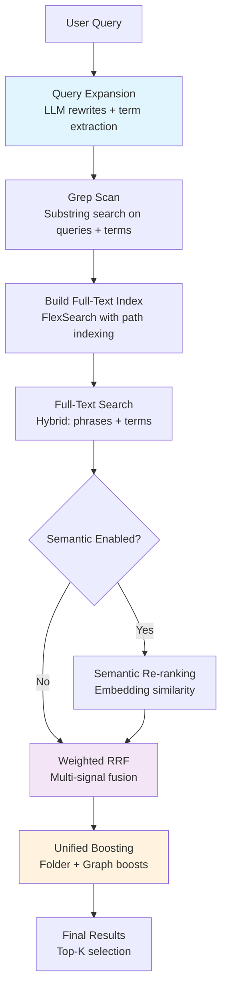

# Obsidian Copilot — Tiered Note-Level Lexical Retrieval

_(Multilingual, Partial In-Memory; optional semantic add-on)_

## Current Implementation Snapshot

- Tiered Lexical Retrieval (Grep → Full-text → RRF → Boosting) fully implemented
- Semantic (optional) integrated via JSONL-backed in-memory index (`MemoryIndexManager`)
- Scores normalized to [0,1] with tiny rank-based epsilon to avoid ties at the top
- Time-based queries show actual `mtime` and use a dedicated cap; daily notes handled explicitly
- UX parity for indexing: live progress notice, pause/resume/stop, inclusions/exclusions display
- Auto-Index Strategy: NEVER, ON STARTUP, ON MODE SWITCH respected only when semantic toggle is on
- Commands wired: Refresh Vault Index → incremental; Force Reindex Vault → full rebuild
- Clear Index deletes legacy and partitioned JSONL files
- Index partitioning: `copilot-index-v3-000.jsonl`, `001`, ... with ~150MB per file guard
- Sync location: `.obsidian/` when “Enable Obsidian Sync” is on; `.copilot/` at vault root otherwise

---

## Quick Example: End-to-End Flow

**Query**: `"How do I set up OAuth in Next.js?"`

### Step-by-Step Processing:

```
1. Query Expansion (LLM, 4s timeout)
   Input:  "How do I set up OAuth in Next.js?"
   Output: ["How do I set up OAuth in Next.js?",
            "Next.js OAuth configuration",
            "NextJS OAuth setup"]
   Terms:  ["oauth", "nextjs"] (nouns only)

2. Grep Scan (L0 - substring search)
   Searches BOTH: Full queries + Individual terms
   Input: ["How do I set up OAuth in Next.js?", "Next.js OAuth configuration",
           "NextJS OAuth setup", "oauth", "nextjs"]
   Finds: ["auth/oauth-guide.md", "nextjs/auth.md", "tutorials/oauth.md"] (up to 200)

3. Full-Text Index (L1 - ephemeral FlexSearch)
   Builds index from grep candidates with fields:
   - title (3x weight), headings (2x), tags (2x), links (2x), body (1x)

4. Full-Text Search (Hybrid: Phrases + Terms)
   Searches BOTH: 3 query variants (precision) + 2 terms (recall)
   Also includes LLM <term> tags as low-weight inputs (reduced influence)
   Input: ["How do I set up OAuth in Next.js?", "Next.js OAuth configuration",
           "NextJS OAuth setup", "oauth", "nextjs"]
   Results by field match + position:

   | Note | Title Match | Path Match | Tag Match | Body Match | Base Score | Folder Boost | Final Score (0–1) |
   |------|------------|------------|-----------|------------|------------|--------------|-------------------|
   | nextjs/auth.md | "NextJS OAuth Setup" (pos 1) | nextjs auth | #oauth #nextjs | Yes | 5.0 | 2x (3 docs in nextjs/) | 0.93 |
   | nextjs/config.md | - | nextjs config | #nextjs | Yes | 1.8 | 2x (3 docs in nextjs/) | 0.36 |
   | nextjs/jwt.md | - | nextjs jwt | #nextjs #auth | Yes | 1.5 | 2x (3 docs in nextjs/) | 0.30 |
   | auth/oauth-guide.md | "OAuth Guide" (pos 2) | auth oauth | #oauth | Yes | 2.1 | 1x (single) | 0.21 |
   | tutorials/oauth.md | - | tutorials oauth | #oauth | Yes | 1.2 | 1x (single) | 0.12 |

5. RRF (combine rankings)
   Merges: full-text (1.0x) + semantic (1.5x if enabled)
   Documents appearing in multiple result sets score higher

6. Folder & Graph Boost (unified boosting stage)
   - Folder Boost: Notes in folders with multiple matches get logarithmic boost (1-3x)
   - Graph Boost: Notes linked to other relevant results get boost (1.0-2.0x)
   Example: If nextjs/auth.md links to nextjs/config.md, both get boosted

7. Final Results (after RRF and unified boosting)
   1. nextjs/auth.md (score: 0.95) - Boosted by folder clustering + graph connections
   2. nextjs/config.md (score: 0.38) - Boosted by folder clustering + graph connections
   3. nextjs/jwt.md (score: 0.30) - Boosted by folder clustering
   4. auth/oauth-guide.md (score: 0.21)
   5. tutorials/oauth.md (score: 0.12)
```

---

## 1) Scope & Goals

- **Bounded RAM** on desktop and mobile; no full-vault body index.
- **Instant first results** with progressive refinement.
- **Multilingual** (English + CJK) lexical search via a hybrid tokenizer.
- **Index-free feel**: everything is in-memory and ephemeral by default.
- **Optional semantic engine**: can add extra candidates and a similarity signal, off by default.

---

## 2) Query → Result Flow

### Complete End-to-End Pipeline



### Detailed Technical Pipeline (Minimal End-to-End Example)

```mermaid
graph LR
    subgraph QP["Query Processing"]
        Q[Query] --> QE[Query Expander]
        QE --> V[3 Variants]
        QE --> T[Salient Terms - Nouns only]
    end

    subgraph ID["Initial Discovery"]
        V --> GS[Grep Scanner - cachedRead]
        T --> GS
        GS --> GH[50-200 hits]
    end

    subgraph FTP["Full-Text Processing"]
        GH --> FTI[FlexSearch Index]
        FTI --> IDX[Field Indexing: Title 3x, Path 2.5x, Tags/Links 2x, Body 1x]
        IDX --> FTS[Search Engine]
        V --> FTS
        T --> FTS
        T -.low weight.-> FTS
        FTS --> SA[Score Accumulation: Multi-match bonus]
        SA --> MF[Multi-field Bonus: +20% per field]
    end

    subgraph RO["Ranking Optimization"]
        MF --> RRF[Weighted RRF: Lexical 1.0x, Semantic 1.5x]
        RRF --> UB[Unified Boosting: Folder + Graph]
    end

    UB --> R[Top-K Results]

    style QE fill:#e1f5fe
    style UB fill:#fff3e0
    style RRF fill:#f3e5f5
    style FTI fill:#e8f5e9
```



### Detailed Step-by-Step Flow

```typescript
async function retrieve(query: string): Promise<NoteIdRank[]> {
  // 1. QUERY EXPANSION - Generate variants for better recall
  // Uses LLM (with 4s timeout) to generate alternative phrasings
  const expanded = await queryExpander.expand(query);
  const variants = expanded.queries; // ["original", "variant1", "variant2"]

  // Example: "How do I implement authentication in my Next.js app?" →
  // variants: ["How do I implement authentication in my Next.js app?",
  //            "Next.js authentication implementation",
  //            "NextJS auth setup guide"]
  // salientTerms: ["authentication", "nextjs", "app"] (extracted nouns only)

  // 2. GREP SCAN - Fast substring search for initial candidates
  // Uses BOTH full queries AND individual terms for maximum recall
  const allSearchStrings = [...variants, ...expanded.salientTerms];
  const grepHits = await grepScanner.batchCachedReadGrep(allSearchStrings, 200);
  // Searches for full phrases + individual terms: "authentication", "nextjs", "app"
  // Returns: ["auth/nextjs-setup.md", "tutorials/nextjs-auth.md", ...] up to 200 files

  // 3. CANDIDATE LIMITING - Respect memory bounds
  const candidates = grepHits.slice(0, 500);

  // 4. BUILD FULL-TEXT INDEX - Ephemeral FlexSearch from candidates
  await fullTextEngine.buildFromCandidates(candidates);
  // Indexes: title, path, headings, tags, links (as basenames), body with multilingual tokenizer
  // Path components are indexed separately for folder/file name search
  // Example indexed doc: {title: "NextJS Auth Guide", path: "nextjs auth-guide",
  //                       headings: ["JWT Setup", "OAuth"], tags: ["nextjs", "auth"],
  //                       links: "jwt-basics oauth-flow", body: "..."}

  // 5. FULL-TEXT SEARCH - Hybrid search with phrases AND terms
  // Combines: Full query variants (precision) + Individual terms (recall)
  const allFullTextQueries = [...variants, ...expanded.salientTerms];
  const fullTextResults = fullTextEngine.search(
    allFullTextQueries,
    limit * 2,
    expanded.salientTerms
  );
  // Searches: ["How do I implement...", "Next.js auth...", "authentication", "nextjs", "app"]
  // Returns: [{id: "tutorials/nextjs-auth.md", score: 0.95, engine: "fulltext"},
  //          {id: "auth/jwt-implementation.md", score: 0.8, engine: "fulltext"}, ...]

  // 6. OPTIONAL SEMANTIC RE-RANKING
  let semanticResults = [];
  if (settings.enableSemantic) {
    // Get semantic candidates from vector store
    const semCandidates = await semanticSearch(query, 200);

    // Combine with full-text results
    const combined = unionById([...fullTextResults, ...semCandidates]);

    // Re-rank all using embedding similarity
    const queryEmbeddings = await embedQueries(variants);
    semanticResults = await reRankBySimilarity(combined, queryEmbeddings);
  }

  // 7. WEIGHTED RRF - Combine all signals
  let fusedResults = weightedRRF(
    {
      lexical: fullTextResults, // weight: 1.0
      semantic: semanticResults, // weight: 1.5 (if enabled)
      weights: { lexical: 1.0, semantic: 1.5 },
    },
    60
  );
  // Combines rankings: docs appearing in multiple result sets score higher

  // 8. UNIFIED BOOSTING - Apply folder and graph boosts
  fusedResults = folderBoostCalculator.applyBoosts(fusedResults);
  fusedResults = graphBoostCalculator.applyBoosts(fusedResults);
  // Folder boost: Notes in same folder get logarithmic boost
  // Graph boost: Notes linked to other results get connection boost

  // 9. CLEANUP & RETURN
  fullTextEngine.clear(); // Free memory
  return fusedResults.slice(0, maxResults); // Default: top 30
  // Final: ["tutorials/nextjs-auth.md", "auth/jwt-implementation.md",
  //         "examples/nextjs-oauth.md", ...]
}
```

### Key Flow Characteristics

1. **Progressive Refinement**: Start fast (grep) → refine (full-text) → boost (folder/graph)
2. **Hybrid Search Strategy**: Uses BOTH full query phrases (precision) AND individual terms (recall)
3. **Score Accumulation**: Documents matching multiple queries/terms get higher scores (not max)
4. **Unified Boosting Stage**: Folder and graph boosts applied together after RRF fusion
5. **Path-Aware Indexing**: Folder and file names are searchable with 2.5x weight
6. **Low-weight Terms**: LLM-extracted salient terms are included as low-weight inputs
7. **Memory-Bounded**: Each step respects platform memory limits
8. **Multilingual**: Handles ASCII and CJK throughout the pipeline
9. **Fault-Tolerant**: Falls back to grep-only if pipeline fails
10. **Configurable**: Semantic search and memory limits adjustable
11. **Link-Aware Search**: Links are indexed as searchable basenames while preserving full paths for graph traversal

---

## 3) Data Model

```ts
interface NoteDoc {
  id: string; // vault-relative path
  title: string; // filename or front-matter title
  headings: string[]; // H1..H6 plain text (indexed)
  tags: string[]; // inline + frontmatter via getAllTags(cache) (indexed)
  props: Record<string, unknown>; // frontmatter key/values (values indexed with 2x weight)
  linksOut: string[]; // outgoing link full paths (extracted and indexed as basenames)
  linksIn: string[]; // backlink full paths (extracted and indexed as basenames)
  body: string; // full markdown text (indexed)
}

interface NoteIdRank {
  id: string; // note path
  score: number; // relevance score
  engine?: string; // source engine (l1, semantic, grepPrior)
}
```

---

## 4) Core Components

### 4.1 Query Expander (Query Enhancement)

Uses LLM to generate alternative query phrasings and extract salient terms.

**Examples**:

- `"How do I implement authentication in my Next.js app?"` →

  - queries: `["How do I implement authentication in my Next.js app?", "Next.js authentication implementation", "NextJS auth setup"]`
  - salientTerms: `["authentication", "nextjs", "app"]` (NOT "how", "implement", "my")

- `"What are the best practices for React hooks?"` →

  - queries: `["What are the best practices for React hooks?", "React hooks best practices", "React hook patterns guidelines"]`
  - salientTerms: `["practices", "react", "hooks"]` (NOT "what", "best", "are")

- `"Can you show me examples of Python decorators?"` →

  - queries: `["Can you show me examples of Python decorators?", "Python decorator examples", "Python decorator patterns"]`
  - salientTerms: `["examples", "python", "decorators"]` (NOT "can", "show", "me")

- `"我需要学习如何使用Git分支"` (Chinese) →
  - queries: `["我需要学习如何使用Git分支", "Git分支使用教程", "Git分支管理"]`
  - salientTerms: `["git", "分支"]` (NOT "需要", "学习", "如何", "使用")

**Key Features**:

- **Language-agnostic**: Works with any language (English, Chinese, Japanese, etc.)
- **Smart filtering**: Excludes action verbs (find, search, get, 查找, buscar, etc.)
- **Timeout protection**: 4s timeout prevents slow LLM responses
- **Caching**: Results cached to avoid redundant LLM calls
- **Fallback**: Uses original query if LLM unavailable

### 4.2 Grep Scanner (L0 - Initial Seeding)

Fast substring search using Obsidian's `cachedRead`. Searches both full queries and individual terms with batch processing optimized for platform (10 files on mobile, 50 on desktop).

### 4.3 Folder Boost Calculator

**Folder connections as a ranking signal for topical clustering.**

Analyzes folder distribution of search results to boost notes that share folders with other relevant results. Uses logarithmic scaling to prevent over-boosting.

**Key Features:**

- **Logarithmic Boost**: Formula: `1 + log2(count + 1)` (2 docs → 2.58x, 3 docs → 3x)
- **Capped at 3x**: Maximum boost factor prevents runaway scores
- **Applied Post-RRF**: Works on already-ranked results
- **Promotes Clusters**: Surfaces related notes from same project/folder

**Example:**

- Results include `nextjs/auth.md`, `nextjs/config.md`, `nextjs/jwt.md`
- All 3 get ~3x boost for being in the same folder
- Helps surface coherent topic groups

### 4.4 Graph Boost Calculator

**Graph connections as a ranking signal, not a retrieval mechanism.**

Analyzes link connections between search result candidates to boost notes that are connected to other relevant results. Similar to PageRank but computed only within the candidate set.

**Key Features:**

- **Bounded Complexity**: Only analyzes connections within candidates (O(N) not O(entire vault))
- **Safe by Default**: Enabled by default, only reranks existing results
- **Configurable Weight**: Control influence via settings (0.1-1.0, default 0.3)
- **Logarithmic Scaling**: Diminishing returns for many connections (prevents over-influence)

**How it Works:**

1. After RRF combines lexical/semantic/grep rankings
2. For each candidate, count connections to other candidates
3. Apply boost multiplier (1.0-2.0x) based on connection count
4. Notes linked to many other relevant notes rank higher

**Example:**

- If `nextjs/auth.md` links to `nextjs/config.md` and both are in results
- Both get a connection boost, improving their final ranking
- Helps surface tightly connected topic clusters

### 4.5 Full-Text Engine (L1 - Ephemeral Body Index)

FlexSearch index built per-query with security and performance optimizations:

**Security Features:**

- Path validation via `VaultPathValidator` to prevent path traversal attacks
- Content size limit of 10MB per file to prevent memory exhaustion
- Circular reference handling with depth-based limiting (maxDepth=2)

#### FlexSearch Ranking Algorithm

FlexSearch uses a **Contextual Index** algorithm (NOT BM25/TF-IDF). Key characteristics:

1. **Position-based scoring**: Results are ranked by position (1st result = score 1.0, 2nd = 0.5, 3rd = 0.33, etc.)
2. **Field weights**: Title (3x) > Path (2.5x) > Headings/Tags/Props/Links (2x) > Body (1x)
3. **Input format**: Can be either sentences or terms. Our tokenizer splits into:
   - ASCII words: `"hello world"` → `["hello", "world"]`
   - CJK bigrams: `"中文编程"` → `["中文", "文编", "编程"]`

**Hybrid Search Approach:**

- Searches both full query phrases (for precision) and individual terms (for recall)
- Accumulates scores from multiple queries (documents matching multiple terms rank higher)
- Multi-field bonus: 20% boost for each additional field matched
- Results in better recall without sacrificing precision

**Path Indexing:**

- Path components are indexed separately with 2.5x weight
- Example: `"Piano Lessons/Lesson 2.md"` indexes as `"Piano Lessons Lesson 2"`
- Enables folder name and file name searching

**Frontmatter Property Indexing:**

- Property VALUES are indexed (keys are ignored) with 2x weight
- Supports strings, numbers, booleans, dates, and arrays of primitives
- Skips null/undefined values and empty strings
- Example frontmatter:
  ```yaml
  ---
  author: John Doe
  date: 2024-01-01
  published: true
  tags: [tutorial, advanced]
  status: draft
  priority: 1
  ---
  ```
  Indexes as: `"John Doe 2024-01-01T00:00:00.000Z true tutorial advanced draft 1"`
- Enables searching for content by author, status, boolean flags, or any custom metadata
- Date objects are indexed as ISO strings (searchable by year, month, day)
- Note: Property keys are NOT searchable (can't search "author:" or "status:")

**Implementation Details:**

- Builds ephemeral FlexSearch index per-query
- Memory-bounded with platform-aware limits (20MB mobile, 100MB desktop)
- Custom tokenizer handles ASCII words and CJK bigrams
- Links indexed as searchable basenames while preserving full paths

### 4.6 Semantic Layer (Optional)

- Storage: JSONL snapshots (`copilot-index-v3-000.jsonl`, …) persisted under `.obsidian/` or `.copilot/`
- Loading: `MemoryIndexManager.loadIfExists()` at startup; non-disruptive if missing
- Building: `indexVault()` full rebuild; `indexVaultIncremental()` reindexes only changed files
- Vector store: LangChain `MemoryVectorStore` in-memory; addVectors + similaritySearchVectorWithScore
- Retrieval: Aggregates per-note by averaging top-3 chunk similarities; per-query min–max scaling
- Fusion: Weighted RRF (semantic default weight 1.5) + tiny rank epsilon for score differentiation

### 4.7 Weighted RRF

Combines multiple rankings with configurable weights using Reciprocal Rank Fusion (RRF). Documents appearing in multiple result sets receive higher scores. Default weights: lexical (1.0x), semantic (1.5x). The grep prior has been removed as all grep hits are already represented in the full-text results.

---

## 5) Runtime Logging

When a search is executed, you'll see detailed logging showing each pipeline step:

```
=== SearchCore: Starting search for "How do I implement authentication in my Next.js app?" ===
Query expansion: 3 variants + 3 terms
  Variants: ["How do I implement authentication in my Next.js app?", "Next.js authentication implementation", "NextJS auth setup guide"]
  Terms: ["authentication", "nextjs", "app"]
Grep scan: Found 52 initial matches
Full-text index: Built with 52 documents
FullText: Indexed 52/200 docs (18% memory, 543210 bytes)
Full-text search: Found 35 results (using 6 search inputs)
Folder boost: Boosting 3 folders with multiple matches
  nextjs: 5 docs (3.0x boost)
  auth: 3 docs (2.58x boost)
  tutorials: 2 docs (2.0x boost)
Graph boost applied to search results
Final results: 30 documents (after RRF)

┌─────────┬──────────────────────┬──────────────────────────┬────────┬──────────┐
│ (index) │ title                │ path                     │ score  │ engine   │
├─────────┼──────────────────────┼──────────────────────────┼────────┼──────────┤
│    0    │ 'nextjs-auth.md'     │ 'nextjs/auth.md'        │ '10.00'│ 'rrf'    │
│    1    │ 'config.md'          │ 'nextjs/config.md'      │ '3.60' │ 'rrf'    │
│    2    │ 'jwt.md'             │ 'nextjs/jwt.md'         │ '3.00' │ 'rrf'    │
└─────────┴──────────────────────┴──────────────────────────┴────────┴──────────┘
```

This logging helps debug search performance and understand the retrieval flow.

## 6) Performance & Configuration

### Performance Characteristics

- **No persistent index**: Everything built per-query
- **Grep scan**: < 50ms for 1k files (cached)
- **Graph expansion**: < 30ms for 200 nodes
- **Full-text build**: < 100ms for 500 candidates
- **Total latency**: < 200ms P95
- **Memory peak**: < 20MB mobile, < 100MB desktop

### Settings

- Enable Semantic Search (v3): master toggle for memory index and auto-index strategy
- Auto-Index Strategy: NEVER, ON STARTUP, ON MODE SWITCH (only when semantic toggle is on)
- Requests per Minute: embedding rate control during indexing
- Embedding Batch Size: indexing throughput control
- Exclusions/Inclusions: respected by `MemoryIndexManager` during builds
- Disable index loading on mobile: skips load/build on mobile to save resources

---

## Implementation Status

### ✅ Completed Features:

**Core Pipeline:**

- Query expansion with LLM integration and 4s timeout via AbortController
- Grep scanner with platform-optimized batching (10 mobile, 50 desktop)
- Full-text engine with ephemeral FlexSearch and multilingual tokenizer (ASCII + CJK)
- Weighted RRF with simple linear scaling
- Folder and Graph boost calculators for post-RRF ranking adjustments
- TieredLexicalRetriever orchestrator integrated into search tools

**Security & Performance:**

- Path traversal protection via VaultPathValidator
- Content size limits (10MB per file) to prevent memory exhaustion
- Circular reference handling with depth-based limiting
- Score normalization using Math.tanh for natural 0-1 range
- Array operations optimized with in-place mutations
- Single-file reindexing for opportunistic updates

**Semantic Search (Optional):**

- JSONL-backed MemoryIndexManager with partitioned storage
- LangChain MemoryVectorStore for in-memory vector operations
- Incremental indexing for new/modified files only
- Auto-index strategies: NEVER, ON STARTUP, ON MODE SWITCH
- Settings toggle to enable/disable semantic search

**UX Improvements:**

- Live indexing progress with pause/resume/stop controls
- Inclusions/exclusions displayed during indexing
- Commands: "Refresh Vault Index" (incremental), "Force Reindex Vault" (full)
- Clear Index command removes all index files
- Unified scoring with rerank_score attached to all documents

### ✅ Final Status:

**Completed in Final Session (2025-08-11):**

- Simplified pipeline: removed graph expansion and grep prior from RRF
- Rate limiting properly integrated with RateLimiter class
- Batching fixed to prepare all chunks first, then process in batches (matching old implementation)
- Indexing notices show file counts instead of chunk counts
- Relevant Notes UI fixed to always show, even without index
- Refresh button fixed to only reindex current file when index exists
- "List Indexed Files" command restored and updated for v3
- All console.error replaced with logError for consistent logging
- Settings validation for all SearchOptions parameters
- Documentation updated to reflect final implementation

**Key Fixes Applied:**

- MemoryIndexManager returns file counts, not chunk counts
- Rate limiting applied once per batch, not per file
- Batch size setting properly respected across all chunks
- Removed duplicate "Semantic memory index updated" notices
- Fixed imports and TypeScript errors in commands

**Deferred (Not Critical):**
The following features were considered but deemed unnecessary based on current performance:

- Incremental indexing hooks (active note switching handles updates)
- Result caching with LRU (performance is already good)
- Debounce/batch indexing (current implementation handles well)
- Additional settings UI beyond graph hops (not needed)
- Metrics panel (existing logging is adequate)

### Migration Notes:

- Orama-based modules deprecated: OramaSearchModal marked as obsolete
- VectorStoreManager replaced by MemoryIndexManager for v3
- All v3 tests passing (126 tests), clean TypeScript build
- Backwards compatible with existing search tools

**Key Insights**:

- No persistent full-text index needed - grep provides fast initial seeding
- Clean separation between retrieval (grep/full-text) and ranking (RRF/boosts)
- Ephemeral indexing eliminates maintenance overhead
- Security hardening prevents common attack vectors
- Platform-aware memory management ensures stability
