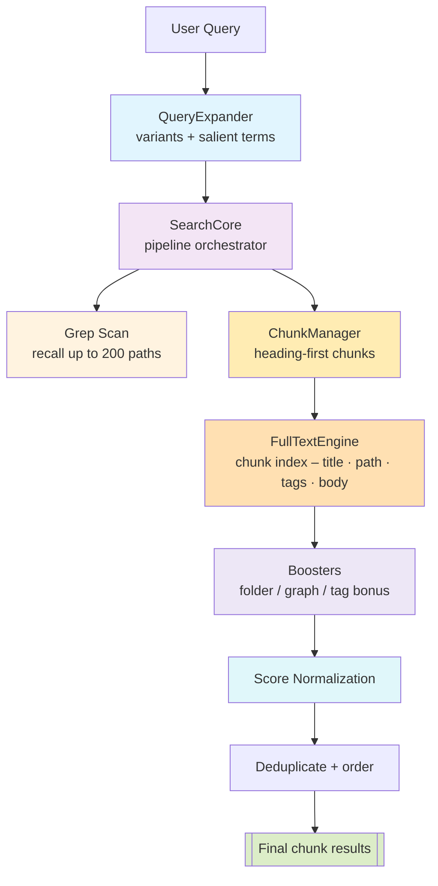

# Search v3: Chunk-Based Lexical Retrieval

A high-performance, memory-bounded lexical search system for Obsidian that uses intelligent chunking to deliver precise, contextual results without content explosion. The search engine operates on individual chunks and returns consistent chunk IDs for result assembly. Semantic search is now handled separately by Orama integration.

## Architecture Overview



## Chunk ID Mapping and Result Assembly

### How Chunk IDs Work

The lexical search engine operates on individual chunks and returns consistent chunk IDs in the format `note_path#chunk_index` (e.g., `Piano Lessons/Lesson 4.md#0`, `Piano Lessons/Lesson 4.md#1`).

### Chunk-to-Text Mapping Process

1. **ChunkManager.getChunkText()**: Maps chunk IDs back to their text content

   ```typescript
   // Example: "Piano Lessons/Lesson 4.md#1" → full chunk text with headers
   const chunkText = chunkManager.getChunkText("Piano Lessons/Lesson 4.md#1");
   ```

2. **Search Result Assembly**:
   - **Lexical Search**: Returns chunk IDs from FlexSearch index with lexical match explanations
   - **Final Assembly**: ChunkManager retrieves chunk text for LLM context generation

### Benefits of Chunk Architecture

- **Granular Context**: LLM receives specific chunk content, not entire notes
- **Memory Efficiency**: Only relevant chunks loaded for generation
- **Consistent Results**: Lexical engine returns consistent chunk ID format
- **Scalable**: Handles large documents by breaking them into manageable pieces

## Key Features

- **Memory-Bounded**: No persistent full-text index, everything ephemeral
- **Progressive Refinement**: Fast grep → full-text lexical search
- **Multilingual**: Supports English and CJK languages
- **Explainable**: Tracks why documents ranked highly
- **Fault-Tolerant**: Graceful fallbacks at each stage
- **Chunk-Based**: Operates on intelligent document chunks for precise context
- **Recall/Ranking Separation**: Uses all terms for finding documents, only salient terms for scoring

## Example: Search Flow

**Query**: `"Need to deploy #project/alpha after fixing #mobile-app sync"`

### 1. Query Expansion

```
Input:  "Need to deploy #project/alpha after fixing #mobile-app sync"
Output: ["Need to deploy #project/alpha after fixing #mobile-app sync",
         "deploy #project/alpha",
         "mobile app sync fix"]
Terms:  ["#project/alpha", "#mobile-app", "deploy", "sync"]
```

### 2. Grep Scan (L0)

Searches for all recall terms (original + expanded + salient):

```
Finds: ["projects/alpha/deploy.md", "projects/mobile/sync.md", "notes/release-checklist.md"]
       (up to 200 candidates)
```

### 3. Chunking (L1)

Heading-first intelligent chunking converts candidate notes into manageable pieces:

```
Input:  3 candidate notes ("projects/alpha/deploy.md", "projects/mobile/sync.md", "notes/release-checklist.md")
Chunks: 7 chunks with size 800-2000 chars each
Output: ["projects/alpha/deploy.md#0", "projects/alpha/deploy.md#1", "projects/mobile/sync.md#0", ...]
```

### 4. Full-Text Search Execution

**Two-phase approach**:

- **Recall**: Uses the original query, expanded variants, and salient/tag terms to locate candidate chunks in the FlexSearch index.
- **Ranking**: Scores with salient/tag terms when they are available; if the expander supplies none, the original user query is used instead. Weighting comes from the FlexSearch scorer plus our field weights, and we taper the impact of tokens that hit most candidates so everyday words (e.g., “note”, “meeting”) can’t overpower rarer matches.

- Builds an ephemeral FlexSearch index from chunks (not full notes)
- **Frontmatter Replication**: Extracts note-level frontmatter once and replicates property values across all chunks from that note
- Field weights: Title (3x), Heading (2.5x), Path (2x), Tags (4x), Body (1x)

### 5. Lexical Reranking (Boosting Stage)

Applied to lexical results (when `enableLexicalBoosts: true`):

- **Folder Boost**: Notes in folders with multiple matches (logarithmic, 1-1.5x)
- **Graph Boost**: Notes linked to other results (1.0-1.15x, only for high-similarity results)
- **Pure Relevance Mode**: When boosts disabled, provides keyword-only scoring without folder/graph influence

### 6. Score Normalization

Min-max normalization prevents auto-1.0 scores

- `baseScore`: The raw score after lexical search and all boosts are applied
- `finalScore`: The normalized score in [0.02, 0.98] range that users see

### 7. Final Results

```
1. projects/alpha/deploy.md#0 (0.94) - Matched `#project/alpha` + “deploy”, folder boost
2. projects/mobile/sync.md#0 (0.46) - Matched `#mobile-app` + “sync”, folder boost
3. notes/release-checklist.md#1 (0.23) - Matched “deploy” and shared tags
```

## Core Components

### SearchCore

- Orchestrates the entire chunk-based search pipeline
- Executes lexical search with intelligent chunking
- Methods:
  - `executeLexicalSearch()`: Chunks candidates, builds index, and searches
  - `retrieve()`: Main entry point for search execution

### ChunkManager

- Converts notes into intelligent chunks using heading-first algorithm
- Simple Map-based cache for performance
- Memory-bounded chunking with configurable size limits
- Methods:
  - `getChunks()`: Creates chunks from note paths with size constraints
  - `getChunkText()`: Retrieves chunk content by ID for LLM context

### Query Expander

- Generates alternative phrasings using LLM (5s timeout)
- Separates recall terms (all) from ranking terms (salient only) to prevent stopword pollution
- Extracts salient terms (nouns) from original user query
- Falls back to original query if LLM unavailable

### Grep Scanner

- Fast substring search using Obsidian's `cachedRead`
- Unified batching (30 files) for all platforms
- Searches both phrases and individual terms
- Path-first optimization for faster matching

### Full-Text Engine

- Ephemeral FlexSearch index built from chunks per-query
- **Two-phase search**: Recall uses all terms, ranking uses only salient terms
- Custom tokenizer for ASCII words + CJK bigrams
- Multi-field indexing with weights: title (3x), heading (2.5x), path (2x), body (1x)
- **Frontmatter Property Indexing**: Extracts and indexes frontmatter property values for searchability
  - **Note-Level Metadata, Chunk-Level Indexing**: Frontmatter extracted once per note, replicated across all chunks
  - Supports primitive values, arrays, and Date objects
  - **Performance Optimization**: Per-note metadata caching
- Memory-efficient: chunk content retrieved from ChunkManager when needed

### Folder & Graph Boost Calculators

**Folder Boost**: Rewards notes that share folders with other search results, scaled by relevance ratio.

- **Relevance Ratio**: `relevant_docs_in_folder / total_docs_in_folder`
- **Requirements**:
  - Minimum 2 relevant documents in folder (configurable)
  - Minimum 40% relevance ratio (configurable)
- **Formula**: `1 + (log2(count + 1) - 1) * sqrt(relevance_ratio)`, capped at 1.15x
- **Example 1**: Searching "authentication" finds 3/5 notes in `nextjs/` folder (60% relevance) → 1.15x boost
- **Example 2**: Finding 2/5 notes in folder (40% relevance) → 1.15x boost (meets threshold)
- **Example 3**: Finding 3/10 notes in folder (30% relevance) → no boost (below 40% threshold)
- **Purpose**: Only boosts truly coherent folders where a significant portion is relevant

**Graph Boost**: Rewards notes that link to other search results.

- **Intelligent Filtering**:
  - Maximum 10 candidates analyzed (performance cap)
  - Requires at least 2 candidates for meaningful connections
- **Connection Types**:
  - Backlinks: Notes that link TO this note (weight: 1.0)
  - Co-citations: Notes cited by same sources (weight: 0.5)
  - Shared tags: Notes with common tags (weight: 0.3)
- **Boost Formula**: `1 + strength × log(1 + connectionScore)`, capped at 1.15x
- **Example**: `auth-guide.md` links to `jwt-setup.md` → both get boosted
- **Purpose**: Surfaces tightly connected knowledge networks while maintaining performance

Both boosts multiply existing scores after lexical search, helping related content rise together.

### Score Normalizer

- Min-max normalization (default) or Z-score with tanh squashing
- Prevents artificial 1.0 scores
- Clips to [0.02, 0.98] range
- Preserves explainability metadata

### External Semantic Search

- Semantic search is now handled by separate Orama integration
- Provides vector-based similarity search capabilities
- Operates independently of the v3 lexical search system

## Frontmatter and Chunk Architecture

### How Note-Level Frontmatter Works with Chunk-Level Search

**The Challenge**: Frontmatter properties (like `author`, `tags`, `status`) are defined once per note, but our search operates on chunks within notes.

**The Solution**: Frontmatter replication with performance optimization:

1. **Extraction Phase** (per note):

   ```typescript
   // Extract frontmatter once per note during chunk indexing
   const frontmatter = cache?.frontmatter ?? {};
   const propValues = this.extractPropertyValues(frontmatter);
   // Cache the extracted values per note path
   processedNotes.set(chunk.notePath, { tags, links, props: propValues });
   ```

2. **Replication Phase** (per chunk):

   ```typescript
   // Include frontmatter in each chunk's searchable body
   const bodyWithProps = [chunk.content, ...noteMetadata.props].join(" ");
   ```

3. **Search Behavior**:
   - Searching for `author: "John Doe"` finds ALL chunks from notes where `author` is "John Doe"
   - Each chunk from that note becomes independently searchable by frontmatter properties
   - Maintains chunk-level granularity while preserving note-level metadata searchability

**Benefits**:

- ✅ **Complete Searchability**: Every frontmatter property is findable via any chunk
- ✅ **Performance**: Per-note caching prevents redundant frontmatter extraction
- ✅ **Consistency**: All chunks from same note have identical frontmatter properties
- ✅ **Granular Results**: Can return specific chunks while preserving metadata context

**Example**:

```
Note: "project-notes.md"
Frontmatter: { author: "Alice", status: "draft", priority: 1 }
Chunks: ["project-notes.md#0", "project-notes.md#1", "project-notes.md#2"]

Search: "Alice" → Finds all 3 chunks, each containing "Alice" in searchable content
Search: "draft" → Finds all 3 chunks, each containing "draft" in searchable content
Search: "priority 1" → Finds all 3 chunks, each containing "1" in searchable content
```

## Data Model

```typescript
interface NoteIdRank {
  id: string; // Chunk ID (note_path#chunk_index) or note path for legacy
  score: number; // Relevance score [0-1]
  engine?: string; // Source engine
  explanation?: {
    // Why it ranked high
    lexicalMatches?: Array<{ field: string; query: string; weight: number }>;
    semanticScore?: number;
    folderBoost?: { folder: string; documentCount: number; boostFactor: number };
    graphConnections?: {
      backlinks: number;
      coCitations: number;
      sharedTags: number;
      score: number;
      boostMultiplier: number;
    };
    baseScore: number; // Score before normalization (after RRF fusion and boosts)
    finalScore: number; // Score after normalization (final 0-1 range score)
  };
}

interface Chunk {
  id: string; // note_path#chunk_index
  notePath: string; // original note path
  chunkIndex: number; // 0-based chunk position
  content: string; // chunk text with headers + frontmatter properties
  title: string; // note title
  heading: string; // section heading
  mtime: number; // note modification time
}
```

## Performance Characteristics

- **Grep scan**: < 50ms for 1k files
- **Chunking**: < 50ms for 500 candidates → ~1000 chunks
- **Full-text build**: < 100ms for 1000 chunks (memory-bounded)
- **Lexical search**: Fast in-memory FlexSearch queries
- **Total latency**: < 200ms P95 (chunking + lexical search)
- **Memory peak**: < 20MB mobile, < 100MB desktop
- **Memory split**: 35% chunk cache, 65% FlexSearch index

## Configuration & Usage

### Search Parameters

- `maxResults`: Number of results to return (default: 30, max: 100)
- `candidateLimit`: Max candidates for full-text (default: 500, range: 10-1000)
- `salientTerms`: Additional terms to enhance the search (optional)
- `enableLexicalBoosts`: Enable folder and graph boosts (default: true)

### Plugin Settings

- **Enable Lexical Boosts**: Toggle for folder and graph relevance boosts
- **Chunk Configuration**:
  - Chunk Size: 6000 characters (uses CHUNK_SIZE constant)
  - All relevant chunks included from matching notes
- **Graph Boost Configuration**:
  - Max Candidates: 10 (performance cap)
  - Boost Strength: 0.1 (connection influence)
  - Max Boost Multiplier: 1.15x (prevents over-boosting)
- **Memory Management**: RAM usage split between chunks (35%) and FlexSearch (65%)
- **File Filtering**: Pattern-based inclusions and exclusions for search

## Full Pipeline Overview

```
┌────────────┐         ┌──────────────────┐          ┌─────────────────────────┐
│ User Query │───────▶│ QueryExpander    │─────────▶│ Salient Terms           │
└────────────┘         └──────┬───────────┘          └────────┬──────────────────┘
                               │ keep language / keep #tags              │
                               ▼                                         ▼
┌──────────────────┐   ┌──────────────────┐          ┌─────────────────────────┐
│ Grep (recall)    │◀──│ SearchCore       │─────────▶│ FlexSearch (ranking pool)│
└──────┬───────────┘   └──────┬───────────┘          └────────┬──────────────────┘
       │ candidate list        │ returnAll? cap=200                     │ normalized scores
       ▼                       ▼                                         ▼
┌──────────────────┐   ┌──────────────────┐          ┌─────────────────────────┐
│ ChunkManager     │──▶│ FullTextEngine   │─────────▶│ Scoring + Boosting      │
└──────────────────┘   └──────┬───────────┘          └────────┬──────────────────┘
                              │ index title/path/body/tags/props          │ folder/graph/tag bonuses
                              ▼                                           ▼
                       ┌─────────────────────────┐             ┌─────────────────────────┐
                       │ Dedup + Ordering        │────────────▶│ Final Results (≤200)   │
                       └─────────────────────────┘             └─────────────────────────┘
```

- **Query & tags**: Expansion keeps hash-prefixed terms exactly as typed (`#project/alpha`). We do not generate plain variants; tag recall is handled by metadata indexing.
- **Recall**: Grep seeds the candidate list with the original query + salient terms while honouring the 200-chunk ceiling when `returnAll` is enabled (time range or tag query).
- **Chunking**: Notes are split once through `ChunkManager`, and frontmatter properties/tags are copied to every chunk while inline tags stay local.
- **Indexing**: `FullTextEngine` indexes title, path, body, and the normalised tag/prop fields. Tags receive their own field but we avoid partial matches for hyphenated tags, keeping tokens intact.
- **Scoring**: FlexSearch results flow through lexical scoring, folder/graph boosts, and a modest tag bonus (`tags` weight = 4) so true tag hits win without overwhelming other evidence.
- **Return-all mode**: When a time range or tag query is detected we raise the cap to 200 chunks (`RETURN_ALL_LIMIT`), guaranteeing tag/time windows fan out widely while staying bounded for downstream ranking.

**Example** — `#project/alpha bugfix`

1. QueryExpander preserves the tag (`#project/alpha`) and extracts `bugfix` as a salient term.
2. SearchCore runs grep + FlexSearch with `#project/alpha` and `bugfix`, raising the cap to 200.
3. FullTextEngine finds chunks where the metadata already lists that tag (inline or frontmatter) and indexes them under the `tags` field.
4. Scoring boosts those chunks via the tag field weight, so the bugfix notes with the exact tag rise above generic “project alpha” mentions.

## Semantic + Lexical Fusion (Design)

Semantic retrieval (HybridRetriever/Orama) is strong at paraphrase recall, while Search v3’s TieredLexicalRetriever excels at deliberate keyword/tag matching. When the **Semantic Search** toggle is enabled we can fuse both without widening the retriever surface area.

- **MergedSemanticRetriever**
  - Implements the same `getRelevantDocuments()` API.
  - Internally holds one `HybridRetriever` and one `TieredLexicalRetriever`, reusing the shared `ChunkManager` when possible.
- **Execution Flow**
  - Run both engines in parallel (`Promise.all` with shared abort handling).
  - Annotate each returned `Document` with `metadata.source = "semantic"` or `"lexical"`.
  - Dedupe by `chunkId`/`path`, preferring the lexical chunk when both engines surface the same slice.
  - Blend scores using lightweight weights (e.g., lexical ×1.0, semantic ×0.7) and reuse existing tag bonuses so tagged hits stay on top.
  - Write the blended score back to `metadata.score`/`metadata.rerank_score`, sort, and cap at `maxK`.
- **Result Limits**
  - When `returnAll` is **false**, request roughly `maxK` items from each engine, merge/dedupe, then truncate to `maxK`.
  - When `returnAll` is **true**, propagate the widened ceiling (`RETURN_ALL_LIMIT`, e.g. 200) to both engines and keep the merged list at that size so tag/time queries still return every chunk Search v3 surfaced.
- **Integration Points**
  - Vault QA: when semantic search is on, instantiate `MergedSemanticRetriever`; otherwise keep TieredLexicalRetriever.
  - `lexicalSearch` tool (and similar call sites) construct the merged retriever instead of branching on the toggle.
- **Fallback Behaviour**
  - With semantic search disabled nothing changes—the TieredLexicalRetriever path remains intact.

This approach keeps callers unaware of the fusion mechanics while giving users semantic coverage plus Search v3’s deterministic tag/keyword strength.

## Key Design Decisions

1. **Lexical-Only Architecture**: Fast, reliable keyword-based search with intelligent boosting
2. **Heading-First Algorithm**: Preserves document structure while respecting size limits
3. **No Persistent Full-Text Index**: Grep provides fast initial seeding, chunks built per-query
4. **Ephemeral Everything**: Eliminates maintenance overhead
5. **Memory-Efficient Indexing**: FlexSearch stores metadata only, chunk content retrieved when needed
6. **Frontmatter Property Integration**: Extract note-level frontmatter once and replicate across all chunks for seamless search
7. **Chunk Sequence Preservation**: Chunks from same note served in order for LLM context
8. **Min-Max Normalization**: Prevents artificial perfect scores while preserving monotonicity
9. **Explainable Rankings**: Track contributing factors for transparency including chunk-level details
10. **Memory Budget Split**: Fixed 35%/65% allocation between chunk cache and FlexSearch index
11. **Semantic Search Separation**: Semantic capabilities now handled by dedicated Orama integration
