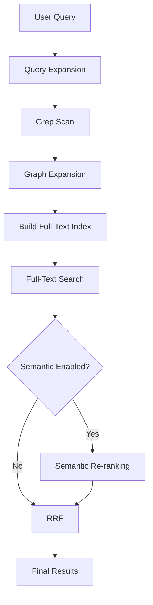

# Obsidian Copilot — Tiered Note-Level Lexical Retrieval

_(Multilingual, Partial In-Memory; optional semantic add-on)_

## TODO: Integration Tasks

- [ ] Hook into existing local search tool (replace Orama)
- [ ] Connect to Obsidian metadataCache events
- [ ] Add file watcher for incremental updates
- [ ] Mobile optimizations (yielding, smaller batches)
- [ ] Create settings UI (memory cap, candidate size, semantic toggle)
- [ ] Integration tests for full retrieval pipeline
- [ ] Performance benchmarks (latency, memory usage)
- [ ] Migration path from existing engines
- [ ] VectorStoreManager integration (future - semantic)

---

## Quick Example: End-to-End Flow

**Query**: `"How do I set up OAuth in Next.js?"`

### Step-by-Step Processing:

```
1. Query Expansion (LLM, 500ms timeout)
   Input:  "How do I set up OAuth in Next.js?"
   Output: ["How do I set up OAuth in Next.js?",
            "Next.js OAuth configuration",
            "NextJS OAuth setup"]
   Terms:  ["oauth", "nextjs"] (nouns only)

2. Grep Scan (L0 - substring search)
   Searches BOTH: Full queries + Individual terms
   Input: ["How do I set up OAuth in Next.js?", "Next.js OAuth configuration",
           "NextJS OAuth setup", "oauth", "nextjs"]
   Finds: ["auth/oauth-guide.md", "nextjs/auth.md", "tutorials/oauth.md"]

3. Graph Expansion (link analysis)
   Strategies: Link traversal + Active context + Co-citation
   From:       3 grep hits → 8 total candidates
   Adds:       JWT.md (linked), auth-flow.md (backlink), config.md (co-cited)

4. Full-Text Index (L1 - ephemeral FlexSearch)
   Builds index from 8 notes with fields:
   - title (3x weight), headings (2x), tags (2x), links (2x), body (1x)

5. Full-Text Search (Hybrid: Phrases + Terms)
   Searches BOTH: 3 query variants (precision) + 2 terms (recall)
   Input: ["How do I set up OAuth in Next.js?", "Next.js OAuth configuration",
           "NextJS OAuth setup", "oauth", "nextjs"]
   Results by field match + position:

   | Note | Title Match | Tag Match | Body Match | Score |
   |------|------------|-----------|------------|-------|
   | nextjs/auth.md | "NextJS OAuth Setup" (pos 1) | #oauth #nextjs | Yes | 5.0 |
   | auth/oauth-guide.md | "OAuth Guide" (pos 2) | #oauth | Yes | 2.1 |
   | tutorials/oauth.md | - | #oauth | Yes | 1.2 |

6. RRF (combine rankings)
   Merges: full-text (1.0x) + grep prior (0.3x) + semantic (2.0x if enabled)

7. Final Results
   1. nextjs/auth.md (score: 5.0)
   2. auth/oauth-guide.md (score: 2.1)
   3. tutorials/oauth.md (score: 1.2)
```

---

## 1) Scope & Goals

- **Bounded RAM** on desktop and mobile; no full-vault body index.
- **Instant first results** with progressive refinement.
- **Multilingual** (English + CJK) lexical search via a hybrid tokenizer.
- **Index-free feel**: everything is in-memory and ephemeral by default.
- **Optional semantic engine**: can add extra candidates and a similarity signal, off by default.

---

## 2) Query → Result Flow

### Complete End-to-End Pipeline



### Detailed Step-by-Step Flow

```typescript
async function retrieve(query: string): Promise<NoteIdRank[]> {
  // 1. QUERY EXPANSION - Generate variants for better recall
  // Uses LLM (with 500ms timeout) to generate alternative phrasings
  const expanded = await queryExpander.expand(query);
  const variants = expanded.queries; // ["original", "variant1", "variant2"]

  // Example: "How do I implement authentication in my Next.js app?" →
  // variants: ["How do I implement authentication in my Next.js app?",
  //            "Next.js authentication implementation",
  //            "NextJS auth setup guide"]
  // salientTerms: ["authentication", "nextjs", "app"] (extracted nouns only)

  // 2. GREP SCAN - Fast substring search for initial candidates
  // Uses BOTH full queries AND individual terms for maximum recall
  const allSearchStrings = [...variants, ...expanded.salientTerms];
  const grepHits = await grepScanner.batchCachedReadGrep(allSearchStrings, 200);
  // Searches for full phrases + individual terms: "authentication", "nextjs", "app"
  // Returns: ["auth/nextjs-setup.md", "tutorials/nextjs-auth.md", ...] up to 200 files

  // 3. GRAPH EXPANSION - Expand via links for better recall
  const activeFile = app.workspace.getActiveFile();
  const expandedCandidates = await graphExpander.expandCandidates(
    grepHits,      // Start from grep hits
    activeFile,    // Include active note neighbors
    graphHops: 1   // 1-hop expansion
  );
  // Expands: 50 grep hits → 150+ via links and co-citations
  // Adds: notes linking to/from auth notes, JWT docs, OAuth guides, etc.

  // 4. CANDIDATE LIMITING - Respect memory bounds
  const candidates = expandedCandidates.slice(0, 500);

  // 5. BUILD FULL-TEXT INDEX - Ephemeral FlexSearch from candidates
  await fullTextEngine.buildFromCandidates(candidates);
  // Indexes: title, headings, tags, links (as basenames), body with multilingual tokenizer
  // Example indexed doc: {title: "NextJS Auth Guide", headings: ["JWT Setup", "OAuth"],
  //                       tags: ["nextjs", "auth"], links: "jwt-basics oauth-flow", body: "..."}

  // 6. FULL-TEXT SEARCH - Hybrid search with phrases AND terms
  // Combines: Full query variants (precision) + Individual terms (recall)
  const allFullTextQueries = [...variants, ...expanded.salientTerms];
  const fullTextResults = fullTextEngine.search(allFullTextQueries, limit * 2);
  // Searches: ["How do I implement...", "Next.js auth...", "authentication", "nextjs", "app"]
  // Returns: [{id: "tutorials/nextjs-auth.md", score: 0.95, engine: "fulltext"},
  //          {id: "auth/jwt-implementation.md", score: 0.8, engine: "fulltext"}, ...]

  // 7. OPTIONAL SEMANTIC RE-RANKING
  let semanticResults = [];
  if (settings.enableSemantic) {
    // Get semantic candidates from vector store
    const semCandidates = await semanticSearch(query, 200);

    // Combine with full-text results
    const combined = unionById([...fullTextResults, ...semCandidates]);

    // Re-rank all using embedding similarity
    const queryEmbeddings = await embedQueries(variants);
    semanticResults = await reRankBySimilarity(combined, queryEmbeddings);
  }

  // 8. WEIGHTED RRF - Combine all signals
  const fusedResults = weightedRRF({
    lexical: fullTextResults,     // weight: 1.0
    semantic: semanticResults,     // weight: 2.0 (if enabled)
    grepPrior: grepHits.slice(50), // weight: 0.3 (weak prior for direct matches)
  }, k: 60);
  // Combines rankings: docs appearing in multiple result sets score higher

  // 9. CLEANUP & RETURN
  fullTextEngine.clear(); // Free memory
  return fusedResults.slice(0, maxResults); // Default: top 30
  // Final: ["tutorials/nextjs-auth.md", "auth/jwt-implementation.md",
  //         "examples/nextjs-oauth.md", ...]
}
```

### Key Flow Characteristics

1. **Progressive Refinement**: Start fast (grep) → expand (graph) → refine (full-text)
2. **Hybrid Search Strategy**: Uses BOTH full query phrases (precision) AND individual terms (recall)
3. **Memory-Bounded**: Each step respects platform memory limits
4. **Multilingual**: Handles ASCII and CJK throughout the pipeline
5. **Fault-Tolerant**: Falls back to grep-only if pipeline fails
6. **Configurable**: Semantic search, graph hops, memory limits all adjustable
7. **Link-Aware Search**: Links are indexed as searchable basenames while preserving full paths for graph traversal

---

## 3) Data Model

```ts
interface NoteDoc {
  id: string; // vault-relative path
  title: string; // filename or front-matter title
  headings: string[]; // H1..H6 plain text (indexed)
  tags: string[]; // inline + frontmatter via getAllTags(cache) (indexed)
  props: Record<string, unknown>; // frontmatter key/values (extracted but not indexed)
  linksOut: string[]; // outgoing link full paths (extracted and indexed as basenames)
  linksIn: string[]; // backlink full paths (extracted and indexed as basenames)
  body: string; // full markdown text (indexed)
}

interface NoteIdRank {
  id: string; // note path
  score: number; // relevance score
  engine?: string; // source engine (l1, semantic, grepPrior)
}
```

---

## 4) Core Components

### 4.1 Query Expander (Query Enhancement)

Uses LLM to generate alternative query phrasings and extract salient terms.

**Examples**:

- `"How do I implement authentication in my Next.js app?"` →

  - queries: `["How do I implement authentication in my Next.js app?", "Next.js authentication implementation", "NextJS auth setup"]`
  - salientTerms: `["authentication", "nextjs", "app"]` (NOT "how", "implement", "my")

- `"What are the best practices for React hooks?"` →

  - queries: `["What are the best practices for React hooks?", "React hooks best practices", "React hook patterns guidelines"]`
  - salientTerms: `["practices", "react", "hooks"]` (NOT "what", "best", "are")

- `"Can you show me examples of Python decorators?"` →

  - queries: `["Can you show me examples of Python decorators?", "Python decorator examples", "Python decorator patterns"]`
  - salientTerms: `["examples", "python", "decorators"]` (NOT "can", "show", "me")

- `"我需要学习如何使用Git分支"` (Chinese) →
  - queries: `["我需要学习如何使用Git分支", "Git分支使用教程", "Git分支管理"]`
  - salientTerms: `["git", "分支"]` (NOT "需要", "学习", "如何", "使用")

**Key Features**:

- **Language-agnostic**: Works with any language (English, Chinese, Japanese, etc.)
- **Smart filtering**: Excludes action verbs (find, search, get, 查找, buscar, etc.)
- **Timeout protection**: 500ms timeout prevents slow LLM responses
- **Caching**: Results cached to avoid redundant LLM calls
- **Fallback**: Uses original query if LLM unavailable

### 4.2 Grep Scanner (L0 - Initial Seeding)

Fast substring search using Obsidian's `cachedRead`. Searches both full queries and individual terms with batch processing optimized for platform (10 files on mobile, 50 on desktop).

### 4.3 Graph Expander

Discovers related notes through link analysis, expanding initial grep hits from ~50 to 150+ candidates.

**Three Strategies:**

1. **BFS Link Traversal** - Follows outgoing/backlinks from grep hits
2. **Active Context** - Includes neighbors of currently open note
3. **Co-citation** - Finds notes linking to same targets (topic similarity)

Enables discovery of conceptually related notes without exact term matches by leveraging the knowledge graph structure.

### 4.4 Full-Text Engine (L1 - Ephemeral Body Index)

FlexSearch index built per-query:

#### FlexSearch Ranking Algorithm

FlexSearch uses a **Contextual Index** algorithm (NOT BM25/TF-IDF). Key characteristics:

1. **Position-based scoring**: Results are ranked by position (1st result = score 1.0, 2nd = 0.5, 3rd = 0.33, etc.)
2. **Field weights**: Title (3x) > Headings/Tags/Links (2x) > Body (1x)
3. **Input format**: Can be either sentences or terms. Our tokenizer splits into:
   - ASCII words: `"hello world"` → `["hello", "world"]`
   - CJK bigrams: `"中文编程"` → `["中文", "文编", "编程"]`

**Hybrid Search Approach:**

- Searches both full query phrases (for precision) and individual terms (for recall)
- Combines scores using max scoring across all searches
- Results in better recall without sacrificing precision

**Implementation Details:**

- Builds ephemeral FlexSearch index per-query
- Memory-bounded with platform-aware limits (8MB mobile, 20MB desktop)
- Custom tokenizer handles ASCII words and CJK bigrams
- Links indexed as searchable basenames while preserving full paths

### 4.5 Semantic Re-ranker (L2 - Optional)

When semantic is enabled, re-ranks combined results using embedding similarity. Uses max similarity across query variants for robust scoring.

### 4.6 Weighted RRF

Combines multiple rankings with configurable weights using Reciprocal Rank Fusion (RRF). Documents appearing in multiple result sets receive higher scores. Default weights: lexical (1.0x), semantic (2.0x), grep prior (0.3x).

---

## 5) Runtime Logging

When a search is executed, you'll see detailed logging showing each pipeline step:

```
=== TieredRetriever: Starting search for "How do I implement authentication in my Next.js app?" ===
Query expansion: 3 variants + 3 terms
  Variants: ["How do I implement authentication in my Next.js app?", "Next.js authentication implementation", "NextJS auth setup guide"]
  Terms: ["authentication", "nextjs", "app"]
Grep scan: Found 52 initial matches (searching 6 inputs)
  Grep: 52 files match from phrases + terms
Graph expansion: grep: 52→156, active: 12, co-cited: 8 → 176 total
  Graph hop 1: 52 → 156 notes (+104)
Full-text index: Built with 176 documents
  FullText: Indexed 176/176 docs (18% memory, 1543210 bytes)
Full-text search: Found 35 results (using 6 search inputs)
RRF: Processed 35 items from lexical with weight 1
RRF: Processed 52 items from grepPrior with weight 0.3
RRF: Fused 68 unique results
Final results: 30 documents (after RRF)
```

This logging helps debug search performance and understand the retrieval flow.

## 6) Performance & Configuration

### Performance Characteristics

- **No persistent index**: Everything built per-query
- **Grep scan**: < 50ms for 1k files (cached)
- **Graph expansion**: < 30ms for 200 nodes
- **Full-text build**: < 100ms for 500 candidates
- **Total latency**: < 200ms P95
- **Memory peak**: < 20MB mobile, < 50MB desktop

### Settings

| Setting         | Mobile | Desktop | Description                     |
| --------------- | ------ | ------- | ------------------------------- |
| Memory cap      | 8MB    | 20MB    | Maximum index memory            |
| Candidate limit | 300    | 500     | Max notes to index              |
| Graph hops      | 1      | 1-3     | Link traversal depth            |
| Semantic        | Off    | Off     | Enable embedding search         |
| Semantic weight | 2.0x   | 2.0x    | RRF weight                      |
| RRF k-value     | 60     | 60      | Reciprocal rank fusion constant |

---

## Implementation Status

**Completed**: All core components implemented with 66 unit tests passing

- Query expansion with LLM integration
- Grep scanner with platform-optimized batching
- Graph expander with BFS traversal
- Full-text engine with ephemeral FlexSearch
- Multilingual tokenizer (ASCII + CJK)
- Weighted RRF
- TieredRetriever orchestrator

**Key Insights**:

- No persistent index needed - grep provides fast initial seeding
- Graph expansion dramatically improves recall (3x candidates)
- Ephemeral indexing eliminates maintenance overhead
