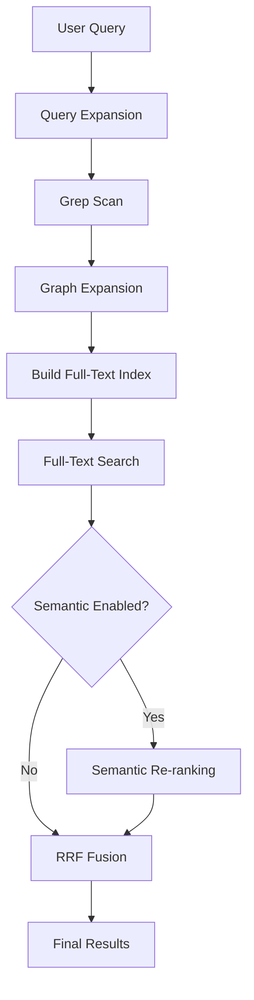

# Obsidian Copilot — Tiered Note-Level Lexical Retrieval

_(Multilingual, Partial In-Memory; optional semantic add-on)_

---

## Quick Example: End-to-End Flow

**Query**: `"How do I set up OAuth in Next.js?"`

### Step-by-Step Processing:

```
1. Query Expansion (LLM, 500ms timeout)
   Input:  "How do I set up OAuth in Next.js?"
   Output: ["How do I set up OAuth in Next.js?",
            "Next.js OAuth configuration",
            "NextJS OAuth setup"]
   Terms:  ["oauth", "nextjs"] (nouns only)

2. Grep Scan (L0 - substring search)
   Searches BOTH: Full queries + Individual terms
   Input: ["How do I set up OAuth in Next.js?", "Next.js OAuth configuration",
           "NextJS OAuth setup", "oauth", "nextjs"]
   Finds: ["auth/oauth-guide.md", "nextjs/auth.md", "tutorials/oauth.md"]

3. Graph Expansion (link analysis)
   Strategies: Link traversal + Active context + Co-citation
   From:       3 grep hits → 8 total candidates
   Adds:       JWT.md (linked), auth-flow.md (backlink), config.md (co-cited)

4. Full-Text Index (L1 - ephemeral FlexSearch)
   Builds index from 8 notes with fields:
   - title (3x weight), headings (2x), tags (2x), links (2x), body (1x)

5. Full-Text Search (Hybrid: Phrases + Terms)
   Searches BOTH: 3 query variants (precision) + 2 terms (recall)
   Input: ["How do I set up OAuth in Next.js?", "Next.js OAuth configuration",
           "NextJS OAuth setup", "oauth", "nextjs"]
   Results by field match + position:

   | Note | Title Match | Tag Match | Body Match | Score |
   |------|------------|-----------|------------|-------|
   | nextjs/auth.md | "NextJS OAuth Setup" (pos 1) | #oauth #nextjs | Yes | 5.0 |
   | auth/oauth-guide.md | "OAuth Guide" (pos 2) | #oauth | Yes | 2.1 |
   | tutorials/oauth.md | - | #oauth | Yes | 1.2 |

6. RRF Fusion (combine rankings)
   Merges: full-text (1.0x) + grep prior (0.3x) + semantic (2.0x if enabled)

7. Final Results
   1. nextjs/auth.md (score: 5.0)
   2. auth/oauth-guide.md (score: 2.1)
   3. tutorials/oauth.md (score: 1.2)
```

---

## 1) Scope & Goals

- **Bounded RAM** on desktop and mobile; no full-vault body index.
- **Instant first results** with progressive refinement.
- **Multilingual** (English + CJK) lexical search via a hybrid tokenizer.
- **Index-free feel**: everything is in-memory and ephemeral by default.
- **Optional semantic engine**: can add extra candidates and a similarity signal, off by default.

---

## 2) Query → Result Flow

### Complete End-to-End Pipeline



### Detailed Step-by-Step Flow

```typescript
async function retrieve(query: string): Promise<NoteIdRank[]> {
  // 1. QUERY EXPANSION - Generate variants for better recall
  // Uses LLM (with 500ms timeout) to generate alternative phrasings
  const expanded = await queryExpander.expand(query);
  const variants = expanded.queries; // ["original", "variant1", "variant2"]

  // Example: "How do I implement authentication in my Next.js app?" →
  // variants: ["How do I implement authentication in my Next.js app?",
  //            "Next.js authentication implementation",
  //            "NextJS auth setup guide"]
  // salientTerms: ["authentication", "nextjs", "app"] (extracted nouns only)

  // 2. GREP SCAN - Fast substring search for initial candidates
  // Uses BOTH full queries AND individual terms for maximum recall
  const allSearchStrings = [...variants, ...expanded.salientTerms];
  const grepHits = await grepScanner.batchCachedReadGrep(allSearchStrings, 200);
  // Searches for full phrases + individual terms: "authentication", "nextjs", "app"
  // Returns: ["auth/nextjs-setup.md", "tutorials/nextjs-auth.md", ...] up to 200 files

  // 3. GRAPH EXPANSION - Expand via links for better recall
  const activeFile = app.workspace.getActiveFile();
  const expandedCandidates = await graphExpander.expandCandidates(
    grepHits,      // Start from grep hits
    activeFile,    // Include active note neighbors
    graphHops: 1   // 1-hop expansion
  );
  // Expands: 50 grep hits → 150+ via links and co-citations
  // Adds: notes linking to/from auth notes, JWT docs, OAuth guides, etc.

  // 4. CANDIDATE LIMITING - Respect memory bounds
  const candidates = expandedCandidates.slice(0, 500);

  // 5. BUILD FULL-TEXT INDEX - Ephemeral FlexSearch from candidates
  await fullTextEngine.buildFromCandidates(candidates);
  // Indexes: title, headings, tags, links (as basenames), body with multilingual tokenizer
  // Example indexed doc: {title: "NextJS Auth Guide", headings: ["JWT Setup", "OAuth"],
  //                       tags: ["nextjs", "auth"], links: "jwt-basics oauth-flow", body: "..."}

  // 6. FULL-TEXT SEARCH - Hybrid search with phrases AND terms
  // Combines: Full query variants (precision) + Individual terms (recall)
  const allFullTextQueries = [...variants, ...expanded.salientTerms];
  const fullTextResults = fullTextEngine.search(allFullTextQueries, limit * 2);
  // Searches: ["How do I implement...", "Next.js auth...", "authentication", "nextjs", "app"]
  // Returns: [{id: "tutorials/nextjs-auth.md", score: 0.95, engine: "fulltext"},
  //          {id: "auth/jwt-implementation.md", score: 0.8, engine: "fulltext"}, ...]

  // 7. OPTIONAL SEMANTIC RE-RANKING
  let semanticResults = [];
  if (settings.enableSemantic) {
    // Get semantic candidates from vector store
    const semCandidates = await semanticSearch(query, 200);

    // Combine with full-text results
    const combined = unionById([...fullTextResults, ...semCandidates]);

    // Re-rank all using embedding similarity
    const queryEmbeddings = await embedQueries(variants);
    semanticResults = await reRankBySimilarity(combined, queryEmbeddings);
  }

  // 8. WEIGHTED RRF FUSION - Combine all signals
  const fusedResults = weightedRRF({
    lexical: fullTextResults,     // weight: 1.0
    semantic: semanticResults,     // weight: 2.0 (if enabled)
    grepPrior: grepHits.slice(50), // weight: 0.3 (weak prior for direct matches)
  }, k: 60);
  // Combines rankings: docs appearing in multiple result sets score higher

  // 9. CLEANUP & RETURN
  fullTextEngine.clear(); // Free memory
  return fusedResults.slice(0, maxResults); // Default: top 30
  // Final: ["tutorials/nextjs-auth.md", "auth/jwt-implementation.md",
  //         "examples/nextjs-oauth.md", ...]
}
```

### Key Flow Characteristics

1. **Progressive Refinement**: Start fast (grep) → expand (graph) → refine (full-text)
2. **Hybrid Search Strategy**: Uses BOTH full query phrases (precision) AND individual terms (recall)
3. **Memory-Bounded**: Each step respects platform memory limits
4. **Multilingual**: Handles ASCII and CJK throughout the pipeline
5. **Fault-Tolerant**: Falls back to grep-only if pipeline fails
6. **Configurable**: Semantic search, graph hops, memory limits all adjustable
7. **Link-Aware Search**: Links are indexed as searchable basenames while preserving full paths for graph traversal

---

## 3) Data Model

```ts
interface NoteDoc {
  id: string; // vault-relative path
  title: string; // filename or front-matter title
  headings: string[]; // H1..H6 plain text (indexed)
  tags: string[]; // inline + frontmatter via getAllTags(cache) (indexed)
  props: Record<string, unknown>; // frontmatter key/values (extracted but not indexed)
  linksOut: string[]; // outgoing link full paths (extracted and indexed as basenames)
  linksIn: string[]; // backlink full paths (extracted and indexed as basenames)
  body: string; // full markdown text (indexed)
}

interface NoteIdRank {
  id: string; // note path
  score: number; // relevance score
  engine?: string; // source engine (l1, semantic, grepPrior)
}
```

---

## 4) Core Components

### 4.1 Query Expander (Query Enhancement)

Uses LLM to generate alternative query phrasings and extract salient terms:

```typescript
class QueryExpander {
  async expand(query: string): Promise<ExpandedQuery> {
    // 1. Try LLM expansion with 500ms timeout
    // 2. Generate 2 alternative phrasings
    // 3. Extract noun-like terms (excludes action verbs)
    // 4. Falls back to original query if LLM unavailable

    return {
      queries: ["original", "variant1", "variant2"],
      salientTerms: ["noun1", "noun2"], // Content-bearing words only
    };
  }
}
```

**Examples**:

- `"How do I implement authentication in my Next.js app?"` →

  - queries: `["How do I implement authentication in my Next.js app?", "Next.js authentication implementation", "NextJS auth setup"]`
  - salientTerms: `["authentication", "nextjs", "app"]` (NOT "how", "implement", "my")

- `"What are the best practices for React hooks?"` →

  - queries: `["What are the best practices for React hooks?", "React hooks best practices", "React hook patterns guidelines"]`
  - salientTerms: `["practices", "react", "hooks"]` (NOT "what", "best", "are")

- `"Can you show me examples of Python decorators?"` →

  - queries: `["Can you show me examples of Python decorators?", "Python decorator examples", "Python decorator patterns"]`
  - salientTerms: `["examples", "python", "decorators"]` (NOT "can", "show", "me")

- `"我需要学习如何使用Git分支"` (Chinese) →
  - queries: `["我需要学习如何使用Git分支", "Git分支使用教程", "Git分支管理"]`
  - salientTerms: `["git", "分支"]` (NOT "需要", "学习", "如何", "使用")

**Key Features**:

- **Language-agnostic**: Works with any language (English, Chinese, Japanese, etc.)
- **Smart filtering**: Excludes action verbs (find, search, get, 查找, buscar, etc.)
- **Timeout protection**: 500ms timeout prevents slow LLM responses
- **Caching**: Results cached to avoid redundant LLM calls
- **Fallback**: Uses original query if LLM unavailable

### 4.2 Grep Scanner (L0 - Initial Seeding)

Fast substring search using Obsidian's `cachedRead`:

```ts
class GrepScanner {
  async batchCachedReadGrep(queries: string[], limit: number): Promise<string[]> {
    const files = app.vault.getMarkdownFiles();
    const matches: Set<string> = new Set();
    const batchSize = Platform.isMobile ? 10 : 50;

    for (let i = 0; i < files.length && matches.size < limit; i += batchSize) {
      const batch = files.slice(i, i + batchSize);

      await Promise.all(
        batch.map(async (file) => {
          const content = await app.vault.cachedRead(file);
          const lower = content.toLowerCase();

          for (const query of queries) {
            if (lower.includes(query.toLowerCase())) {
              matches.add(file.path);
              break;
            }
          }
        })
      );

      // Yield on mobile
      if (Platform.isMobile && i % 100 === 0) {
        await new Promise((r) => setTimeout(r, 0));
      }
    }

    return Array.from(matches).slice(0, limit);
  }
}
```

### 4.3 Graph Expander (Increase Recall via Link Analysis)

Discovers related notes that don't contain search terms but are conceptually connected through the knowledge graph.

**Three Expansion Strategies:**

1. **BFS Link Traversal** - Breadth-first search following outgoing links and backlinks
2. **Active Context** - Includes neighbors of the currently open note
3. **Co-citation** - Finds notes linking to same targets (topic similarity)

**How It Works:**

```typescript
// Example: Search for "authentication" finds 3 notes initially
grepHits = ["auth/oauth.md", "auth/jwt.md", "tutorials/auth.md"];

// 1. Link Traversal (1 hop)
// - oauth.md links to: ["concepts/tokens.md", "auth/flow.md"]
// - jwt.md has backlinks from: ["api/security.md", "examples/login.md"]
// → Adds 4 more notes via direct connections

// 2. Active Context (user has "nextjs/setup.md" open)
// - setup.md links to: ["auth/nextjs-auth.md", "config/env.md"]
// → Adds 2 more contextually relevant notes

// 3. Co-citation (oauth.md and jwt.md both link to "crypto/signing.md")
// - Other notes also linking to signing.md: ["auth/saml.md"]
// → Adds 1 topically similar note

// Final expansion: 3 → 10 notes
```

**Key Benefits:**

- Finds conceptually related notes without exact term matches
- Uses graph structure to infer relationships
- Adapts to user's current context (active note)
- Discovers notes about similar topics via shared references

### 4.4 Full-Text Engine (L1 - Ephemeral Body Index)

FlexSearch index built per-query:

#### FlexSearch Ranking Algorithm

FlexSearch uses a **Contextual Index** algorithm (NOT BM25/TF-IDF). Key characteristics:

1. **Position-based scoring**: Results are ranked by position (1st result = score 1.0, 2nd = 0.5, 3rd = 0.33, etc.)
2. **Field weights**: Title (3x) > Headings/Tags/Links (2x) > Body (1x)
3. **Input format**: Can be either sentences or terms. Our tokenizer splits into:
   - ASCII words: `"hello world"` → `["hello", "world"]`
   - CJK bigrams: `"中文编程"` → `["中文", "文编", "编程"]`

**Example Search Flow (Hybrid Approach)**:

```typescript
// Original Query: "How do I implement authentication in my Next.js app?"
//
// We search with BOTH:
// 1. Full phrases: ["How do I implement authentication in my Next.js app?",
//                   "Next.js authentication implementation", "NextJS auth setup"]
// 2. Individual terms: ["authentication", "nextjs", "app"]
//
// Each gets tokenized and searched across all fields:

// Search 1: Full phrase "Next.js authentication implementation"
// - Title match: "Next.js Authentication Guide" → score 3.0
// - Body matches: multiple positions → score 0.5

// Search 2: Term "authentication" (better recall)
// - Title matches: 5 documents → various scores
// - Tag matches: 12 documents → various scores
// - Body matches: 25 documents → various scores

// Search 3: Term "nextjs" (better recall)
// - Similar broad matching across fields

// Combined scoring (max score per document across all searches):
// - Note A: Best from phrase search (3.0) OR term search (2.5) = 3.0
// - Note B: Best from term searches only = 2.1
// - Note C: Matches only individual terms = 1.2

// Final ranking: Note A (3.0) > Note B (2.1) > Note C (1.2)
// Result: Better recall (from terms) + Better precision (from phrases)
```

```ts
class FullTextEngine {
  private index: FlexSearch.Document;
  private bytesUsed = 0;
  private readonly maxBytes: number;

  constructor() {
    this.maxBytes = Platform.isMobile ? 8 * 1024 * 1024 : 20 * 1024 * 1024;
    this.index = new FlexSearch.Document({
      encode: false,
      tokenize: this.tokenizeMixed,
      cache: false,
      document: {
        id: "id",
        index: [
          { field: "title", tokenize: this.tokenizeMixed, weight: 3 },
          { field: "headings", tokenize: this.tokenizeMixed, weight: 2 },
          { field: "tags", tokenize: this.tokenizeMixed, weight: 2 },
          { field: "links", tokenize: this.tokenizeMixed, weight: 2 },
          { field: "body", tokenize: this.tokenizeMixed, weight: 1 },
        ],
        store: false,
      },
    });
  }

  async buildFromCandidates(paths: string[]): Promise<void> {
    this.clear();

    for (const path of paths) {
      if (this.bytesUsed >= this.maxBytes) break;

      const file = app.vault.getAbstractFileByPath(path);
      if (file instanceof TFile) {
        const content = await app.vault.cachedRead(file);
        const bytes = new Blob([content]).size;

        if (this.bytesUsed + bytes <= this.maxBytes) {
          const cache = app.metadataCache.getFileCache(file);
          const allTags = cache ? (getAllTags(cache) ?? []) : [];
          const headings = cache?.headings?.map((h) => h.heading) ?? [];

          // Get links as full paths but index as basenames
          const outgoing = app.metadataCache.resolvedLinks[file.path] ?? {};
          const backlinks = app.metadataCache.getBacklinksForFile(file)?.data ?? {};
          const linksOut = Object.keys(outgoing);
          const linksIn = Object.keys(backlinks);

          // Extract basenames for searchability
          const linkBasenames = [...linksOut, ...linksIn]
            .map((path) => path.replace(/.*\//, "").replace(/\.md$/, ""))
            .join(" ");

          this.index.add({
            id: path,
            title: file.basename,
            headings: headings.join(" "),
            tags: allTags.join(" "),
            links: linkBasenames,
            body: content,
          });
          this.bytesUsed += bytes;
        }
      }
    }
  }

  search(query: string, limit: number): NoteIdRank[] {
    const results = this.index.search(query, { limit, enrich: true });
    return results.flatMap((r) =>
      r.result.map((id: string, idx: number) => ({
        id,
        score: 1 / (idx + 1),
        engine: "l1",
      }))
    );
  }

  clear(): void {
    this.index = this.createIndex();
    this.bytesUsed = 0;
  }

  private tokenizeMixed(str: string): string[] {
    // ASCII words + CJK bigrams
    const tokens: string[] = [];

    // ASCII words
    const asciiWords = str.toLowerCase().match(/[a-z0-9_]+/g) || [];
    tokens.push(...asciiWords);

    // CJK bigrams
    const cjkPattern = /[\u4e00-\u9fff\u3040-\u309f\u30a0-\u30ff\uac00-\ud7af]+/g;
    const cjkMatches = str.match(cjkPattern) || [];

    for (const match of cjkMatches) {
      if (match.length === 1) {
        tokens.push(match);
      }
      for (let i = 0; i < match.length - 1; i++) {
        tokens.push(match.slice(i, i + 2));
      }
    }

    return tokens;
  }
}
```

### 4.5 Semantic Re-ranker (L2 - Optional)

When semantic is enabled, re-rank combined results:

```ts
class SemanticReranker {
  async reRankBySimilarity(
    candidates: NoteIdRank[],
    queryEmbeddings: number[][]
  ): Promise<NoteIdRank[]> {
    const scores: Map<string, number> = new Map();

    for (const candidate of candidates) {
      const file = app.vault.getAbstractFileByPath(candidate.id);
      if (file instanceof TFile) {
        const content = await app.vault.cachedRead(file);
        const noteEmbedding = await this.embedText(content.slice(0, 2000));

        // Max similarity across query variants
        let maxSim = 0;
        for (const qEmbed of queryEmbeddings) {
          const sim = this.cosineSimilarity(qEmbed, noteEmbedding);
          maxSim = Math.max(maxSim, sim);
        }

        scores.set(candidate.id, maxSim);
      }
    }

    return Array.from(scores.entries())
      .sort((a, b) => b[1] - a[1])
      .map(([id, score]) => ({ id, score, engine: "semantic" }));
  }
}
```

### 4.6 Weighted RRF Fusion

Combine multiple rankings with different weights:

```ts
function weightedRRF(
  lists: Record<string, NoteIdRank[]>,
  weights: Record<string, number> = {},
  k = 60
): NoteIdRank[] {
  const scores = new Map<string, number>();

  for (const [name, ranking] of Object.entries(lists)) {
    const weight = weights[name] || 1.0;

    ranking.forEach((item, idx) => {
      const current = scores.get(item.id) || 0;
      scores.set(item.id, current + weight * (1 / (k + idx + 1)));
    });
  }

  return Array.from(scores.entries())
    .sort((a, b) => b[1] - a[1])
    .map(([id, score]) => ({ id, score }));
}
```

---

## 5) Runtime Logging

When a search is executed, you'll see detailed logging showing each pipeline step:

```
=== TieredRetriever: Starting search for "How do I implement authentication in my Next.js app?" ===
Query expansion: 3 variants + 3 terms
  Variants: ["How do I implement authentication in my Next.js app?", "Next.js authentication implementation", "NextJS auth setup guide"]
  Terms: ["authentication", "nextjs", "app"]
Grep scan: Found 52 initial matches (searching 6 inputs)
  Grep: 52 files match from phrases + terms
Graph expansion: grep: 52→156, active: 12, co-cited: 8 → 176 total
  Graph hop 1: 52 → 156 notes (+104)
Full-text index: Built with 176 documents
  FullText: Indexed 176/176 docs (18% memory, 1543210 bytes)
Full-text search: Found 35 results (using 6 search inputs)
RRF: Processed 35 items from lexical with weight 1
RRF: Processed 52 items from grepPrior with weight 0.3
RRF: Fused 68 unique results
Final results: 30 documents (after RRF fusion)
```

This logging helps debug search performance and understand the retrieval flow.

## 6) Memory & Performance

- **No persistent index**: Everything built per-query
- **Grep scan**: < 50ms for 1k files (cached)
- **Graph expansion**: < 30ms for 200 nodes
- **Full-text build**: < 100ms for 500 candidates
- **Total latency**: < 200ms P95
- **Memory peak**: < 20MB mobile, < 50MB desktop

---

## 7) Settings

- **Memory cap**: 8MB (mobile) / 20MB (desktop)
- **Candidate limit**: 300 (mobile) / 500 (desktop) notes max
- **Graph hops**: 1 (expandable to 2-3 on low recall)
- **Semantic**: Off by default, toggle to enable
- **Semantic weight**: 2.0x in RRF fusion
- **RRF k-value**: 60 (standard reciprocal rank fusion constant)

---

# 4-Day Implementation Plan

## Day 1: Core Infrastructure & Grep Scanner ✅

- [x] Create `NoteDoc` and `NoteIdRank` interfaces
- [x] Implement multilingual tokenizer (ASCII + CJK bigrams)
- [x] Create memory budget manager with platform detection
- [x] Implement `GrepScanner` with batch cachedRead
- [x] Add CJK-aware substring matching
- [x] Optimize batching for mobile (10 files) vs desktop (50 files)
- [x] Add unit tests for tokenizer and grep

## Day 2: Graph Expansion & L1 Engine ✅

- [x] Implement GraphExpander for multi-hop traversal
- [x] **Implement graph expansion from grep results** (1-hop from each hit)
- [x] Add co-citation neighbor discovery
- [x] Create `FullTextEngine` with ephemeral FlexSearch
- [x] Implement byte-capped indexing (8MB mobile / 20MB desktop)
- [x] Add `clear()` for post-query cleanup
- [x] Test L1 memory usage via unit tests

## Day 3: Ranking, Fusion & Semantic Integration ✅

- [x] Implement weighted RRF fusion with configurable weights
- [x] Create `TieredRetriever` main orchestrator
- [x] **Create SemanticReranker structure** (ready for integration)
- [x] Add similarity scoring against query variant embeddings
- [x] Configure heavier weight (2.0x) for semantic ranking in RRF
- [x] Add progressive expansion (increase hops on low recall)

## Day 4: Integration, Optimization & Testing

- [ ] Hook into Obsidian metadataCache events
- [ ] Add file watcher for incremental updates
- [ ] Mobile optimizations (yielding, smaller batches)
- [ ] Create basic settings UI (memory cap, candidate size, semantic toggle)
- [ ] Unit tests for RRF, graph expansion
- [ ] Integration test for full retrieval pipeline
- [ ] Performance benchmarks (latency, memory usage)
- [ ] Migration path from existing engines
- [ ] Document API changes and usage

---

## Current Implementation Status

### ✅ Completed

- ✅ Basic LexicalEngine with FlexSearch (legacy, will be replaced)
- ✅ QueryExpander with LLM integration
- ✅ GrepScanner with batch cachedRead
- ✅ GraphExpander for multi-hop traversal
- ✅ FullTextEngine with ephemeral FlexSearch
- ✅ MemoryManager with platform detection
- ✅ Multilingual tokenizer (ASCII + CJK bigrams)
- ✅ SemanticReranker (placeholder for integration)
- ✅ Weighted RRF fusion
- ✅ TieredRetriever main orchestrator
- ✅ Unit tests for core components

### 🎯 Next Steps

1. Integration with existing VectorStoreManager for semantic search
2. Hook into Obsidian metadataCache events
3. Performance benchmarks and optimization
4. Settings UI for search configuration

### Key Insights

1. **No L0 index needed** - Grep provides fast initial seeding
2. **Graph expansion from grep hits** - Dramatically improves recall
3. **Semantic re-ranking** - Combine L1+semantic, re-rank all through embeddings
4. **Ephemeral L1 only** - Built per-query, no persistence needed

---

## Success Metrics

- [ ] Memory < 20MB mobile, < 50MB desktop
- [ ] P95 latency < 200ms for typical queries
- [ ] Recall@10 > 0.8 for test queries
- [ ] Zero breaking changes for API consumers
- [ ] CJK search working acceptably
