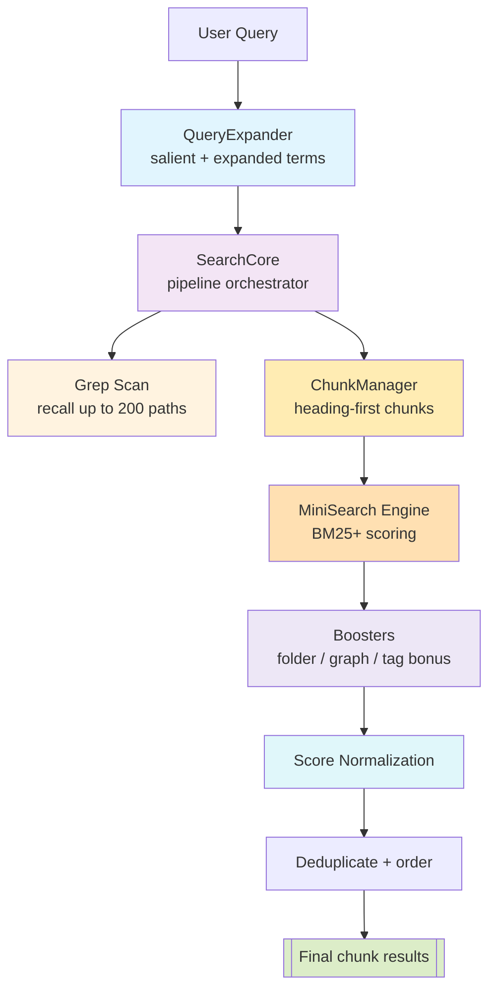

# Search v3: Chunk-Based Lexical Retrieval

A high-performance, memory-bounded lexical search system for Obsidian that uses intelligent chunking to deliver precise, contextual results without content explosion. The search engine operates on individual chunks and returns consistent chunk IDs for result assembly. Semantic search is now handled separately by Orama integration.

## Architecture Overview



## Recall vs Ranking: Core Design

The search system clearly separates **recall** (finding candidates) from **ranking** (scoring precision):

```
Original query: "find my piano notes"

FOR RECALL (finding candidate documents):
├── Original query: "find my piano notes"
├── Expanded queries: "piano lesson notes", "piano practice sheets"
└── Expanded terms: music, sheet, practice, lesson

FOR RANKING (scoring/precision):
└── Salient terms: piano, notes (from original query only, stopwords filtered)
```

**Key principle**: LLM expansion improves recall (finding more documents), but ranking uses only terms from the original query to maintain precision.

## Chunk ID Mapping and Result Assembly

### How Chunk IDs Work

The lexical search engine operates on individual chunks and returns consistent chunk IDs in the format `note_path#chunk_index` (e.g., `Piano Lessons/Lesson 4.md#0`, `Piano Lessons/Lesson 4.md#1`).

### Chunk-to-Text Mapping Process

1. **ChunkManager.getChunkText()**: Maps chunk IDs back to their text content

   ```typescript
   // Example: "Piano Lessons/Lesson 4.md#1" → full chunk text with headers
   const chunkText = chunkManager.getChunkText("Piano Lessons/Lesson 4.md#1");
   ```

2. **Search Result Assembly**:
   - **Lexical Search**: Returns chunk IDs from MiniSearch index with lexical match explanations
   - **Final Assembly**: ChunkManager retrieves chunk text for LLM context generation

### Benefits of Chunk Architecture

- **Granular Context**: LLM receives specific chunk content, not entire notes
- **Memory Efficiency**: Only relevant chunks loaded for generation
- **Consistent Results**: Lexical engine returns consistent chunk ID format
- **Scalable**: Handles large documents by breaking them into manageable pieces

## Key Features

- **Memory-Bounded**: No persistent full-text index, everything ephemeral
- **Progressive Refinement**: Fast grep → full-text lexical search
- **Multilingual**: Supports English and CJK languages via custom tokenizer
- **BM25+ Scoring**: Proper multi-term relevance scoring via MiniSearch
- **Explainable**: Tracks why documents ranked highly
- **Fault-Tolerant**: Graceful fallbacks at each stage
- **Chunk-Based**: Operates on intelligent document chunks for precise context
- **Recall/Ranking Separation**: Uses all terms for finding documents, only salient terms for scoring

## Example: Search Flow

**Query**: `"Need to deploy #project/alpha after fixing #mobile-app sync"`

### 1. Query Expansion

The LLM extracts salient terms and generates expanded terms/queries:

```
Input:  "Need to deploy #project/alpha after fixing #mobile-app sync"

LLM Response:
<salient>                           ← From original query (for ranking)
<term>deploy</term>
<term>sync</term>
<term>#project/alpha</term>
<term>#mobile-app</term>
</salient>
<queries>                           ← Alternative phrasings (for recall)
<query>deploy project alpha</query>
<query>mobile app sync fix</query>
</queries>
<expanded>                          ← Related terms (for recall only)
<term>release</term>
<term>synchronization</term>
</expanded>
```

### 2. Grep Scan (L0)

Searches for all recall terms (original + expanded queries + expanded terms + salient terms):

```
Finds: ["projects/alpha/deploy.md", "projects/mobile/sync.md", "notes/release-checklist.md"]
       (up to 200 candidates)
```

### 3. Chunking (L1)

Heading-first intelligent chunking converts candidate notes into manageable pieces:

```
Input:  3 candidate notes ("projects/alpha/deploy.md", "projects/mobile/sync.md", "notes/release-checklist.md")
Chunks: 7 chunks with size 800-2000 chars each
Output: ["projects/alpha/deploy.md#0", "projects/alpha/deploy.md#1", "projects/mobile/sync.md#0", ...]
```

### 4. Full-Text Search Execution

**MiniSearch with BM25+ scoring**:

- **Recall**: All queries and terms used to find candidate chunks in the index
- **Ranking**: Only salient terms (from original query) used for BM25+ scoring
- Field weights: Title (3x), Heading (2.5x), Path (1.5x), Tags (4x), Body (1x)

**Why BM25+?**: Documents matching more salient terms naturally score higher. A query "hk milk tea home recipe" will rank "HK Milk Tea - Home Recipe" highly because all 5 terms match in the title field (3x weight).

### 5. Lexical Reranking (Boosting Stage)

Applied to lexical results (when `enableLexicalBoosts: true`):

- **Folder Boost**: Notes in folders with multiple matches (logarithmic, 1-1.5x)
- **Graph Boost**: Notes linked to other results (1.0-1.15x, only for high-similarity results)
- **Pure Relevance Mode**: When boosts disabled, provides keyword-only scoring without folder/graph influence

### 6. Score Normalization

Min-max normalization prevents auto-1.0 scores

- `baseScore`: The raw BM25+ score after all boosts are applied
- `finalScore`: The normalized score in [0.02, 0.98] range that users see

### 7. Final Results

```
1. projects/alpha/deploy.md#0 (0.94) - Matched `#project/alpha` + "deploy", folder boost
2. projects/mobile/sync.md#0 (0.46) - Matched `#mobile-app` + "sync", folder boost
3. notes/release-checklist.md#1 (0.23) - Matched "deploy" and shared tags
```

## Core Components

### SearchCore

- Orchestrates the entire chunk-based search pipeline
- Executes lexical search with intelligent chunking
- Methods:
  - `executeLexicalSearch()`: Chunks candidates, builds index, and searches
  - `retrieve()`: Main entry point for search execution

### ChunkManager

- Converts notes into intelligent chunks using heading-first algorithm
- Simple Map-based cache for performance
- Memory-bounded chunking with configurable size limits
- Methods:
  - `getChunks()`: Creates chunks from note paths with size constraints
  - `getChunkText()`: Retrieves chunk content by ID for LLM context

### QueryExpander

Generates three distinct outputs for recall vs ranking:

```typescript
interface ExpandedQuery {
  originalQuery: string; // "find my piano notes"
  queries: string[]; // [original + expanded queries] for recall
  salientTerms: string[]; // ["piano", "notes"] for ranking (from original only)
  expandedTerms: string[]; // ["music", "sheet"] for recall only
  expandedQueries: string[]; // ["piano lesson notes"] for recall only
}
```

**LLM Prompt Design**:

- `<salient>` section: Terms FROM the original query (stopwords filtered)
- `<expanded>` section: NEW related terms (for recall only)
- `<queries>` section: Alternative phrasings (for recall only)

Falls back to extracting terms from original query if LLM unavailable.

### Grep Scanner

- Fast substring search using Obsidian's `cachedRead`
- Unified batching (30 files) for all platforms
- Searches both phrases and individual terms
- Path-first optimization for faster matching

### MiniSearch Engine (Full-Text Engine)

- **BM25+ Scoring**: Proper multi-term relevance ranking (not position-based)
- Ephemeral index built from chunks per-query
- Custom `tokenizeMixed` tokenizer for ASCII words + CJK bigrams
- Multi-field indexing with weights: title (3x), heading (2.5x), path (1.5x), tags (4x), body (1x)
- **Frontmatter Property Indexing**: Extracts and indexes frontmatter property values
  - Note-level metadata replicated across all chunks from that note
  - Supports primitive values, arrays, and Date objects
- Memory-efficient: chunk content retrieved from ChunkManager when needed

### Folder & Graph Boost Calculators

**Folder Boost**: Rewards notes that share folders with other search results, scaled by relevance ratio.

- **Relevance Ratio**: `relevant_docs_in_folder / total_docs_in_folder`
- **Requirements**:
  - Minimum 2 relevant documents in folder (configurable)
  - Minimum 40% relevance ratio (configurable)
- **Formula**: `1 + (log2(count + 1) - 1) * sqrt(relevance_ratio)`, capped at 1.15x
- **Example 1**: Searching "authentication" finds 3/5 notes in `nextjs/` folder (60% relevance) → 1.15x boost
- **Example 2**: Finding 2/5 notes in folder (40% relevance) → 1.15x boost (meets threshold)
- **Example 3**: Finding 3/10 notes in folder (30% relevance) → no boost (below 40% threshold)
- **Purpose**: Only boosts truly coherent folders where a significant portion is relevant

**Graph Boost**: Rewards notes that link to other search results.

- **Intelligent Filtering**:
  - Maximum 10 candidates analyzed (performance cap)
  - Requires at least 2 candidates for meaningful connections
- **Connection Types**:
  - Backlinks: Notes that link TO this note (weight: 1.0)
  - Co-citations: Notes cited by same sources (weight: 0.5)
  - Shared tags: Notes with common tags (weight: 0.3)
- **Boost Formula**: `1 + strength × log(1 + connectionScore)`, capped at 1.15x
- **Example**: `auth-guide.md` links to `jwt-setup.md` → both get boosted
- **Purpose**: Surfaces tightly connected knowledge networks while maintaining performance

Both boosts multiply existing scores after lexical search, helping related content rise together.

### Score Normalizer

- Min-max normalization (default) or Z-score with tanh squashing
- Prevents artificial 1.0 scores
- Clips to [0.02, 0.98] range
- Preserves explainability metadata

### External Semantic Search

- Semantic search is now handled by separate Orama integration
- Provides vector-based similarity search capabilities
- Operates independently of the v3 lexical search system

## Frontmatter and Chunk Architecture

### How Note-Level Frontmatter Works with Chunk-Level Search

**The Challenge**: Frontmatter properties (like `author`, `tags`, `status`) are defined once per note, but our search operates on chunks within notes.

**The Solution**: Frontmatter replication with performance optimization:

1. **Extraction Phase** (per note):

   ```typescript
   // Extract frontmatter once per note during chunk indexing
   const frontmatter = cache?.frontmatter ?? {};
   const propValues = this.extractPropertyValues(frontmatter);
   // Cache the extracted values per note path
   processedNotes.set(chunk.notePath, { tags, links, props: propValues });
   ```

2. **Replication Phase** (per chunk):

   ```typescript
   // Include frontmatter in each chunk's searchable body
   const bodyWithProps = [chunk.content, ...noteMetadata.props].join(" ");
   ```

3. **Search Behavior**:
   - Searching for `author: "John Doe"` finds ALL chunks from notes where `author` is "John Doe"
   - Each chunk from that note becomes independently searchable by frontmatter properties
   - Maintains chunk-level granularity while preserving note-level metadata searchability

**Benefits**:

- ✅ **Complete Searchability**: Every frontmatter property is findable via any chunk
- ✅ **Performance**: Per-note caching prevents redundant frontmatter extraction
- ✅ **Consistency**: All chunks from same note have identical frontmatter properties
- ✅ **Granular Results**: Can return specific chunks while preserving metadata context

**Example**:

```
Note: "project-notes.md"
Frontmatter: { author: "Alice", status: "draft", priority: 1 }
Chunks: ["project-notes.md#0", "project-notes.md#1", "project-notes.md#2"]

Search: "Alice" → Finds all 3 chunks, each containing "Alice" in searchable content
Search: "draft" → Finds all 3 chunks, each containing "draft" in searchable content
Search: "priority 1" → Finds all 3 chunks, each containing "1" in searchable content
```

## Data Model

```typescript
interface NoteIdRank {
  id: string; // Chunk ID (note_path#chunk_index) or note path for legacy
  score: number; // BM25+ relevance score [0-1]
  engine?: string; // Source engine
  explanation?: {
    // Why it ranked high
    lexicalMatches?: Array<{ field: string; query: string; weight: number }>;
    semanticScore?: number;
    folderBoost?: { folder: string; documentCount: number; boostFactor: number };
    graphConnections?: {
      backlinks: number;
      coCitations: number;
      sharedTags: number;
      score: number;
      boostMultiplier: number;
    };
    baseScore: number; // BM25+ score before normalization
    finalScore: number; // Score after normalization (final 0-1 range score)
  };
}

interface Chunk {
  id: string; // note_path#chunk_index
  notePath: string; // original note path
  chunkIndex: number; // 0-based chunk position
  content: string; // chunk text with headers + frontmatter properties
  title: string; // note title
  heading: string; // section heading
  mtime: number; // note modification time
}

interface ExpandedQuery {
  originalQuery: string; // The user's original query
  queries: string[]; // [original + expanded queries] for recall
  salientTerms: string[]; // Terms from original query (for ranking)
  expandedTerms: string[]; // LLM-generated related terms (for recall)
  expandedQueries: string[]; // LLM-generated alternative queries (for recall)
}
```

## Performance Characteristics

- **Grep scan**: < 50ms for 1k files
- **Chunking**: < 50ms for 500 candidates → ~1000 chunks
- **MiniSearch build**: < 100ms for 1000 chunks (memory-bounded)
- **BM25+ search**: Fast in-memory MiniSearch queries
- **Total latency**: < 200ms P95 (chunking + lexical search)
- **Memory peak**: < 20MB mobile, < 100MB desktop
- **Memory split**: 35% chunk cache, 65% MiniSearch index

## Configuration & Usage

### Search Parameters

- `maxResults`: Number of results to return (default: 30, max: 100)
- `candidateLimit`: Max candidates for full-text (default: 500, range: 10-1000)
- `salientTerms`: Additional terms to enhance the search (optional)
- `enableLexicalBoosts`: Enable folder and graph boosts (default: true)

### Plugin Settings

- **Enable Lexical Boosts**: Toggle for folder and graph relevance boosts
- **Chunk Configuration**:
  - Chunk Size: 6000 characters (uses CHUNK_SIZE constant)
  - All relevant chunks included from matching notes
- **Graph Boost Configuration**:
  - Max Candidates: 10 (performance cap)
  - Boost Strength: 0.1 (connection influence)
  - Max Boost Multiplier: 1.15x (prevents over-boosting)
- **Memory Management**: RAM usage split between chunks (35%) and MiniSearch (65%)
- **File Filtering**: Pattern-based inclusions and exclusions for search

## Full Pipeline Overview

```
┌────────────┐         ┌──────────────────┐          ┌─────────────────────────┐
│ User Query │───────▶│ QueryExpander    │─────────▶│ Salient + Expanded      │
└────────────┘         └──────┬───────────┘          └────────┬──────────────────┘
                               │ <salient> for ranking                │
                               │ <expanded> for recall                │
                               ▼                                      ▼
┌──────────────────┐   ┌──────────────────┐          ┌─────────────────────────┐
│ Grep (recall)    │◀──│ SearchCore       │─────────▶│ MiniSearch (BM25+ rank) │
└──────┬───────────┘   └──────┬───────────┘          └────────┬──────────────────┘
       │ candidate list        │ returnAll? cap=200                  │ BM25+ scores
       ▼                       ▼                                      ▼
┌──────────────────┐   ┌──────────────────┐          ┌─────────────────────────┐
│ ChunkManager     │──▶│ MiniSearch Engine│─────────▶│ Scoring + Boosting      │
└──────────────────┘   └──────┬───────────┘          └────────┬──────────────────┘
                              │ index title/path/body/tags/props     │ folder/graph bonuses
                              ▼                                      ▼
                       ┌─────────────────────────┐         ┌─────────────────────────┐
                       │ Dedup + Ordering        │────────▶│ Final Results (≤200)   │
                       └─────────────────────────┘         └─────────────────────────┘
```

- **Query & tags**: Expansion keeps hash-prefixed terms exactly as typed (`#project/alpha`). Salient terms extracted from original query only.
- **Recall**: Grep seeds the candidate list with original query + expanded queries + expanded terms + salient terms.
- **Chunking**: Notes are split once through `ChunkManager`, and frontmatter properties/tags are copied to every chunk.
- **Indexing**: MiniSearch indexes title, path, body, and the normalized tag/prop fields with field weights.
- **Scoring**: MiniSearch's BM25+ algorithm scores documents based on salient terms only. Documents matching more terms score higher naturally.
- **Return-all mode**: When a time range or tag query is detected, cap raised to 100 chunks (`RETURN_ALL_LIMIT`).

**Example** — `#project/alpha bugfix`

1. QueryExpander extracts salient terms: `#project/alpha`, `bugfix` (from original query)
2. LLM may provide expanded terms: `fix`, `issue`, `patch` (for recall only)
3. SearchCore runs grep with all terms, MiniSearch scores using only salient terms
4. BM25+ naturally ranks documents with both `#project/alpha` and `bugfix` higher than those with only one term

## Semantic + Lexical Fusion (Design)

Semantic retrieval (HybridRetriever/Orama) is strong at paraphrase recall, while Search v3's TieredLexicalRetriever excels at deliberate keyword/tag matching. When the **Semantic Search** toggle is enabled we can fuse both without widening the retriever surface area.

- **MergedSemanticRetriever**
  - Implements the same `getRelevantDocuments()` API.
  - Internally holds one `HybridRetriever` and one `TieredLexicalRetriever`, reusing the shared `ChunkManager` when possible.
- **Execution Flow**
  - Run both engines in parallel (`Promise.all` with shared abort handling).
  - Annotate each returned `Document` with `metadata.source = "semantic"` or `"lexical"`.
  - Dedupe by `chunkId`/`path`, preferring the lexical chunk when both engines surface the same slice.
  - Blend scores using lightweight weights (e.g., lexical ×1.0, semantic ×0.7) and reuse existing tag bonuses so tagged hits stay on top.
  - Write the blended score back to `metadata.score`/`metadata.rerank_score`, sort, and cap at `maxK`.
- **Result Limits**
  - When `returnAll` is **false**, request roughly `maxK` items from each engine, merge/dedupe, then truncate to `maxK`.
  - When `returnAll` is **true**, propagate the widened ceiling (`RETURN_ALL_LIMIT`, 100) to both engines and keep the merged list at that size so tag/time queries still return every chunk Search v3 surfaced.
- **Integration Points**
  - Vault QA: when semantic search is on, instantiate `MergedSemanticRetriever`; otherwise keep TieredLexicalRetriever.
  - `lexicalSearch` tool (and similar call sites) construct the merged retriever instead of branching on the toggle.
- **Fallback Behaviour**
  - With semantic search disabled nothing changes—the TieredLexicalRetriever path remains intact.

This approach keeps callers unaware of the fusion mechanics while giving users semantic coverage plus Search v3's deterministic tag/keyword strength.

### TODO

- Investigate an adaptive fetch strategy that requests additional lexical/semantic batches only when the initial `maxK` from one engine leaves gaps, instead of always pulling `maxK * 2` from each.
- Explore mutating metadata in place or deferring `Document` decoration to avoid cloning every chunk during merge, reducing object churn for large result sets.

## Key Design Decisions

1. **Lexical-Only Architecture**: Fast, reliable keyword-based search with intelligent boosting
2. **MiniSearch with BM25+**: Proper multi-term relevance scoring (replaced FlexSearch's position-based scoring)
3. **Recall vs Ranking Separation**: Expanded terms improve recall, salient terms (from original query) drive ranking
4. **Heading-First Algorithm**: Preserves document structure while respecting size limits
5. **No Persistent Full-Text Index**: Grep provides fast initial seeding, chunks built per-query
6. **Ephemeral Everything**: Eliminates maintenance overhead
7. **Memory-Efficient Indexing**: MiniSearch stores metadata only, chunk content retrieved when needed
8. **Frontmatter Property Integration**: Extract note-level frontmatter once and replicate across all chunks for seamless search
9. **Chunk Sequence Preservation**: Chunks from same note served in order for LLM context
10. **Min-Max Normalization**: Prevents artificial perfect scores while preserving monotonicity
11. **Explainable Rankings**: Track contributing factors for transparency including chunk-level details
12. **Memory Budget Split**: Fixed 35%/65% allocation between chunk cache and MiniSearch index
13. **Semantic Search Separation**: Semantic capabilities now handled by dedicated Orama integration
