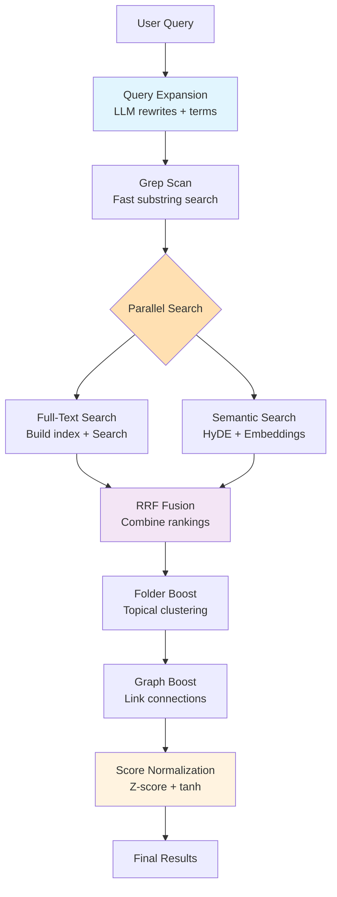

# Search v3: Tiered Lexical Retrieval with Optional Semantic

A high-performance, memory-bounded search system for Obsidian that combines multiple retrieval and ranking techniques.

## Architecture Overview



## Key Features

- **Memory-Bounded**: No persistent full-text index, everything ephemeral
- **Parallel Search**: Lexical and semantic searches run concurrently for optimal performance
- **Progressive Refinement**: Fast grep → parallel (full-text + semantic)
- **Multilingual**: Supports English and CJK languages
- **Explainable**: Tracks why documents ranked highly
- **Fault-Tolerant**: Graceful fallbacks at each stage

## Example: Search Flow

**Query**: `"How do I set up OAuth in Next.js?"`

### 1. Query Expansion

```
Input:  "How do I set up OAuth in Next.js?"
Output: ["How do I set up OAuth in Next.js?",
         "Next.js OAuth configuration",
         "NextJS OAuth setup"]
Terms:  ["oauth", "nextjs"]
```

### 2. Grep Scan (L0)

Searches for both full queries AND individual terms:

```
Finds: ["auth/oauth-guide.md", "nextjs/auth.md", "tutorials/oauth.md"]
       (up to 200 candidates)
```

### 3. Parallel Search Execution

**Full-Text Search (L1)** and **Semantic Search (Optional)** run in parallel:

#### Full-Text Branch:

- Builds ephemeral FlexSearch index from candidates
- Searches with field weights: Title (3x), Path (1.5x), Tags/Links/Props/Headings (1.5x), Body (1x)
- Returns up to 2x maxResults for better recall

#### Semantic Branch (if enabled):

- Generates HyDE synthetic answer for query expansion
- Searches vector store limited to same candidates
- Combines HyDE document with query variants

Both branches complete before fusion begins.

### 4. RRF Fusion

Combines rankings with normalized weights (sum to 1.0):

- Default: 40% lexical + 60% semantic (when enabled)
- Configurable via slider (0-100% semantic weight)

### 5. Boosting Stage

- **Folder Boost**: Notes in folders with multiple matches (logarithmic, 1-1.5x)
- **Graph Boost**: Notes linked to other results (1.0-1.15x, only for high-similarity results)

### 6. Score Normalization

Min-max normalization prevents auto-1.0 scores

- `baseScore`: The raw score after RRF fusion and all boosts are applied
- `finalScore`: The normalized score in [0.02, 0.98] range that users see

### 7. Final Results

```
1. nextjs/auth.md (0.95) - Title match, folder boost, graph connections
2. nextjs/config.md (0.38) - Folder boost, linked from auth.md
3. auth/oauth-guide.md (0.21) - Title match, no boosts
```

## Core Components

### SearchCore

- Orchestrates the entire search pipeline
- Executes lexical and semantic searches in parallel via `Promise.all()`
- Methods:
  - `executeLexicalSearch()`: Builds index and searches in isolation
  - `executeSemanticSearch()`: Runs HyDE + embedding search independently
  - `mapSemanticHit()`: Transforms semantic results to unified format

### Query Expander

- Generates alternative phrasings using LLM (5s timeout)
- Extracts salient terms (nouns only, language-agnostic)
- Falls back to original query if LLM unavailable

### Grep Scanner

- Fast substring search using Obsidian's `cachedRead`
- Unified batching (30 files) for all platforms
- Searches both phrases and individual terms
- Path-first optimization for faster matching

### Full-Text Engine

- Ephemeral FlexSearch index built per-query
- Runs independently in lexical search branch
- Custom tokenizer for ASCII words + CJK bigrams
- Multi-field indexing with configurable weights
- Path components indexed for folder/file search
- Frontmatter values indexed (not keys)

### RRF (Reciprocal Rank Fusion)

- Combines lexical and semantic rankings with normalized weights
- Weights always sum to 1.0 for consistent scoring
- Merges explanations from both search engines
- Default: 40% lexical + 60% semantic (configurable)

### Folder & Graph Boost Calculators

**Folder Boost**: Rewards notes that share folders with other search results, scaled by relevance ratio.

- **Relevance Ratio**: `relevant_docs_in_folder / total_docs_in_folder`
- **Requirements**:
  - Minimum 2 relevant documents in folder (configurable)
  - Minimum 40% relevance ratio (configurable)
- **Formula**: `1 + (log2(count + 1) - 1) * sqrt(relevance_ratio)`, capped at 1.15x
- **Example 1**: Searching "authentication" finds 3/5 notes in `nextjs/` folder (60% relevance) → 1.15x boost
- **Example 2**: Finding 2/5 notes in folder (40% relevance) → 1.15x boost (meets threshold)
- **Example 3**: Finding 3/10 notes in folder (30% relevance) → no boost (below 40% threshold)
- **Purpose**: Only boosts truly coherent folders where a significant portion is relevant

**Graph Boost**: Rewards notes that link to other search results.

- **Intelligent Filtering**:
  - Only analyzes notes with semantic similarity ≥75% (when semantic search is enabled)
  - Maximum 10 candidates analyzed (performance cap)
  - Requires at least 2 candidates for meaningful connections
- **Connection Types**:
  - Backlinks: Notes that link TO this note (weight: 1.0)
  - Co-citations: Notes cited by same sources (weight: 0.5)
  - Shared tags: Notes with common tags (weight: 0.3)
- **Boost Formula**: `1 + strength × log(1 + connectionScore)`, capped at 1.15x
- **Example**: `auth-guide.md` has 75% semantic similarity and links to `jwt-setup.md` → both get boosted
- **Purpose**: Surfaces tightly connected knowledge networks while maintaining performance

Both boosts multiply existing scores after RRF fusion, helping related content rise together.

### Score Normalizer

- Min-max normalization (default) or Z-score with tanh squashing
- Prevents artificial 1.0 scores
- Clips to [0.02, 0.98] range
- Preserves explainability metadata

### Semantic Layer (Optional)

- JSONL-backed vector store in memory
- Runs in parallel with lexical search when enabled
- HyDE generation for query expansion (5s timeout)
- Incremental indexing for changed files
- Auto-index strategies: NEVER, ON STARTUP, ON MODE SWITCH
- Partitioned storage (~150MB per file)

## Data Model

```typescript
interface NoteIdRank {
  id: string; // Note path
  score: number; // Relevance score [0-1]
  engine?: string; // Source engine
  explanation?: {
    // Why it ranked high
    lexicalMatches?: Array<{ field: string; query: string; weight: number }>;
    semanticScore?: number;
    folderBoost?: { folder: string; documentCount: number; boostFactor: number };
    graphConnections?: {
      backlinks: number;
      coCitations: number;
      sharedTags: number;
      score: number;
      boostMultiplier: number;
    };
    baseScore: number; // Score before normalization (after RRF fusion and boosts)
    finalScore: number; // Score after normalization (final 0-1 range score)
  };
}
```

## Performance Characteristics

- **Grep scan**: < 50ms for 1k files
- **Full-text build**: < 100ms for 500 candidates
- **Parallel search**: Lexical and semantic run concurrently
- **Total latency**: < 200ms P95 (reduced from sequential execution)
- **Memory peak**: < 20MB mobile, < 100MB desktop

## Configuration

### Search Options

- `maxResults`: Number of results to return (default: 30, max: 100)
- `enableSemantic`: Enable vector search (default: false)
- `semanticWeight`: Percentage for semantic results (0-1, default: 0.6 = 60%)
- `candidateLimit`: Max candidates for full-text (default: 500, range: 10-1000)
- `rrfK`: RRF smoothing parameter (default: 60, range: 1-100)
- `salientTerms`: Additional terms to enhance the search (optional)

### Settings

- **Enable Semantic Search**: Master toggle for vector features
- **Auto-Index Strategy**: NEVER | ON STARTUP | ON MODE SWITCH
- **Graph Boost Configuration**:
  - Semantic Similarity Threshold: 75% (only boost highly relevant results)
  - Max Candidates: 10 (performance cap)
  - Boost Strength: 0.1 (connection influence)
  - Max Boost Multiplier: 1.15x (prevents over-boosting)
- **Lexical Search RAM Limit**: RAM usage for lexical search
- **Embedding Batch Size**: Number of chunks to embed at once (reduce if token limits exceeded)
- **Exclusions/Inclusions**: File patterns to index

## Implementation Status

✅ **Core Pipeline**: Query expansion, grep, parallel search, RRF fusion
✅ **Parallel Execution**: Full-text and semantic searches run concurrently
✅ **Boosting**: Folder and graph boost calculators
✅ **Normalization**: Z-score + tanh with explainability
✅ **Semantic**: Optional vector search with consistent candidates
✅ **Security**: Path validation, size limits, circular reference handling
✅ **UX**: Progress notifications, incremental indexing, commands

## Key Design Decisions

1. **No Persistent Full-Text Index**: Grep provides fast initial seeding
2. **Ephemeral Everything**: Eliminates maintenance overhead
3. **Parallel Search Architecture**: Lexical and semantic run concurrently for performance
4. **Unified Boosting Stage**: All boosts applied post-RRF
5. **Consistent Candidates**: Both lexical and semantic search same subset
6. **Min-Max Normalization**: Prevents artificial perfect scores while preserving monotonicity
7. **Explainable Rankings**: Track contributing factors for transparency
8. **Intelligent Graph Boost**: Only analyzes highly relevant results (≥75% similarity) to balance quality and performance
9. **Token-Aware Indexing**: Automatic chunk truncation when embedding token limits approached
