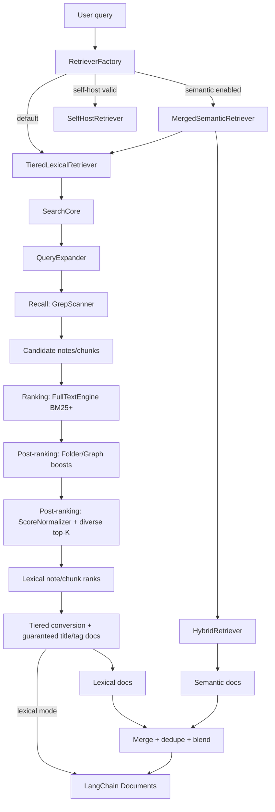

# Search v3: Chunk-Based Retrieval (Current Implementation)

This document reflects the runtime behavior in the current codebase.
Search v3 is the lexical retrieval core used by `TieredLexicalRetriever`, with optional semantic fusion via `MergedSemanticRetriever`.

## High-Level Topology



`Lexical docs` are produced from the same `SearchCore` path (after Tiered conversion/guaranteed-match composition); they are not a separate retrieval branch.
Ranking happens at `FullTextEngine BM25+` and is then adjusted by post-ranking boosts/normalization.

## Doc Title/Tag Guarantee (In-Depth)

This section describes exactly how title/tag intent is carried through retrieval and into RAG context.

### 1. Where guaranteed docs come from

- Title guarantee source:
  - `TieredLexicalRetriever` extracts explicit `[[note]]` mentions from query text (`extractNoteFiles`).
  - Those files are loaded as full-note documents via `getTitleMatches()`.
- Tag guarantee source:
  - Tag terms are resolved from hash-prefixed salient terms (or extracted from raw query as fallback).
  - `getTagMatches()` scans markdown files and metadata tags (`getAllTags`) with hierarchical prefix matching:
    - exact match: `#project/alpha == #project/alpha`
    - prefix match: searching `#project` also matches `#project/alpha`

### 2. What makes them "guaranteed" in lexical retrieval

Guaranteed title/tag docs are emitted with:

- full-note `pageContent` (not chunk snippets)
- `metadata.includeInContext = true`
- `metadata.score = 1.0` and `metadata.rerank_score = 1.0`
- `metadata.source = "title-match"` or `"tag-match"`

This means they do not depend on BM25 lexical score thresholds to be context-eligible.

### 3. Priority and dedupe behavior in `TieredLexicalRetriever`

`TieredLexicalRetriever.getRelevantDocuments()` performs:

1. `searchCore.retrieve()` for normal lexical chunk ranks
2. build guaranteed sets (`titleMatches`, `tagMatches`)
3. `combineGuaranteedMatches(title, tag)`:
   - dedupes by note path
   - title set is applied first (title wins if same path appears in tag set)
4. `combineResults(searchDocuments, guaranteedMatches)`:
   - guaranteed docs are inserted first
   - chunk docs from notes already covered by a title-guaranteed doc are skipped
   - remaining docs are score-sorted (with chunk-order preservation for near-ties in same note)

Net effect: explicit title/tag intent is represented at note level before ordinary lexical chunk expansion.

### 4. How they reach final RAG context

After retrieval, `SearchTools` maps documents into tool payload entries and preserves `includeInContext`.

Then RAG formatting does:

- `processLocalSearchResult()` -> `prepareLocalSearchResult()`
- context inclusion filter: keep docs where `includeInContext !== false`
- `formatSearchResultsForLLM()` applies the same inclusion rule

Since guaranteed docs are emitted with `includeInContext: true`, they pass this filter path by default.

### 5. Scope of the guarantee (important caveats)

- Strong guarantee in lexical path:
  - For lexical retrieval output, title/tag-guaranteed docs are always injected and marked context-eligible.
- Bounded by downstream selection/dedupe:
  - Tool-level dedupe and ordering can still choose one best entry per path/title key.
  - In semantic mode (`MergedSemanticRetriever`), lexical docs are merged with semantic docs and then top-K slicing is applied.
  - So "guaranteed" means guaranteed injection into lexical candidate/output flow, not an absolute promise that every guaranteed note survives every later global cap in every mode.

## Step-by-Step: Lexical Search Path

### 1. Entry point and retriever selection

- `RetrieverFactory` priority order:
  1. Self-host mode (`SelfHostRetriever`) if valid and backend available
  2. Semantic mode (`MergedSemanticRetriever`) if `enableSemanticSearchV3` is true
  3. Lexical mode (`TieredLexicalRetriever`) otherwise
- `localSearch` forces lexical mode when:
  - a valid `timeRange` is present, or
  - any salient term starts with `#` (tag-focused query)

### 2. Query expansion (`SearchCore` -> `QueryExpander`)

`SearchCore` expands the query unless `preExpandedQuery` is supplied.

`ExpandedQuery` contract:

```ts
interface ExpandedQuery {
  queries: string[]; // [original, ...expandedQueries]
  salientTerms: string[]; // terms from original query (ranking intent)
  originalQuery: string;
  expandedQueries: string[]; // alternative phrasings only
}
```

Current behavior:

- SearchCore creates `QueryExpander` with `maxVariants: 3`
  - max 4 total query strings (`original + 3 variants`)
- QueryExpander prompt expects:
  - `<salient>` with `<term>`
  - `<queries>` with `<query>`
- There is no separate `<expanded>` term list in the runtime parser.
- Salient term filtering is mainly prompt-guided.
- Structural term validation is code-based (`minTermLength = 2`, allowed character sets, tag formats).
- Fallback mode (LLM unavailable/error/timeout):
  - extracts terms from original query
  - returns no expanded variants (`expandedQueries: []`)
- Results are cached with LRU-like eviction (`cacheSize` default 100).

### 3. Recall term assembly (`SearchCore`)

Recall terms are built in this order and deduplicated/lowercased:

1. `expanded.queries` (includes original query string)
2. `salientTerms` (plus any caller-provided salient terms)

Tag matching is handled separately by `getTagMatches()` in `TieredLexicalRetriever` via Obsidian's metadata cache, not through grep recall terms.

### 4. Candidate recall (`GrepScanner`)

`GrepScanner.batchCachedReadGrep(recallQueries, limit)` uses two passes:

1. Path pass: score files by how many recall terms appear in path
2. Content pass: fill remaining slots by content substring match

Noise controls in grep:

- ASCII terms must be length >= 3
- CJK terms must be length >= 2

### 5. Full-text lexical ranking (`FullTextEngine`)

From grep candidates, SearchCore builds an ephemeral MiniSearch index over chunks.

Indexed fields:

- `title`
- `heading`
- `path`
- `tags`
- `body` (chunk content + extracted frontmatter primitive values)

Field weights:

- `title`: 5
- `tags`: 4
- `heading`: 2.5
- `path`: 1.5
- `body`: 1

Search behavior:

- BM25+ scoring via MiniSearch
- `combineWith: "OR"`
- `prefix: true`
- `fuzzy: false`
- ranking query text is:
  - `salientTerms.join(" ")` when salient terms exist
  - otherwise `originalQuery` (or first query fallback)

Important: expanded queries increase candidate recall but are not directly used as the ranking query string.

### 6. Post-ranking adjustments

After lexical ranking:

- Optional folder boost (`enableLexicalBoosts`)
- Optional graph boost (`enableLexicalBoosts`)
- Score normalization (min-max in SearchCore configuration)
- Note-diverse top-K selection (`selectDiverseTopK`)

Folder boost defaults:

- min docs for boost: 2
- min relevance ratio: 0.4
- max boost factor: 1.15
- formula: `1 + (log2(count + 1)) * sqrt(relevanceRatio)` with cap

Graph boost effective SearchCore configuration:

- `maxCandidates: 20`
- `boostStrength: 0.1`
- `maxBoostMultiplier: 1.15`
- connection score uses backlinks, co-citations, shared tags
- formula: `1 + strength * log(1 + connectionScore)` with cap

Score normalization in SearchCore:

- method: `minmax`
- clip range: `[0.02, 0.98]`

### 7. Result conversion (`TieredLexicalRetriever`)

`TieredLexicalRetriever` stores `lastQueryExpansion` and converts chunk IDs to `Document`.

Guaranteed inclusion paths:

- explicit `[[note]]` title matches -> full-note documents with score `1.0`
- tag matches from metadata cache (prefix-aware, e.g. `#project` matches `#project/alpha`) -> full-note docs with score `1.0`

Combine rules:

- title/tag guaranteed documents are added first
- chunk results from notes already covered by title matches are skipped
- remaining docs sorted by score
- near-tie chunks from same note preserve chunk order

### 8. Failure fallback

If the main SearchCore pipeline throws, SearchCore falls back to simple grep-only ranking:

- grep with the original query
- score by position (`1 / (index + 1)`)
- return empty results only if fallback also fails

## Time-Range Flow (Special Path)

When `timeRange` is provided, `TieredLexicalRetriever` bypasses SearchCore lexical pipeline and:

1. generates daily-note titles in range (`[[YYYY-MM-DD]]`)
2. includes matching daily notes
3. adds all notes with `mtime` within range (up to limits)
4. ranks by recency score

This path does not use query expansion/BM25 ranking.

## Semantic Mode (`MergedSemanticRetriever`)

When semantic search is enabled (and not forced lexical by tag/time), the system uses `MergedSemanticRetriever`.

Current behavior:

- runs lexical (`TieredLexicalRetriever`) and semantic (`HybridRetriever`) in parallel
- dedupes on chunk/path-like stable key
- lexical result wins on key collision
- blends scores by source with current weights:
  - lexical weight: `1.0`
  - semantic weight: `1.0`
- applies extra lexical tag-match boost:
  - `TAG_MATCH_BOOST = 1.1`
- writes blended score to `metadata.score` and `metadata.rerank_score`
- returns top `maxK` (or `RETURN_ALL_LIMIT` in return-all mode)

## Limits and Defaults

### SearchCore limits

- query length clamp: 1000 chars
- `maxResults` default 30, range 1..100
- `candidateLimit` default 200, range 10..1000
- `RETURN_ALL_LIMIT`: 100
- grep limit:
  - normal: 200
  - return-all: 100
- full-text search limit:
  - normal: `maxResults * 3`
  - return-all: `100 * 3 = 300`

Note: these return-all branches apply only when the caller sets `SearchOptions.returnAll = true`.
`TieredLexicalRetriever` standard (non-time-range) path currently governs result volume primarily via `maxK`.

### QueryExpander limits

- SearchCore-configured `maxVariants`: 3
- QueryExpander default `maxVariants` (outside SearchCore): 2
- min term length: 2
- cache size default: 100

## Recall vs Ranking (Current)

| Stage              | Inputs used                               | Goal                              |
| ------------------ | ----------------------------------------- | --------------------------------- |
| Recall seed (grep) | `queries` + `salientTerms`                | Maximize candidate coverage       |
| Full-text ranking  | `salientTerms` (fallback: original query) | Preserve original-query precision |
| Boosting           | folder/graph signals                      | Surface coherent note clusters    |

## Frontmatter and Tag Indexing

Per note, metadata is extracted once and reused across chunks:

- frontmatter primitive values are appended into chunk searchable body
- tags are normalized to include:
  - hashed and non-hashed forms
  - hierarchical prefixes/segments for slash tags

This lets chunk-level retrieval still reflect note-level metadata.

## Data Contracts

```ts
interface SearchExplanation {
  lexicalMatches?: Array<{ field: string; query: string; weight: number }>;
  folderBoost?: {
    folder: string;
    documentCount: number;
    totalDocsInFolder: number;
    relevanceRatio: number;
    boostFactor: number;
  };
  graphBoost?: { connections: number; boostFactor: number };
  baseScore: number;
  finalScore: number;
}

interface NoteIdRank {
  id: string; // typically chunk id: note_path#chunk_index
  score: number;
  engine?: string;
  explanation?: SearchExplanation;
}

interface ExpandedQuery {
  queries: string[];
  salientTerms: string[];
  originalQuery: string;
  expandedQueries: string[];
}
```

## Important Implementation Notes

- Older docs referenced 90/10 weighted query-expansion scoring. Current code does not do that.
- Older docs referenced an `<expanded>` term section. Current parser uses `<salient>` and `<queries>` only.
- Semantic fusion is implemented and active via `MergedSemanticRetriever` when enabled; it is not design-only.
